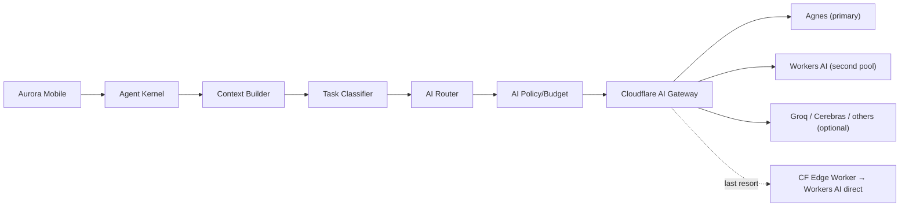
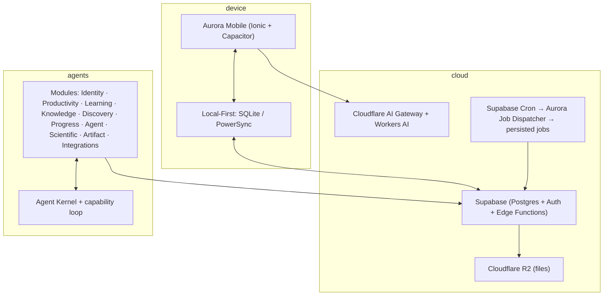

# Architecture Spine — Aurora

## Design Paradigm

Composite, frozen in ADR v1.6–v1.7:

- **Modular Monolith** — one deployable unit, strongly separated business modules (Identity, Productivity, Learning, Knowledge, Discovery, Progress, Agent, Scientific, Artifact, Integrations).
- **Vertical Slices** — each capability owns its code scope, tests, and contracts.
- **Hexagonal / Ports & Adapters** — domain and application never reference vendors or frameworks; every external provider (AI, research, OCR, transcription, storage, notifications) sits behind a typed port.
- **Local-First** — device state (SQLite/PowerSync) is authoritative for the UI, synced to Supabase.
- **Targeted Event-Driven** — events decouple multi-consumer state changes only; simple operations stay direct commands.
- **Central Agent Kernel** — one coordinator (Intent → Context → Plan → Retrieve → Tools → Verify → Action → Result → Memory); Planner/Coach/Tutor/Researcher/Executor are kernel *capabilities*, not separately deployed agents.

## Invariants & Rules

### AD-1 — Vendor & framework isolation [ADOPTED]

- **Binds:** all
- **Prevents:** a feature importing a vendor SDK (or a concrete model name) directly, which would leak provider churn into the domain.
- **Rule:** domain/application code never imports a vendor, framework, or concrete model. All external providers are consumed through typed Ports/Providers. Optional capabilities (OCR, transcription, research) must degrade gracefully when their provider is absent.

### AD-2 — Module boundary discipline [ADOPTED]

- **Binds:** all modules
- **Prevents:** two modules reaching into each other's internal tables/shapes.
- **Rule:** a business module never accesses another module's internal data without an explicit contract. Cross-module data exchange goes through the module's public contract only. A module may **read** another module's public contract types, and **declare its event consumers** (AD-9); it may never write into another module's tables or re-persist another module's events as its own.

### AD-3 — No keys or secrets on the device [ADOPTED]

- **Binds:** mobile client, web, Agent Kernel
- **Prevents:** provider keys shipped in the client, and per-client rate-limiting being bypassable.
- **Rule:** the mobile/web client never holds a model or provider key. All AI calls go through the server-side Router/Gateway; the client only sees the normalized `AIProvider` contract.

### AD-4 — Multi-provider AI pipeline [ADOPTED]

- **Binds:** Agent Kernel, AI layer
- **Prevents:** hard-coupling to one model provider; silent loss of service when one provider degrades.
- **Rule:** flow is `Agent Kernel → Context Builder → Task Classifier → AI Router → AI Policy/Budget → Cloudflare AI Gateway → Provider Adapter → model`. Agnes is primary; Cloudflare Workers AI is the second pool (and the fallback pool); Groq/Cerebras are optional; the last-resort path is a dedicated Cloudflare Worker calling Workers AI directly. The fallback Worker carries **no** business logic — it normalizes requests/responses, applies timeouts, and stops there.



### AD-5 — Fallback & quota hygiene [ADOPTED]

- **Binds:** AI layer
- **Prevents:** quota-bypass patterns, untraceable fallbacks, and silent free-tier decay.
- **Rule:** retry only on transient faults; fallback on unavailability/incompatibility/limit hit. A `429` is **never** bypassed by rotating keys or accounts. Every fallback response is traceable (provider, model, attempt, reason, expected quality). Free tiers are treated as *capacities*, not SLAs — the Model Registry can auto-retire a provider that becomes unavailable or paid.

### AD-6 — Data layer split [ADOPTED]

- **Binds:** Data
- **Prevents:** using one storage for what needs another; losing semantic retrieval or event history.
- **Rule:** PostgreSQL is the transactional source of truth. pgvector extends it for semantic retrieval. The Semantic Tree is the knowledge hierarchy — its truth lives in the Knowledge Base, **never** in the rendering engine. **Ownership split:** Knowledge owns `SemanticNode`/`SemanticEdge`/`SemanticBridge` structure and content, and is the **only writer of `NodeState`** (mastered/fragile/forgotten) — it updates it by consuming `ProgressEvidenceCreated` / `SkillStateChanged`; Progress owns `SkillState` and only **emits** events, it never writes into Knowledge's tables. **Semantic Tree versioning** ("évolution temporelle", §14) is a Knowledge-owned table (`semantic_tree_version`), not Progress's Event History. Event History is kept for progression/audit; full Event Sourcing is **excluded** from V1.

### AD-7 — Local-first sync [ADOPTED]

- **Binds:** mobile client, Data
- **Prevents:** UI latency coupling to cloud availability.
- **Rule:** PowerSync + SQLite on device; the UI reads local state first and syncs to Supabase. Offline is a first-class state, not a failure mode. **Single-writer discipline:** every local entity has exactly one owning module that is the **only writer** of that entity's local store. The Agent Kernel's `Action` step never mutates a table directly — it emits the event/command (e.g. `TaskCompleted`) and the owning module (Productivity) applies the mutation. **Conflict resolution:** PowerSync scopes use *server-wins + per-entity server timestamp* (lists that need merge use CRDT); a scope must **never** join another module's internal tables (consistent with AD-2). **PowerSync scope ownership:** `packages/data` owns all server-side PowerSync views/scopes, provisioned in wave 0.

### AD-8 — Async jobs for anything heavy [ADOPTED]

- **Binds:** all features using OCR, transcription, artifact generation, search, scientific compute
- **Prevents:** long work blocking the UI; unobservable failures.
- **Rule:** long/heavy work runs as a **persisted, idempotent, retryable, observable Job** (Supabase Cron → Aurora dispatcher → persisted jobs → Edge Functions/Workers). No heavy work blocks the interface.

### AD-9 — Events are targeted [ADOPTED]

- **Binds:** all modules
- **Prevents:** event-everywhere dogma, or ad-hoc cross-module coupling.
- **Rule:** events exist only where multiple components must react independently or async decoupling is wanted. A simple transactional operation stays a direct command. V1 event vocabulary: `TaskCompleted`, `CourseImported`, `FlashcardReviewed`, `ProgressEvidenceCreated`, `SkillStateChanged`, `GoalUpdated`, `ArtifactGenerated`, `JobCompleted`, `DiscoveryItemCreated`. **Each event has exactly one producer and a declared consumer set — a module may consume an event only if it declares it in its Contract Pack (AD-13).** Normative matrix:

| Event | Producer | Consumers (must be declared) |
| --- | --- | --- |
| `TaskCompleted` | Productivity | Progress (evidence), Learning (revision trigger), Agent (re-plan) |
| `CourseImported` | Learning | Knowledge (tree ingestion), Discovery (gap analysis), Progress |
| `FlashcardReviewed` | Learning (FSRS) | Progress (freshness) |
| `ProgressEvidenceCreated` | **Progress only** (aggregates/qualifies learning events) | Knowledge (`NodeState`), Agent (context) |
| `SkillStateChanged` | **Progress** | Agent (Expert Skills), Discovery (competence profile), Learning (targeted revision) |
| `GoalUpdated` | Productivity | Progress (trajectory), Agent |
| `ArtifactGenerated` | **Artifact module, after R2 upload only** | Knowledge (`SourceRef`), Learning (evidence) |
| `JobCompleted` (payload must carry `jobId` + `jobKind`) | Job system | Artifact, UI (success state) |
| `DiscoveryItemCreated` | Discovery | Learning (activity creation), Knowledge (tree links), Progress (measurement), Agent (next recommendations) |

Rules: Learning never creates a `ProgressEvidence` row directly (AD-2); the Agent Kernel never emits `ArtifactGenerated` — it only requests generation (F-06); `JobCompleted` payloads are opaque without `jobId`/`jobKind` and must carry both (F-08).

### AD-10 — Visualization engines behind contracts [ADOPTED]

- **Binds:** Knowledge UI, Agent, Design System
- **Prevents:** domain code importing React Flow / AntV / KaTeX internals.
- **Rule:** frozen engines — `@xyflow/react` + `@dagrejs/dagre` (Semantic Tree), `@antv/infographic` (explanations), `@antv/g2` (data), `KaTeX` (LaTeX), `motion` (animation). Each sits behind an internal renderer contract: `SemanticTreeRenderer`, `InfographicRenderer`, `DataVisualizationRenderer`, `MathRenderer`, `AnimationController`. The rendering engine is never the source of truth.

### AD-11 — Corpus fidelity & provenance [ADOPTED]

- **Binds:** Learning, Knowledge, Agent outputs
- **Prevents:** the agent silently rephrasing an authoritative definition/formula, or presenting a paraphrase as the source text.
- **Rule:** when a corpus is authoritative (e.g., a professor's defined terminology), its formulations stay textually dominant. Agent-generated explanation is explicitly separated and labeled. Every significant concept carries provenance (document, page, passage, source).

### AD-12 — One Agent Kernel [ADOPTED]

- **Binds:** Agent module
- **Prevents:** N independently deployed agents drifting into incompatible context/permission models.
- **Rule:** one central kernel coordinates all capabilities through the fixed loop `Intent → Context → Plan → Retrieve → Tools → Verify → Action → Result → Memory`. Capability-specific "agents" (Planner, Coach, Tutor, Researcher, Executor) are kernel capabilities, not standalone services. Context forms: Intent, Personal, Productivity, Learning, Discovery, Semantic, Expert Skills, Tool, Permission. **Placement (F-09):** Context Builder, Task Classifier, Router, and all AI execution run **server-side** (jobs + gateway — consistent with AD-3, no keys on device); the device runs only UI state and reads. `Verify` for critical tasks (KB/source + Scientific Engine) runs as a server-side Job (AD-8), never on-device.

### AD-13 — Contract Packs gate parallel work [ADOPTED]

- **Binds:** all feature/agent teams
- **Prevents:** two agents editing the same central file and colliding.
- **Rule:** before parallel coding, every domain ships a **Contract Pack**: exact responsibilities, owned packages/files, public TypeScript interfaces, data models, in/out events, exposed APIs, allowed/forbidden deps, required states (loading/empty/success/error/offline), permissions, acceptance criteria & DoD, and mandatory tests. Ownership is one-writer-per-file; `main` is always buildable; integration happens through PRs with Codex review. No agent touches another's perimeter without agreement, and no parallel abstraction may be created where a contract already exists. **A pack must list consumed types (AD-15) and declared event consumers (AD-9) — omission of either is a blocking review finding.**

### AD-14 — Home screen invariant [ADOPTED]

- **Binds:** Productivity UI
- **Prevents:** the home screen degrading into a widget dashboard.
- **Rule:** the home answers one question — *"What matters now?"* — with a fixed composition: today's agenda, next important action, main priority, critical progress, due reviews, immediate Focus access, Coach suggestions.

### AD-15 — Shared domain types have a single source of truth [ADOPTED]

- **Binds:** all
- **Prevents:** two parallel teams each declaring their own copy of `Task`, `Artifact`, `SemanticNode`, … in their own package and shipping incompatible shapes to `main`.
- **Rule:** every frozen domain entity (the entity list in Consistency Conventions, plus `ProgressSnapshot/Evidence/SkillState/Trend/Event/TrajectoryScenario`, `SemanticNode/Edge/Bridge/State`, `SourceRef`, `EvidenceRef`, `DiscoveryItem`, `Gap`, `ExpertSkill`) has **exactly one owning package** and one owning team; the mapping (entity → package → team) is cut in wave 0. Any other team must **consume** that type, never re-declare it; a Context Builder "projection" is a declared *view* of the shared type, not a re-definition.

### AD-16 — Frozen operational envelope [ADOPTED]

- **Binds:** Foundation, all modules
- **Prevents:** each team provisioning its own buckets/keys/environments and drifting on the infra envelope.
- **Rule:** (a) three environments — `dev`, `staging`, `prod` — are the only deploy targets; concrete values (regions, bucket names, provider account IDs) are wave-0 data, the *structure* is fixed here. (b) **One owner of the Model Registry** = `packages/data` + a Supabase table; only that owner may auto-retire a provider (gates AD-5). (c) Foundation owns all provider accounts & CI/CD keys (Supabase, Cloudflare, OneSignal, Sentry, PostHog, GitHub Actions). (d) Foundation is ops duty owner for failed jobs and per-job SLO until a module owns measurable traffic. No feature team may create a new provider account, bucket, or registry entry.

### AD-17 — Multi-theme skin system with invariant semantic states [ADOPTED]

- **Binds:** Design System (`packages/ui`), all UI screens
- **Prevents:** a visual "theme" silently redefining functional meaning (a success state that stops reading as success when the user changes skin), and teams shipping divergent theme/token implementations.
- **Rule:** theming resolves in three layers — (1) a **neutral style** (`Light` off-white `#F8F9FA` / `Dark` `#121212`) that owns background, text, surfaces, borders, shadows **and the semantic state tokens** `success`/`warning`/`danger`/`info`; (2) one **expressive theme** (10 catalogued universes: `aurora` default, `lagoon`, `boreal`, `sakura`, `vesper`, `solara`, `terra`, `verdant`, `citrus`, `cosmos`) that owns only accent/decorative tokens (primary, secondary, gradients, shapes, chart palette, motion mood); (3) **declarative local adaptations** per module/screen. A theme **never** redefines a semantic state token (danger stays danger under any skin). Themes live as JSON SSoT in `packages/ui/src/themes/` (AD-15), resolved by `resolveToken(theme, style, key)`; adding a theme = one JSON file, no code change. `user_context.theme` carries the `AuroraTheme` enum (SSoT `packages/domain`), `user_context.theme_style` the light/dark axis; the binary→enum migrator lives in `packages/domain`, not in a module.

## Consistency Conventions

| Concern | Convention |
| --- | --- |
| Architecture decisions | Versioned; any significant change requires a documented ADR (frozen v1.7 supersedes v1.6, kept for traceability) |
| Parallel integration | Branch per mission (`feat/foundation-setup`, `feat/design-system`, …); PR = integration contract (summary, Contract Pack, consumed/exposed interfaces, tests, DB/UX impact, risks, DoD checklist, UI capture for visual changes) |
| Contract evolution | Additive = normal; internal-compatible = standard review; breaking = dedicated PR + mandatory Codex review; migrates consumers in the same sequence |
| Merge order | Foundation → Contracts → Data/Core → Features → Agent → UI refinement → QA; `main` buildable after every wave |
| Naming (domain entities) | Frozen initial domain: Task, Event, Project, Goal, Milestone, Habit, Routine, Note, Resource, Course, Subject, Skill, LearningSession, Review, FocusSession, Artifact, Automation, Decision, UserContext |
| Error/data envelopes | Every provider response normalized (provider, model, attempt, reason, expected quality); heavy capabilities expose typed states: loading, empty, success, error, offline |
| Forbidden (agent work) | Modifying another agent's perimeter without agreement; changing a shared contract without signaling; creating a parallel abstraction where a contract exists; editing global config to solve a local problem without review; bypassing interfaces/types; merging to `main` directly; adding external deps without justification + review |

## Stack

| Name | Version |
| --- | --- |
| Frontend | Ionic React + TypeScript |
| Mobile | Capacitor (Android — Phase 1 target) |
| Desktop | Electron (Phase 2 — introduced after mobile is production-stable) |
| Monorepo | pnpm |
| Local-First | PowerSync + SQLite |
| Backend | Supabase (PostgreSQL + Auth + Edge Functions) |
| Files | Cloudflare R2 (private bucket + presigned URLs) |
| Notifications | OneSignal + Capacitor local (mobile); Electron native (desktop) |
| AI | Agnes AI (primary) + Cloudflare AI Gateway / Workers (second pool + last-resort fallback) |
| Research | You.com, Tavily, Exa (via `ResearchProvider`) |
| Integrations | Composio (via `IntegrationProvider`) |
| Knowledge | PostgreSQL + FTS + pgvector; documents in R2 |
| Math | KaTeX |
| Observation | Sentry + PostHog |
| CI/CD | GitHub Actions |

## Structural Seed

```text
{root}/
  apps/
    mobile/            # Ionic React + Capacitor (Phase 1)
  packages/
    ui/                # design system, reusable components
    data/              # PowerSync/SQLite, migrations, repositories
    agent/             # Agent Kernel + capabilities
    scientific-engine/ # generic math/units engine + LaTeX
    integrations/      # Composio, notifications adapters
    domain/            # business rules & models (platform-agnostic)
    platform/          # Capacitor / Electron adapters behind interfaces
```



## Capability → Architecture Map

| Capability / Area | Lives in | Governed by |
| --- | --- | --- |
| Tasks, goals, calendar, focus, habits | Productivity module + local-first state | AD-7, AD-8, AD-14 |
| Courses, skills, reviews, FSRS spaced repetition | Learning module + Knowledge Base | AD-6, AD-11 |
| Semantic tree of knowledge | Knowledge module (truth) + `@xyflow/react` (view) | AD-6, AD-10 |
| Discovery (multi-source, gap analysis, horizons) | Discovery module via `ResearchProvider` | AD-1, AD-8 |
| Progress (evidence, causality, trajectories) | Progress module + Event History | AD-6, AD-9 |
| AI orchestration | Agent Kernel + AI Router/Gateway | AD-4, AD-5, AD-12 |
| Math & units | Scientific engine (swappable backends) | AD-10, AD-8 |
| Artifacts & file visualization | Artifact Hub + renderer contracts | AD-10 |
| External integrations | Integrations module (`IntegrationProvider` = Composio) | AD-1 |
| Parallel feature development | Contract Packs + PR gates + Codex review | AD-13 |

## Deferred

- **RLS policies & data-model field-level details** — the spine fixes the split (AD-6) but concrete tables/permissions are owned by the Data Contract Pack (wave 0).
- **Environment *values*** (region names, bucket names, provider account IDs, per-environment Model Registry entries) — the *structure* of the three environments is fixed by AD-16; the values are wave-0 data.
- **Entity → package → team ownership mapping (AD-15)** — the SSoT rule is fixed; the mapping table is cut in wave 0 by Foundation + each team.
- **Which specific Groq/Cerebras model** — registered as optional; picked per task profile at routing time, not pinned here.
- **Yjs collaborative editing on Tiptap** — architectured as future extension, **not** in the One-Day Build.
- **Local STT (e.g., whisper.cpp on Android)** — capability known to the core via `TranscriptionProvider` (optional); concrete engine evaluated later on real devices.
- **Extraction of any module into a microservice** — only on measurable production need (scalability, isolation, cadence, team, tech constraint). Modular boundaries are already enforced in code (AD-2); distribution is a later decision, not a V1 one.
- **Desktop (Electron) specifics** — Phase 2; the platform-agnostic core (AD-7) keeps the domain portable, but no desktop adapter is in V1.

## Open Questions

- [ASSUMPTION] The pnpm package layout above (`packages/agent`, `packages/scientific-engine`, …) is inferred from the ownership matrix, not the frozen ADR text — to be ratified in wave 0 before the Design System / Data / Agent packs are cut.
- [ASSUMPTION] RLS on Supabase is the enforcement mechanism for module isolation (AD-2) at the data layer; the ADR text says "contracts" but not "RLS". Confirm before Data pack.
- Free-tier quotas in the v1.7 registry (21 Sept 2026 snapshot) are point-in-time; the spine intentionally keeps them out of the `Stack` table so the registry can drift without a spine change.
