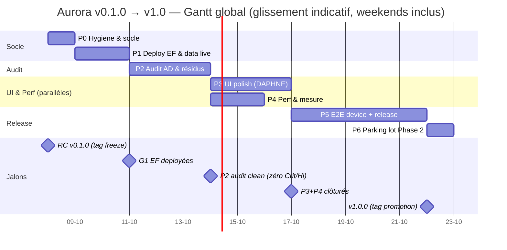
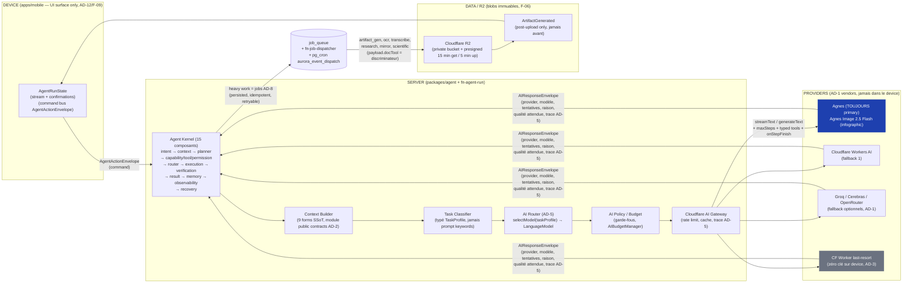
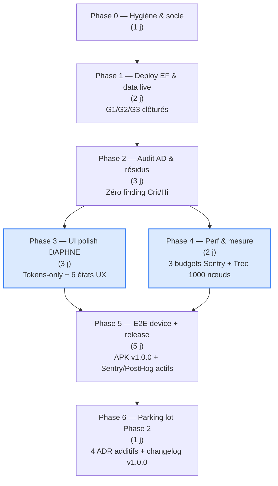

# Aurora — Plan de finalisation v0.1.0 → v1.0 (+ prépa Phase 2)

> **Statut :** plan d'exécution — créé 2026-10-07 (après wave-3 `4fd7644`, RC v0.1.0).
> **Sources du gap :** `git log` (commits wave-3 / canvas / skills), `_bmad-output/project-context.md` v1.10 (09-27), checklist DoD `_bmad-output/project-context.md` §6, live Supabase `opagfyspdbhxthlxvlrk`.
> **Règle de lecture (norme §1 AI_RULES) :** si ce doc et le tree divergent, le **changelog + le code gagnent**. Les boxes `[ ]` se cochent au fur et à mesure ; chaque case close = 1 story = 1 commit = 1 rollback (AD-13).
> **Périmètre owner :** finalisation totale — tous les résidus des waves 0–7 + préparation Phase 2 (décisions seulement).

---

## 1. GAP ACTUEL (mesuré, 2026-10-07)

| # | Gap | Niveau | Source |
|---|---|---|---|
| G1 | **6 Edge Functions non déployées** : les verbes `create / lock / rename` de `fn-canvas` (wave-3) et le wiring `DISCOVERY_JOB_HANDLERS` de `fn-job-dispatcher` n'existent que dans le repo ; le code Deno déployé sur Supabase est de l'ancienne édition. Le repo TypeScript `packages/*` **n'est pas visible** par le runtime Deno des EF. | Blocking Phase 1 | git `4fd7644` + confirmation owner 10-07 |
| G2 | **Jobs E2E non exécutés** : le scheduler pg_cron est live (jobids 7–10 : `aurora_keep_alive` / `fsrs_tick` / `skill_recompute` / `event_dispatch`) mais le test *dispatch → claim → résultat + idempotence `source_local_mutation_id`* n'a jamais tourné (DoD wave 1 W1-E2-3 non close). | Blocking Wave 1 DoD | project-context v1.10 |
| G3 | **PowerSync round-trip non exécuté** : relay déployé sur Aurora Dev (slot actif, lag 0, 12 flux) mais le test `powersync/test/roundtrip.md` attend un user Supabase Auth + un client PowerSync. | DoD wave 1 | project-context v1.5/v1.7 |
| G4 | **Perf non mesurée (W5-E1-3)** : budgets statiques OK (`apps/mobile/src/perf/`), mais **≤ 300 Ko JS gz / TTI ≤ 1,5 s / 30 fps sur Pixel 4a** n'ont jamais été mesurés via Sentry (device réel ou Appium). | DoD wave 5 | epics-stories W5-E1-3 |
| G5 | **Wave 6 (deep review) non exécutée** : audit global AD-1..AD-17 + audit de la matrice de tests (20 scénarios agent / 23 workflows / 13 Focus DPC / 8 E2E device) — rien n'a été passé depuis le RC. | DoD wave 6 | epics-stories W6-E1 |
| G6 | **Wave 7 (release) non exécutée** : E2E Playwright + driver Capacitor sur Android 14 (OQ-08), CI/CD staging→prod, valeurs env OQ-03 **à confirmer**, OQ-17 DPC toujours **OPEN** (fallback consumer = restriction-only). | DoD wave 7 | epics-stories W7-E1 |
| G7 | **UI polish « interface lisse et propre »** : pass DAPHNE design-QA (`prompts/dyad-design-qa.md`) à étendre sur **toutes** les pages (horebs S-41 + 49 mockups + 10 thèmes + 3 presets) ; 6 états UX uniformes ; tokens-only (zéro `#000`/`#fff` hardcodés, zéro radius > 8 px, zéro animation bouncy, AD-17 + pack 05 §3). | UX owner-requested | questionnaire 10-07 |
| G8 | **Hygiène du repo** : `.claude/worktrees/` + `node_modules` à gitignorer ; artefact vite transitoire untracked (`apps/mobile/vite.config.ts.timestamp-*.mjs`) ; doc-lag `AI_RULES.md` (§3 dit 20 migrations alors que le gate scanne 24) ; `anthropic-skills/` à marquer **snapshot** (source de seed, pas du code). | Hygiène | tree 10-07 |
| G9 | **Phase 2 non préparée** : Electron adapter, Yjs multi-device, STT local, microservices — **décisions à prendre, pas de code** (ADR additifs uniquement, V1 non-impacts). | Parking lot | ADR §23.1/§23.3 |
| G10 | ~~**Shell mobile boots sans relay** : `apps/mobile/.env.local` absent → `VITE_SUPABASE_URL`/`VITE_SUPABASE_PUBLISHABLE_KEY`/`VITE_POWERSYNC_URL` vides → `createClient('')` = « supabaseUrl is required » (erreur PowerSync en boucle 5 s).~~ | **RESOLVED 10-07** | `apps/mobile/.env.local` créé (publishable only, AD-3) + restart dev server ; logs post-restart : 0 erreur sync, client pointé sur `sb-opagfyspdbhxthlxvlrk` ✅ |

### État live vérifié le 2026-10-07 (via `execute_sql` sur `opagfyspdbhxthlxvlrk`)

| Check | Résultat |
|---|---|
| `canvas_sessions.locked` (0023) | ✅ colonne `BOOLEAN NOT NULL DEFAULT FALSE` présente ; `RLS enabled + FORCE` ; 2 policies (`_user_isolation` ALL `user_id=auth.uid()` + `_service_role` SELECT) |
| pg_cron `aurora_*` (jobids 1,2,3,9) | ✅ tous `active=true`, **0 échec** : `event_dispatch` */5 min = 3066 runs « succeeded », dernière 10-07 12:30 UTC ; `fsrs_tick` + `skill_recompute` = 11 runs ; **fix heartbeat v1.10 confirmé** (`keep_alive.last_ping` = 10-07 00:00:00.076, jobid 9 = 10 runs OK) |
| `job_queue` | ✅ vide (0 job stuck/failed — le dispatcher consomme sans résidu) |
| `skill_catalog` | ✅ total **607** (18 builtin + 589 marketplace, 0021) ; distribution live : business 199 / legal 160 / finance 128 / documents 24 / research 17 / science 15 / marketing 15 / coding 13 / productivity 12 / healthcare 11 / design 7 / students 4 / social 1 / creative 1 *(drift vs le snapshot du commit 43693d9 = patchs postérieurs, pas un bug)* |

| Audit grants live (10-07) | ✅ **14/14 vues `v_*`** granted `service_role` SELECT (relay PowerSync OK) · `expert_skills` + `ascent_paths` : **FORCE RLS** + policies bornées `user_id = auth.uid()` (AD-3 respecté) · `canvas_sessions/comments` : RLS enabled + FORCE · `skill_catalog` : lecture public (anon+authenticated), écriture service-only — **finding Low → FIXÉ au live 10-07** : `ALTER TABLE skill_catalog FORCE ROW LEVEL SECURITY` appliqué + confirmé (`forced=true`) ; le `service_role` (BYPASSRLS) reste borné mais conserve l'accès `ALL` via `skill_catalog_service_write` (qual nulle) → EF non impactées — **reste (monorepo)** : 1 ligne FORCE à resyncer dans le SSoT `supabase/migrations/0021` (ou migration 0024 additif) |
| Shell dev client (10-07, post-G10) | ✅ `apps/mobile/.env.local` créé (`VITE_SUPABASE_URL` + publishable key + `VITE_POWERSYNC_URL`) → 0 erreur « supabaseUrl is required » post-restart ; GoTrueClient pointé sur `sb-opagfyspdbhxthlxvlrk` (l'erreur d'avant ressemblait à un retry en boucle ~5 s) |

**Restant côté DB = rien** — les résidus G1/G2/G3 sont **EF + client** (à faire depuis le monorepo : `supabase functions deploy` × 6 + round-trip PowerSync avec un user Auth).

---

## 2. PLAN D'EXÉCUTION — 7 phases

> **Estimation totale : ≈ 17 j homme** (1+2+3+3+2+5+1, dont polish + perf parallélisables).
> Dates = jauge (non calendaire) ; le Gantt §3.1 donne un glissement indicatif **10-08 → 10-30 (week-ends inclus)**.

### Phase 0 — Hygiène & socle (1 j) — owner : Foundation
- [x] **P0-1** — gitignorer `.claude/worktrees/**` + `node_modules/**` ; supprimer l'artefact vite untracked (commit `chore: repo hygiene`) — *fait 2026-10-07 : `.gitignore` couvrait déjà `.claude/worktrees/` + `node_modules/` ; pattern `vite.config.ts.timestamp-*.mjs` ajouté ; tree propre*
- [x] **P0-2** — marquer `anthropic-skills/` **snapshot** (README interne : « source de seed skill_catalog, non du code applicatif ») + corriger `AI_RULES.md` §3 (20 → 24 migrations, état RC) — *fait 2026-10-07 : marqueur snapshot ajouté `AI_RULES.md` §3 + `.gitignore` ; §1/§3 corrigés (24 migrations, 6 EF)*
- [ ] **P0-3** — tag git `v0.1.0` (marker RC officiel ; le tag existe déjà en main, on le fige)
- [ ] **P0-4** — secrets prod : `set-secrets.ps1` poussé pour les 3 envs (dev / staging / prod, OQ-03) + checklist `supabase/manual-secrets-checklist.md` re-vérifiée post-set

### Phase 1 — Deploy & données live (2 j) — owner : Data + Orion
- [ ] **P1-1** — `supabase functions deploy` × 6 EF (`fn-agent-run`, `fn-canvas`, `fn-import-course`, `fn-integrations`, `fn-job-dispatcher`, `fn-skills`) + **vérif** verbes `canvas.create / canvas.lock / canvas.rename` (smoke test curl authed)
- [ ] **P1-2** — **Résoudre `DISCOVERY_JOB_HANDLERS` côté EF** : le module `packages/discovery` n'est pas résolvable par le runtime Deno → **décision = Option B (copie vendée `_shared/` + gate de drift CI), Option A (esbuild bundle) en backlog** — voir [ef-bundling-p1-2.md](ef-bundling-p1-2.md)
- [ ] **P1-3** — **Test jobs E2E** (DoD wave 1) : job créé par le pg_cron `aurora_event_dispatch` → `fn-job-dispatcher` le claim → résultat écrit + **idempotence** sur `source_local_mutation_id` (replay = no-op) ; vérif via `job_logs` + `job_queue.attempts` — *état live vérifié 10-07 : scheduler 4 jobs OK + queue vide ; reste le test de claim par l'EF (après P1-1/P1-2, monorepo)*
- [ ] **P1-4** — **PowerSync round-trip** (DoD wave 1) : user Supabase Auth (`joynagassi` ou dev user) + client PowerSync local → lecture `tasks`/`goals` → écriture locale → upsync → relecture ; **offline kill-app relaunch = état intact** (03 §5.9) — *côté client débloqué 10-07 (G10 : `apps/mobile/.env.local` VITE_* créé + restart → 0 erreur sync, client pointé sur `sb-opagfyspdbhxthlxvlrk`) ; ⚠️ reste : `auth.users` = **0 ligne** (les users du test RLS de 09-26 ont disparu) → **prérequis P1-4/P1-5 : créer 2 dev users Auth avant tout test live A/B + round-trip***
- [ ] **P1-5** — **RLS penetration re-run post-0023** : `canvas_sessions.locked` (test A vs B sur la colonne `locked`, `tests/rls-penetration.sql`) — *vérif structurelle 10-07 ✅ (RLS enabled + FORCE, policies ALL user + SELECT service_role) ; le test A/B live avec 2 users reste à faire (monorepo)*

### Phase 2 — Audit & résidus (3 j) — owner : QA + toutes équipes
- [ ] **P2-1** — **Audit AD-1..AD-17 global** : exécution des 4 gates (`scripts/check-boundaries.sh`, `check-rls.sh`, `check-view-joins.ts`, `tests/spine/spine.test.ts`) + relecture manuelle des invariants (AD-1 vendor, AD-3 secrets, AD-7 single-writer, AD-8 jobs, AD-9 9-év., AD-10 boundary, AD-15 SSoT, AD-14 Home, AD-17 thèmes) ; **rapport classé Critique / High / Medium / Low** (n° W6-E1-1)
- [ ] **P2-2** — **Audit matrice de tests** : `docs/testing/matrix.md` 100 % couvert ou **nouvelle story par gap** (n° W6-E1-2)
- [ ] **P2-3** — **20 scénarios E2E agent en local** (Playwright, sans device — `docs/agent/e2e-agent-scenarios.md`) ; run du kernel (AD-12) sur `fn-agent-run` déployé
- [ ] **P2-4** — **23 workflows en local** (`packages/workflows/w1…w23` + `event-flow` + `error-recovery` + `self-improvement`) ; rollback sur échec partiel testé
- [ ] **P2-5** — **Fix des findings critiques** : chaque fix = 1 story = 1 commit = 1 rollback (AD-13) ; re-run des 4 gates post-fix ; zéro finding Critique/High restant avant de passer en Phase 3

### Phase 3 — UI polish (3 j) — owner : DAPHNE + DS team
- [ ] **P3-1** — Pass design-QA `prompts/dyad-design-qa.md` sur **toutes les pages** (horebs S-41 + 49 mockups + 10 thèmes + 3 presets + neutral) ; « no double work » (le pass DAPHNE ne refait pas ce qui est déjà conforme)
- [ ] **P3-2** — **6 états UX** (`loading / empty / success / error / offline / killed`) sur chaque écran asynchrone (`apps/mobile/src/ux-states.tsx` + `hooks/use-killed.ts`) — manquant = DoD non close (AD-13)
- [ ] **P3-3** — **Tokens-only** : zéro couleur hardcodée (`#000`/`#fff` hors thème), zéro border-radius > 8 px, zéro animation bouncy (150–250 ms, GPU-only, `prefers-reduced-motion` respecté, AD-17 + pack 05 §3)
- [ ] **P3-4** — **Home invariant AD-14** : composition fixe « *What matters now?* » (agenda · next action · priorité · progress critique · reviews dues · Focus · Coach), jamais un dashboard de widgets
- [ ] **P3-5** — **Screenshot test visuel** (Playwright) sur les 5 écrans critiques (Home, Goals, Agent, Ascent, Focus) ; baseline commitée pour la régression future

### Phase 4 — Perf & mesure (2 j) — owner : Erynis
- [ ] **P4-1** — **Budgets Sentry sur Pixel 4a** (réel ou Appium) : **≤ 300 Ko JS gz / TTI ≤ 1,5 s / 30 fps** (OQ-11) ; les 3 budgets de `apps/mobile/src/perf/budgets.ts` = SSoT des seuils
- [ ] **P4-2** — **Semantic Tree 1000 nœuds @ 30 fps** : harness `packages/ui/scripts/semantic-tree-30fps.mts` exécuté sur device ; Dagre incrémental + lazy/memo vérifiés (≤ 150 nœuds visibles)
- [ ] **P4-3** — **5 moteurs AD-10 lazy** : vérif qu'aucun n'est dans le **bundle Home** (le Home ne charge jamais les 5 moteurs, n°2 de `apps/mobile/src/perf/` = « Home = zero engines »)

### Phase 5 — E2E device + release (5 j) — owner : Erynis + Foundation
- [ ] **P5-1** — **Playwright + Capacitor driver** sur Android 14 (OQ-08 ; si le driver ne supporte pas Android 14 → fallback **Appium**, même scénario)
- [ ] **P5-2** — **Sur device** : 20 scénarios agent + 23 workflows + 8 scénarios DPC (`docs/focus-mode/spec S13`) — tous passés
- [ ] **P5-3** — **DPC OQ-17** : si le device cible est provisionnable (`dpm set-device-owner`), le mode **DPC natif** (suspend + restore, crash/reboot) ; sinon le **consumer fallback** = restriction-only (timer in-app + DND guidance + Screen Pinning optionnel) — **zéro promesse de blocage natif** sur consumer (pack 04 §4.1)
- [ ] **P5-4** — **CI/CD** : `main` = gates + build + Playwright device spec (release) ; tag `v*` → `release.yml` → **APK signée + notes de release** (CI : `.github/workflows/release.yml`)
- [ ] **P5-5** — **Release notes v1.0.0** + promotion du tag `v0.1.0` → **`v1.0.0`** (le tag v0.1.0 existe, on le promeut en v1.0.0 au green de cette phase)
- [ ] **P5-6** — **Sentry (errors + perf SLOs) + PostHog (EU)** actifs ; SLOs monitorés (pas de regression sur les 3 budgets post-release)

### Phase 6 — Parking lot Phase 2 (1 j) — owner : owner + Foundation
> **Mémo de décision prêt** : [phase2-parking-lot.md](phase2-parking-lot.md) (recommandations : Electron/Yjs/STT = **différer**, microservices = **rejeté** sauf échelle multi-produit ; chaque décision = ADR additif noté §5, zéro code V1).
- [ ] **P6-1** — **Décision Electron adapter** : ADR additif (V1 = mobile-only, Electron = adapter ajouté au Phase 2, core platform-agnostic — ADR §23.1/§23.3)
- [ ] **P6-2** — **Décision Yjs multi-device** : ADR additif (V1 = CRDT OR-Set figé, Yjs = Phase 2 seulement)
- [ ] **P6-3** — **Décision STT local** : exclus V1 (pack 04 R8), à ratifier ou non pour le Phase 2 (le transcribe = optionnel via `Audio/Transcription` port, jamais local dans V1)
- [ ] **P6-4** — **Décision microservices** : exclus V1 (spine AD-13 mobile-only), à ratifier ou non
- [ ] **P6-5** — **Changelog `docs/release/changelog.md`** mis à jour avec la **promotion v1.0.0** + date de closure du parking lot (chaque décision notée §5 `project-context.md`, additif pas spine change)

---

## 3. DIAGRAMMES

### 3.1 Gantt global (phases 0–6, ≈ 17 j homme, glissement 10-08 → 10-30)

### 3.2 Pipeline AI / agent — **As Is** (wave-3)

### 3.3 Dépendances de release (parallélisme P3/P4)

---

## 4. CONTRAINTES & RISQUES (transversaux à toutes les phases)

- **1 story = 1 commit = 1 rollback** (AD-13) — chaque case `[ ]` ci-dessus = 1 story atomique ; si le gate casse : `git revert <commit>`.
- **Zéro promesse de blocage natif d'app** sur consumer device (pack 04 §4.1, OQ-17) — le consumer fallback = restriction-only (timer in-app + DND + Screen Pinning) ; jamais `if (dpcActive) { … } else { … }` caché : la matrice de dégradation est déclarée dans `docs/focus-mode/`.
- **OQ-03 valeurs prod** : si non confirmées avant P5, le déploiement staging→prod est **bloquant** (gate P5-4) ; la Phase 5 ne démarre pas sans OQ-03.
- **EF Deno ≠ monorepo TS** : le code déployé sur Supabase **ne voit que `supabase/functions/`**, pas `packages/*` — P1-2 (bundler ou copier `DISCOVERY_JOB_HANDLERS`) est **le point d'attention n° 1** de la Phase 1 ; sans lui, le G2 (jobs E2E) est non-testable et le G1 (EF déployées) reste faux.
- **Doc-lag** : `AI_RULES.md` reste le SSoT scannable des invariants, mais **ce plan pointe vers `docs/release/changelog.md` + `git log`** (norme §1 AI_RULES : le tree + le changelog gagnent sur les bannières des docs).
- **Free-tier Supabase** : le `0018` `keep_alive` (pg_cron jobid 9) pinge le live quotidien ; **ne jamais désactiver le heartbeat** ; un `ALTER TABLE` / `CREATE TABLE` sans RLS + GRANT = violation du §AD-2 + §AD-3 du spine.

---

## 5. LIVRABLES FINAUX (après exécution des 7 phases)

| Livrable | Où | Quand |
|---|---|---|
| Ce plan (`docs/plans/finalisation-v1.md`) | ici | P0-2 (correction §3 AI_RULES 20 → 24 migrations) |
| `AI_RULES.md` mis à jour (état §1 post-RC v1.0.0 + pointeur §11) | root | P5-5 |
| `docs/release/changelog.md` avec la **promotion v1.0.0** | `docs/release/` | P6-5 |
| **APK v1.0.0 signée** + notes de release | `.github/workflows/release.yml` (tag `v1.0.0`) | P5-5 |
| **Rapport d'audit AD-1..AD-17** (n° W6-E1-1, classé Crit/Hi/Med/Low) | `docs/architecture/` (nouveau) ou ajout au §6 wave 6 | P2-1 |
| Screenshot baselines (5 écrans critiques) | `apps/mobile/test/screenshots/` (ou `e2e/`) | P3-5 |
| SLOs Sentry (3 budgets) + PostHog EU actifs | `apps/mobile/src/perf/` + config Sentry | P4-1 / P5-6 |

---

## 6. PARKING LOT PHASE 2 (décisions à prendre, **pas de code**)

| Décision | V1 (figé) | Phase 2 (à trancher) | Critère de déclenchement | ADR (additif, pas spine) |
|---|---|---|---|---|
| **Electron adapter** | mobile-only (Android, Capacitor) | Adapter ajouté (core platform-agnostic) | Demande desktop / Kiosk confirmé | ADR §23.1/§23.3 (excl. V1) |
| **Yjs multi-device** | CRDT OR-Set figé (AD-7/F-03) | Yjs pour le sync collaboratif multi-appareil | Multi-device = P2 feature (non V1) | ADR §23 (excl. V1) |
| **STT local** | Transcription = optionnel via port, jamais local | STT on-device (reconnaissance locale) | Device capable + privacy-first confirmé | ADR §23.1/§23.3 (excl. V1) |
| **Microservices** | Monolith Supabase + EF + Workers (AD-13 mobile-only) | Découpage services (si > 1 app / équipe) | Échelle multi-produit confirmée | ADR §23 (excl. V1) |

> **Règle V1 (spine AD-13) : aucune des 4 décisions ci-dessus n'implique de code dans V1.** Le parking lot = 1 journée de tranchées (P6-1..P6-4), **notées §5 de `project-context.md`** (additif), **jamais des modifications du spine figé** (AD-1..AD-17 read-only).
