# PRD · App de productivité

_Tâches, calendrier, Pomodoro, habitudes, compte à rebours, matrice d'Eisenhower, IA_

- **Nom de travail :** FocusFlow (nom provisoire, à remplacer)
- **Source :** Captures de l'app de productivité de référence : réf. #7-9, #19-122 (≈107 écrans, thème sombre, Android, français)
- **Plateforme cible :** Android d'abord (captures 576×1152, gestes Android), extensible iOS
- **Destinataire :** Agent de codage : ce document est la source de vérité fonctionnelle
- **Captures :** Dossier ref_screens.zip : ref_NNN.png correspond à la référence #NNN de ce document
- **Important :** La marque, les logos, illustrations, icônes d'habitudes, noms de thèmes et textes d'upsell de l'app de référence ne doivent PAS être reproduits : tout est à recréer en original.

# 0. Mode d'emploi pour l'agent de codage

Ce document sert de modèle de départ pour construire rapidement une application inspirée de ces écrans. Chaque fiche est accompagnée de ses captures : la capture fait foi pour la structure, les composants et la disposition.

- À reproduire : la hiérarchie des écrans, les composants UI, leur ordre et leur disposition, les états (vide, chargement, erreur), les interactions et la navigation.
- Libre : couleurs, polices, illustrations, icônes et textes de marque. Les couleurs citées dans les fiches sont indicatives (sens : alerte, actif, verrouillé) ; choisir une palette cohérente et la centraliser dans un fichier de thème.
- Méthode conseillée : construire d'abord le squelette de navigation et les composants réutilisables, puis les écrans par phase (voir plan de livraison), en comparant chaque écran à sa capture.
- Les références ref_NNN renvoient aux fichiers du dossier ref_screens.zip ; les captures sont aussi intégrées dans ce PDF.
- Remplacer les noms de marque, logos et textes d'origine par du contenu original.

# 1. Vision et périmètre

FocusFlow est un organiseur personnel tout-en-un : tâches avec listes et étiquettes, calendrier multi-vues, minuteur Pomodoro / chronomètre avec statistiques, suivi d'habitudes, comptes à rebours d'événements, matrice d'Eisenhower et assistant IA. Un compte gratuit donne accès au cœur ; un abonnement Premium débloque les vues avancées, statistiques détaillées, thèmes et IA.

## 1.1 Utilisateurs cibles

- Étudiants et actifs qui planifient leur journée sur mobile.
- Personnes construisant des routines (eau, sport, lecture) et mesurant leur régularité.
- Utilisateurs avancés : intégrations (Notion, Google/Outlook calendar), widgets, modèles, partage de listes.

## 1.2 Objectifs produit

- Capturer une tâche en moins de 3 secondes (ajout rapide, saisie vocale, widget).
- Donner une vue claire de « Aujourd'hui » avec retards, tâches du jour et habitudes.
- Offrir un modèle freemium cohérent : chaque fonction Premium est visible, aperçue et verrouillée proprement.

## 1.3 Hors périmètre v1

- Collaboration temps réel avancée (commentaires, assignation) : seuls les écrans de réglages de partage sont fournis.
- Synchronisation Notion / Zapier / IFTTT / Telegram : écrans d'entrée prévus, logique en phase 3.
- Application web et iOS.

# 2. Composants UI et mise en page

Aucune charte de couleurs n'est imposée : l'objectif est de reproduire la structure. Thème sombre dans la référence ; prévoir un thème clair en option.

## 2.1 Principes de disposition

| Principe | Description |
|---|---|
| Grille et marges | Une seule colonne, marges latérales constantes (≈16 dp), contenu groupé en cartes arrondies séparées par ≈12 dp. |
| Hiérarchie | Barre supérieure (retour / titre / actions) > contenu défilant en cartes > action principale flottante (+) > barre d'onglets basse. |
| Groupes de réglages | Chaque écran de réglages est une pile de cartes ; une carte contient 2 à 7 lignes séparées par des filets fins. |
| Ligne standard | Icône à gauche (dans une pastille), libellé, sous-titre secondaire optionnel, valeur ou interrupteur ou chevron à droite. |
| Feuilles basses et dialogues | Saisie, date, tri : feuille ancrée en bas, coins supérieurs arrondis, fond assombri. Choix simples : dialogue centré avec Annuler / OK. |
| Contenu verrouillé | Fonction payante : visible avec petit badge, aperçu illustré, bouton d'abonnement plein et large en bas. |
| Densité | Listes compactes (hauteur de ligne ≈ 48-56 dp), cibles tactiles ≥ 48 dp. |

## 2.2 Composants réutilisables

| Composant | Description |
|---|---|
| AppBar | Flèche retour à gauche, titre, actions à droite (recherche, ampoule IA, menu ⋮). |
| SettingsGroup | Carte arrondie contenant des lignes (icône + libellé + chevron, ou libellé + sous-titre + valeur). |
| ToggleRow | Libellé, description grise optionnelle, interrupteur à droite. |
| BottomTabBar | 5 onglets max (configurables) : icône + état actif ; au-delà de la limite, onglet « Plus » (…). |
| FAB | Bouton rond « + » en bas à droite, au-dessus de la barre d'onglets. |
| BottomSheet | Feuille modale pour date, saisie rapide, groupement/tri, panneau latéral. |
| Dialog | Boîte centrée, titre, liste radio ou sélecteur, boutons texte « Annuler » / « OK ». |
| SectionHeader | Titre de section repliable avec compteur et chevron (« Déjà passée 101 »). |
| TaskRow | Case à cocher (teinte selon priorité), titre, métadonnées (date, heure), liste d'origine à droite. |
| PremiumBadge | Petite couronne sur élément verrouillé ; au tap : écran d'aperçu + bouton d'abonnement. |
| Toast | Pastille arrondie en bas (« Oups, un problème réseau est survenu »). |

# 3. Architecture de navigation

Barre d'onglets inférieure configurable (réf. #22-24). Ordre par défaut : Tâche, Calendrier, Pomodoro, Matrice d'Eisenhower, Plus (…). Onglets disponibles : Tâche, Calendrier, Pomodoro, Matrice d'Eisenhower, Suivi des habitudes, Compte à rebours, Paramètres (activables) ; Rechercher et IA (désactivés par défaut). Limite réglable 4 ou 5 ; le surplus passe sous « Plus ».

| Zone | Écrans enfants |
|---|---|
| Tâche (Aujourd'hui) | Liste du jour, détail tâche, saisie rapide, sélecteur date/durée, panneau d'organisation, suggestions, bilan, menu Vue / Groupe et tri |
| Calendrier | Liste, Année, Mois, Semaine, 3 jours, Jour (4 derniers verrouillés Premium) |
| Pomodoro | Minuteur, chronomètre, choix de tâche, statistiques de focus, ajout minuterie |
| Matrice d'Eisenhower | 4 quadrants, ajout rapide |
| Plus | Habitudes, Compte à rebours, IA, Paramètres, Profil |
| Paramètres | Profil/compte, barre d'onglets, apparence, date/heure, sons, widgets, IA, général, intégrations, à propos |

Gestes : balayage horizontal sur une tâche (actions configurables), glisser-déposer des onglets pour réordonner, tirer vers le bas pour synchroniser.

# 4. Spécification des écrans

## 4.1 Aujourd'hui et tâches

### PRD-TASK-01 · Aujourd'hui (liste des tâches)

**Captures de référence :** #56, #120, #121

- **Objectif :** Vue quotidienne : ce qui est en retard, ce qui est dû aujourd'hui, les habitudes du jour.
- **Composition UI :**
  - AppBar : menu hamburger (listes), titre « Aujourd'hui », icône ampoule (suggestions IA), menu ⋮
  - Section « Déjà passée » : compteur, bouton bleu « Reporter », chevron
  - Section « Aujourd'hui » : lignes TaskRow ; heure en bleu à droite
  - Section « Habitude » : pastilles circulaires colorées + libellé + « Aujourd'hui »
  - Section « Terminées » repliable avec compteur, texte barré grisé
  - FAB « + », barre d'onglets
- **États :**
  - Vide : illustration + texte d'invitation
  - Chargement : squelettes de lignes
  - Retard : date en rouge
  - Hors ligne : toast réseau
- **Interactions :**
  - Tap ligne : ouvre détail (PRD-TASK-03)
  - Tap case : termine la tâche (vibration légère si activée)
  - Balayage gauche/droite : actions configurées (PRD-SET-12)
  - Tap « Reporter » : replanifie tout le retard à aujourd'hui (confirmation)
  - Tap FAB : saisie rapide (PRD-TASK-02)
  - Menu ⋮ : voir PRD-TASK-07
- **Règles métier :**
  - Tri par défaut : date croissante
  - Habitude due aujourd'hui apparaît dans « Habitude »
  - Tâche terminée passe sous « Terminées » (animation 200 ms)
- **Critères d'acceptation :**
  - La liste reflète en < 300 ms toute modification
  - Reporter ne modifie que les tâches en retard
  - Le compteur de section est exact

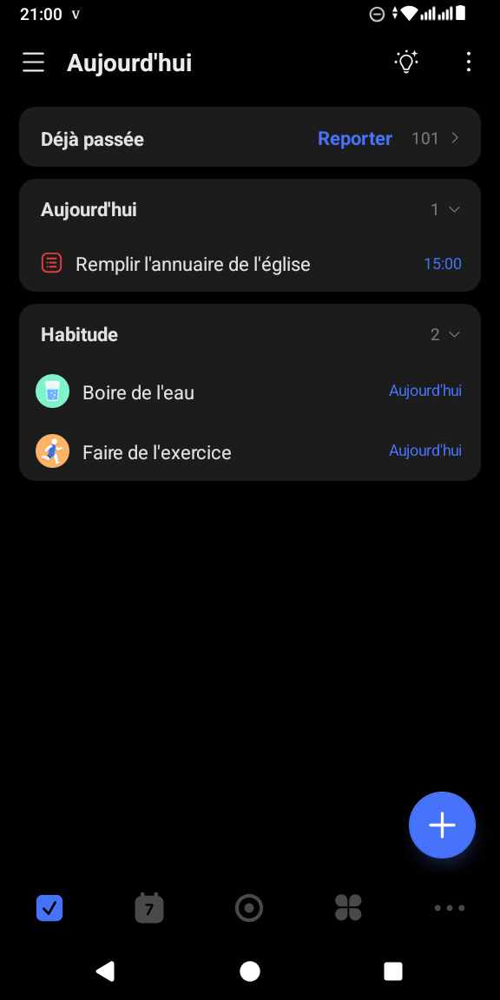
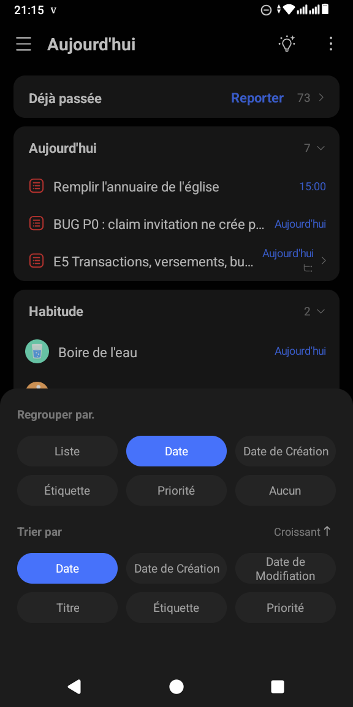
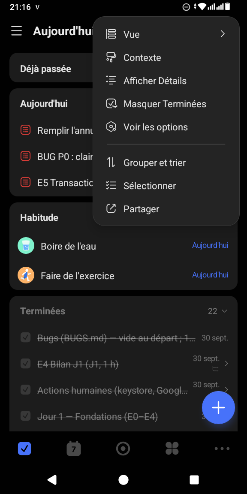

### PRD-TASK-02 · Saisie rapide (feuille basse)

**Captures de référence :** #58, #64, #122

- **Objectif :** Créer une tâche en quelques secondes depuis n'importe quelle liste.
- **Composition UI :**
  - Feuille ancrée au clavier ; champ « Que voulez-vous faire ? »
  - Rangée d'actions : puce de date (« Aujourd'hui »), drapeau priorité, étiquette, liste, « … » (plus), micro (dictée), bouton valider vert-turquoise
  - Menu « … » : Image, Modèle, Convertir en Note, Écran complet, Paramètres
  - Dans la matrice : menu supplémentaire Date, Priorité, Étiquette, Liste, Image, Modèle, Convertir en Note, Écran complet
- **États :**
  - Titre vide : bouton valider désactivé
  - Quadrant présélectionné quand ouverte depuis la matrice (puce rouge « Urgent et important »)
- **Interactions :**
  - Tap puce date : PRD-TASK-04
  - Tap drapeau : choisit priorité
  - Tap micro : dictée vocale
  - Écran complet : ouvre PRD-TASK-08
  - Valider : crée la tâche et garde la feuille ouverte pour enchaîner
- **Règles métier :**
  - Valeurs par défaut issues de PRD-SET-10
  - Reconnaissance du texte : « demain 15h » pré-remplit la date si option activée (PRD-SET-09)
- **Critères d'acceptation :**
  - Création < 3 s
  - Champ garde le focus après création
  - Aucun doublon si double tap

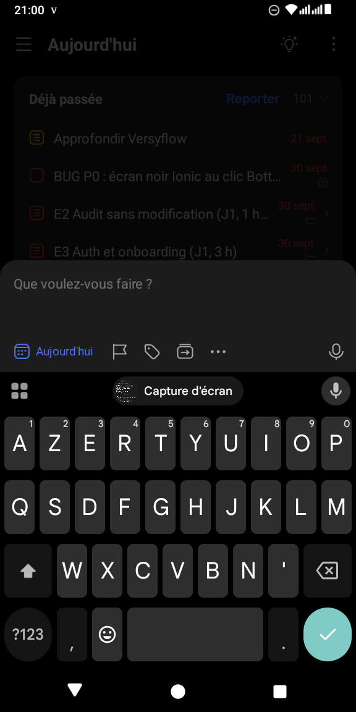
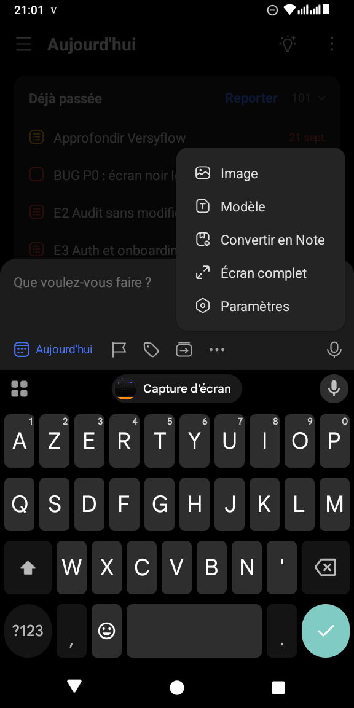
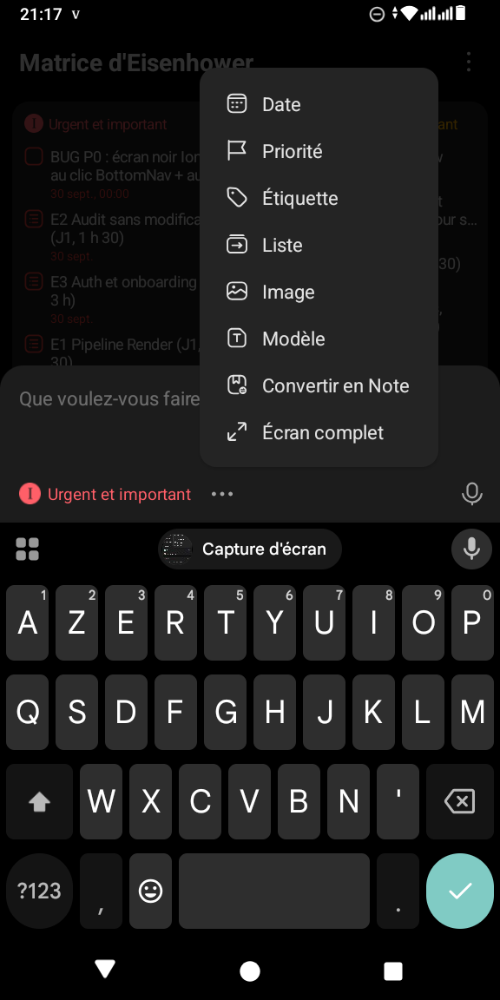

### PRD-TASK-03 · Détail de tâche (dialogue / page)

**Captures de référence :** #57, #38

- **Objectif :** Lire et modifier tous les champs d'une tâche.
- **Composition UI :**
  - En-tête : liste d'origine (menu déroulant), drapeau priorité, menu ⋮
  - Case + date/échéance en rouge si retard
  - Titre gras 20 sp ; description multiligne (texte riche, liens, puces)
  - Barre du bas : étiquette, sous-tâches, pièce jointe
  - Fil d'activité/commentaires avec avatar et compteur
- **États :**
  - Mode Dialogue (carte flottante) ou Page plein écran selon réglage
  - Hors ligne : modifications mises en file
- **Interactions :**
  - Tap date : PRD-TASK-04
  - Édition inline sauvegardée automatiquement
  - Fermeture par balayage bas ou tap hors carte
- **Règles métier :**
  - Style Page / Dialogue réglable dans Général > Page de détail
  - Fichiers joints soumis au réglage données mobiles
- **Critères d'acceptation :**
  - Aucune perte de saisie à la rotation ou mise en arrière-plan
  - Sauvegarde automatique visible < 1 s

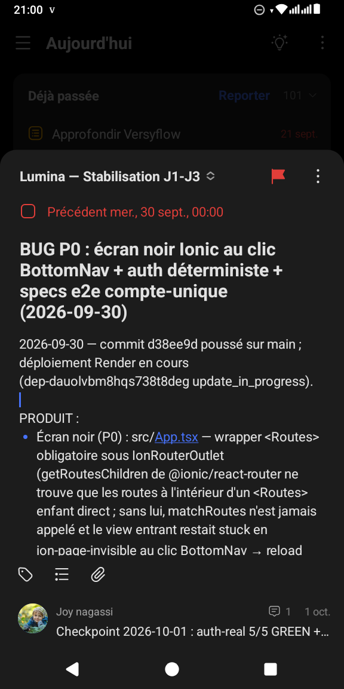
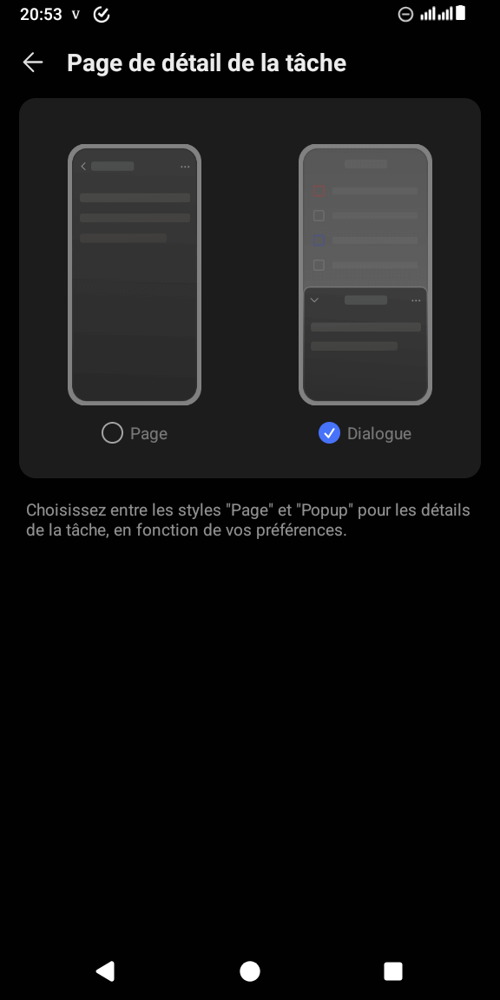

### PRD-TASK-04 · Sélecteur Date et Durée

**Captures de référence :** #59, #60, #61, #62, #63

- **Objectif :** Planifier date, heure, durée, rappel et récurrence.
- **Composition UI :**
  - Onglets « Date » et « Durée », boutons ✕ et ✓
  - Calendrier mensuel (lun-dim, semaines numérotées), jour sélectionné bleu
  - Lignes : Heure, Rappel, Récurrence (valeur « Aucun » + chevron)
  - Bouton rouge « Effacer »
  - Dialogue Heure : cadran analogique 24 h ou molettes (bascule clavier/horloge), fuseau (ex. Porto-Novo GMT+1), Annuler/OK
  - Dialogue Rappel : Aucun, À l'heure, 5 min, 30 min, 1 h, 1 jour en avance, Personnalisé, « Rappel constant » (Premium)
  - Onglet Durée : cartes Date et Heure (« 22:00 - 23:00, Durée : 1 heure »), interrupteur « Journée entière », bouton orange Premium
- **États :**
  - Durée verrouillée Premium : aperçu visible + bouton orange
  - Fuseau horaire modifiable seulement si l'option est activée
- **Interactions :**
  - Tap jour : sélection
  - Tap ✓ : applique et ferme
  - Rappel constant : ouvre upsell si gratuit
- **Règles métier :**
  - Rappel par défaut : « À l'heure »
  - Heure de fin > heure de début
- **Critères d'acceptation :**
  - Rappel déclenché à l'heure exacte (tolérance 1 min)
  - Fuseau respecté lors d'un changement de pays

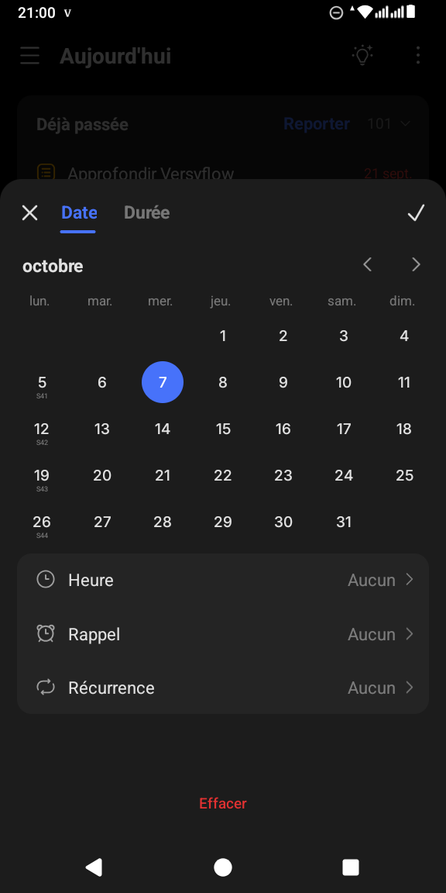
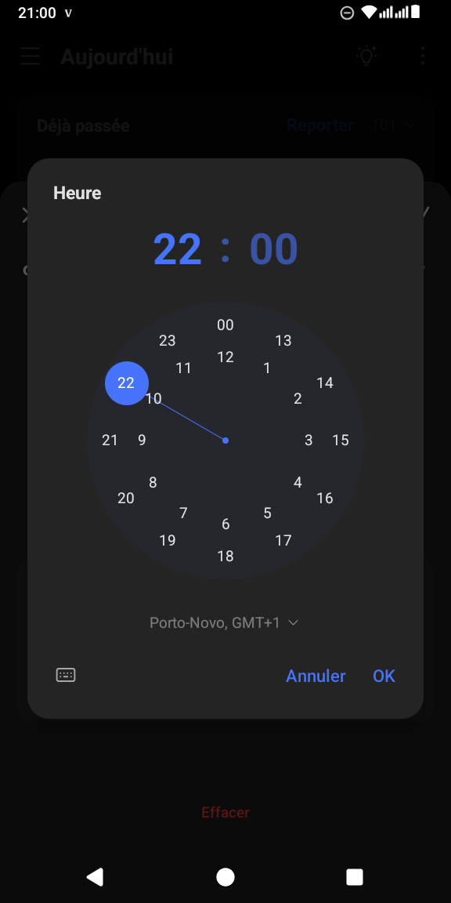
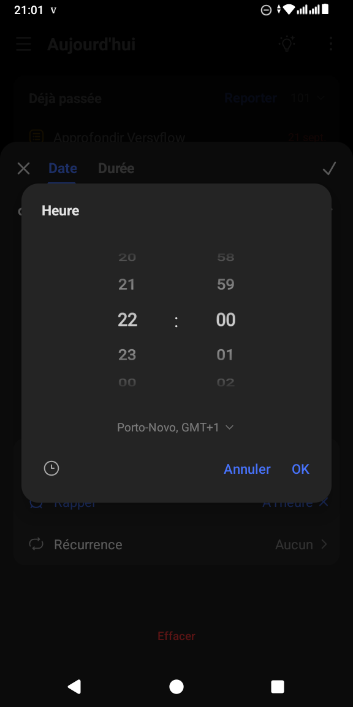
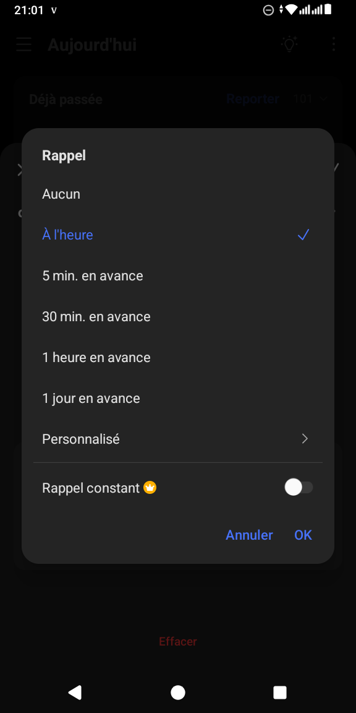
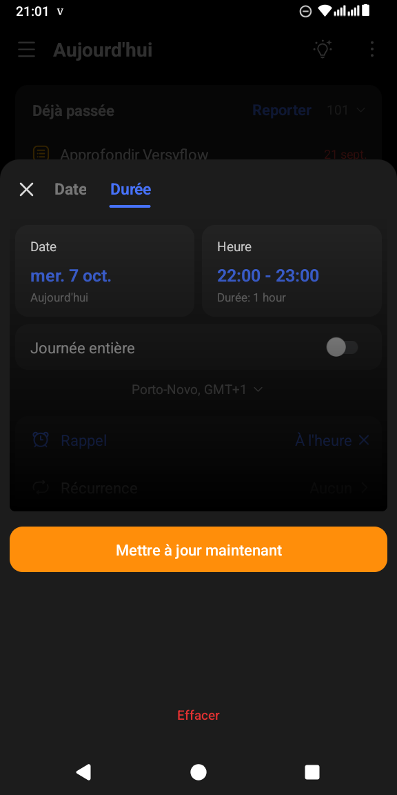

### PRD-TASK-05 · Panneau « Organisation de tâche »

**Captures de référence :** #75, #76

- **Objectif :** Parcourir toutes les tâches regroupées par liste, étiquette ou priorité depuis un panneau latéral.
- **Composition UI :**
  - Panneau droit sur fond sombre : titre, onglets Liste / Étiquette / Priorité
  - Groupes repliables ; pastilles de tâche bleues, sous-tâches indentées
  - Bouton bas « Filtrer les Listes »
- **États :**
  - Groupe vide masqué
  - Défilement vertical long
- **Interactions :**
  - Tap tâche : ouvre détail
  - Tap titre de groupe : replier/déplier
  - Tap hors panneau : ferme
- **Règles métier :**
  - Priorités affichées Haute, Moyenne, Aucune
- **Critères d'acceptation :**
  - Le regroupement change sans rechargement

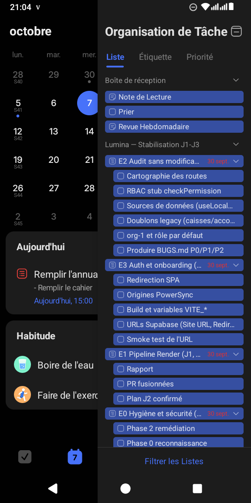
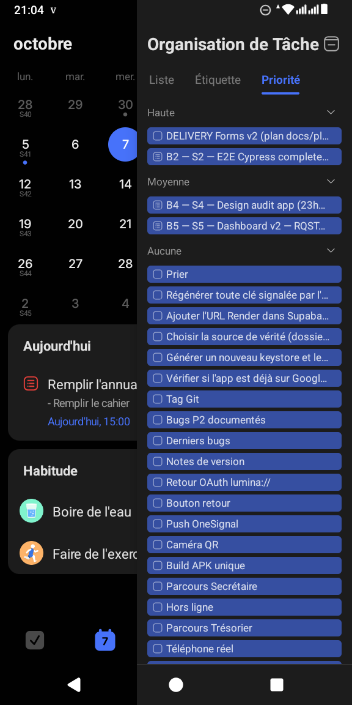

### PRD-TASK-06 · Tâches suggérées et bilan IA

**Captures de référence :** #118, #119, #116, #117

- **Objectif :** Aider à reprendre les tâches négligées et faire un bilan matinal.
- **Composition UI :**
  - « Tâches suggérées » : carte « Longtemps en retard », lignes avec « Créé il y a N jours » et bouton « + » bleu
  - Bilan : « Bonjour ! », cartes plein écran défilantes (n/29) avec tâche, barre d'actions Terminé / Aujourd'hui / Plus tard / Ne fera pas / Supprimer
  - IA : écran de chat avec suggestions (« Quelles sont les tâches à accomplir ? », « Créer une tâche », « En résumé, aujourd'hui… », « Planification des activités »), champ « Enregistrez vos idées ou vos plans… », bandeau Premium
  - Historique de conversation vide : « Aucune conversation historique pour l'instant », bouton « Nouvelle conversation »
- **États :**
  - IA verrouillée en gratuit (bandeau orange)
  - Bilan terminé : carte de félicitations
- **Interactions :**
  - Tap « + » : ajoute à Aujourd'hui
  - Swipe carte : suivante
  - Envoyer message : appel IA avec contexte des tâches
- **Règles métier :**
  - IA : réponses sourcées sur les données de l'utilisateur uniquement
  - Aucune action destructive sans confirmation
- **Critères d'acceptation :**
  - Chaque action du bilan met à jour la tâche immédiatement
  - Erreur réseau : message + bouton réessayer

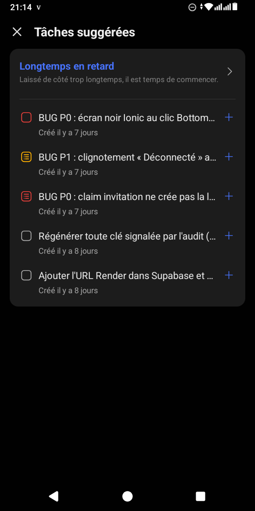
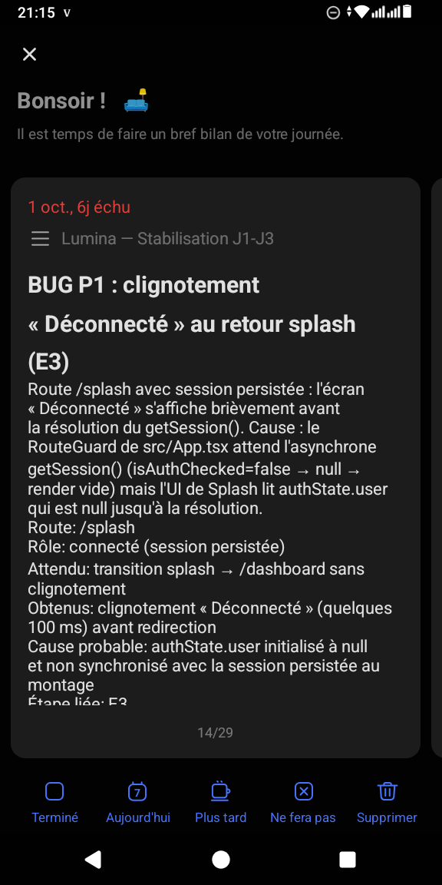

### PRD-TASK-07 · Menus Vue, Groupe et tri, Organisation

**Captures de référence :** #120, #121

- **Objectif :** Personnaliser l'affichage de la liste.
- **Composition UI :**
  - Menu ⋮ : Vue (sous-menu), Contexte, Afficher Détails, Masquer Terminées, Voir les options, Grouper et trier, Sélectionner, Partager
  - Feuille « Grouper et trier » : Regrouper par (Liste, Date, Date de Création, Étiquette, Priorité, Aucun) ; Trier par (Date, Date de Création, Date de Modification, Titre, Étiquette, Priorité) ; ordre Croissant / Décroissant
- **États :**
  - Option active : puce bleue pleine
- **Interactions :**
  - Tap puce : applique immédiatement
  - Tap « Croissant » : inverse
- **Règles métier :**
  - Préférence mémorisée par liste
- **Critères d'acceptation :**
  - Le tri/groupement persiste après redémarrage

### PRD-TASK-08 · Saisie plein écran

**Captures de référence :** #65

- **Objectif :** Rédiger une tâche ou note longue.
- **Composition UI :**
  - AppBar : retour, liste (« Boîte de réception »), drapeau, ⋮
  - Case + date bleue
  - Zone de texte « Que voulez-vous faire ? »
  - Barre basse : étiquette, sous-tâches (liste), pièce jointe, réduire
- **États :**
  - Brouillon conservé si retour
- **Interactions :**
  - Retour : sauvegarde le brouillon
  - Réduire : retourne à la feuille rapide
- **Règles métier :**
  - Titre = première ligne
- **Critères d'acceptation :**
  - Rien n'est perdu sur appel entrant ou mise en arrière-plan

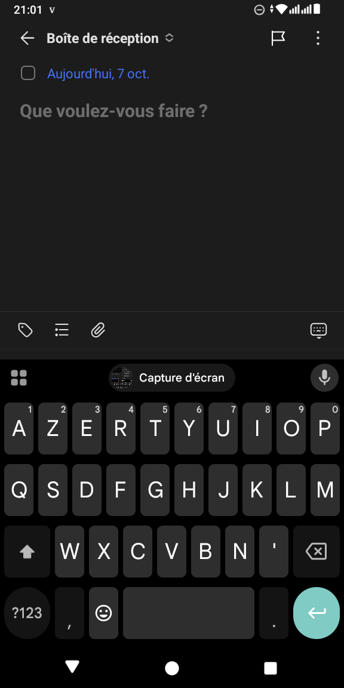

## 4.2 Calendrier

### PRD-CAL-01 · Calendrier : vue Liste

**Captures de référence :** #7, #66, #67

- **Objectif :** Mois compact + liste des événements/tâches du jour sélectionné.
- **Composition UI :**
  - En-tête : mois (« octobre »), icônes vue liste / vue calendrier, menu ⋮
  - Grille lun-dim ; jours hors mois en gris ; points sous les jours ayant des éléments ; numéro de semaine (S41…) ; jour courant en pastille bleue
  - Sous la grille : carte « Aujourd'hui » (tâche + liste d'origine + heure) et carte « Habitude »
  - Variante chronologie : date à gauche, ligne verticale, cartes sombres (heure, titre, sous-titre)
  - FAB, barre d'onglets (calendrier actif)
- **États :**
  - Jour sans élément : message vide
  - Semaine paire/impaire : numéros affichables (réglage)
- **Interactions :**
  - Tap jour : sélectionne
  - Tap carte : détail
  - Tap FAB : saisie rapide pré-datée
- **Règles métier :**
  - 1er jour de semaine configurable (lundi par défaut)
- **Critères d'acceptation :**
  - Points visibles pour tout jour ayant au moins un élément

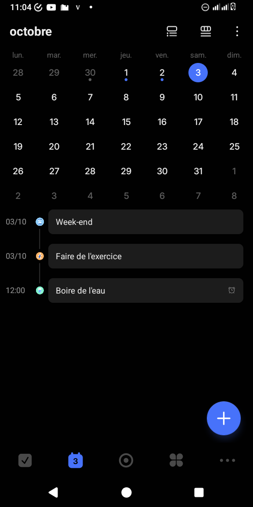
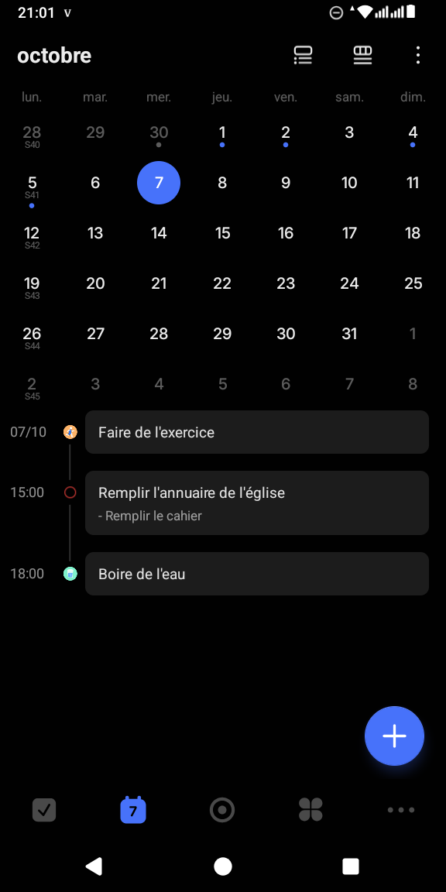
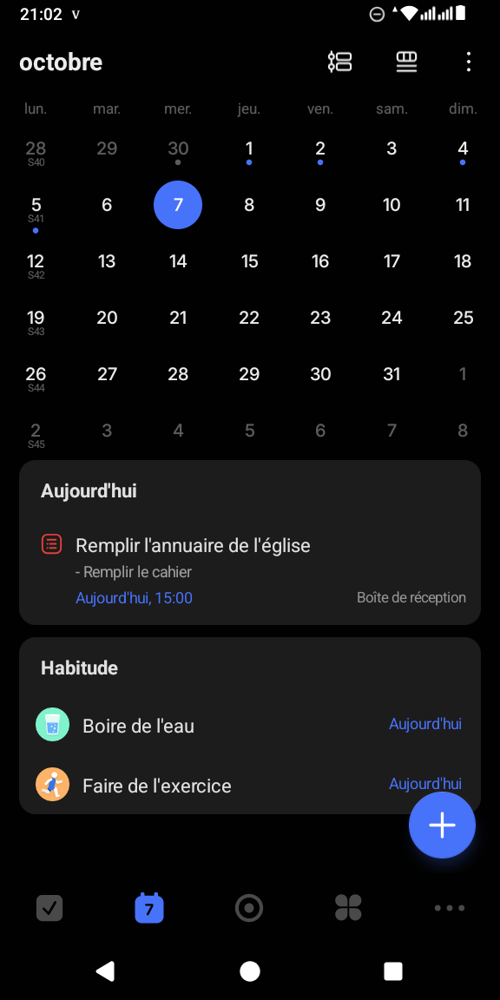

### PRD-CAL-02 · Sélecteur de vue (menu)

**Captures de référence :** #8, #68, #69

- **Objectif :** Changer entre Liste, Année, Mois, Semaine, 3 Jours, Jour.
- **Composition UI :**
  - Popover en haut à droite avec 6 entrées icône + libellé, coche bleue sur la vue active
- **États :**
  - Vues Mois, Semaine, 3 Jours, Jour : badge Premium en version gratuite
- **Interactions :**
  - Tap : change la vue ; vue verrouillée : ouvre PRD-CAL-04
- **Règles métier :**
  - Vue Année : 12 mini-mois en grille 3×4, jours avec éléments surlignés bleu nuit
- **Critères d'acceptation :**
  - Dernière vue utilisée restaurée à la réouverture

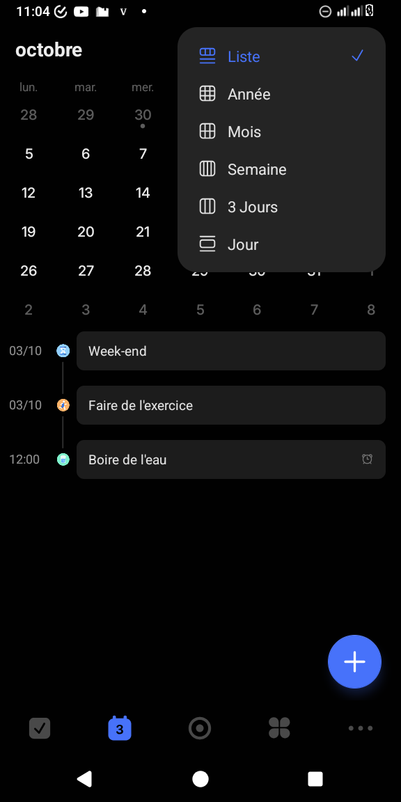
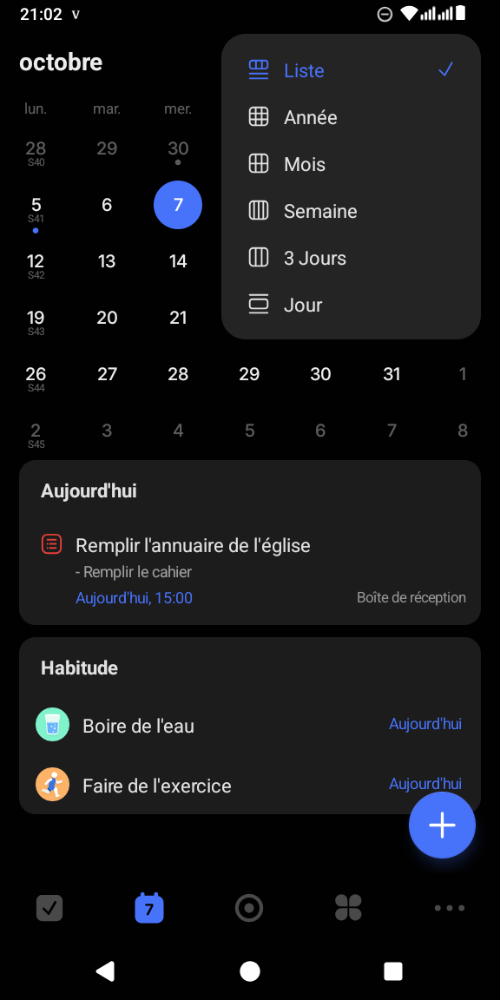
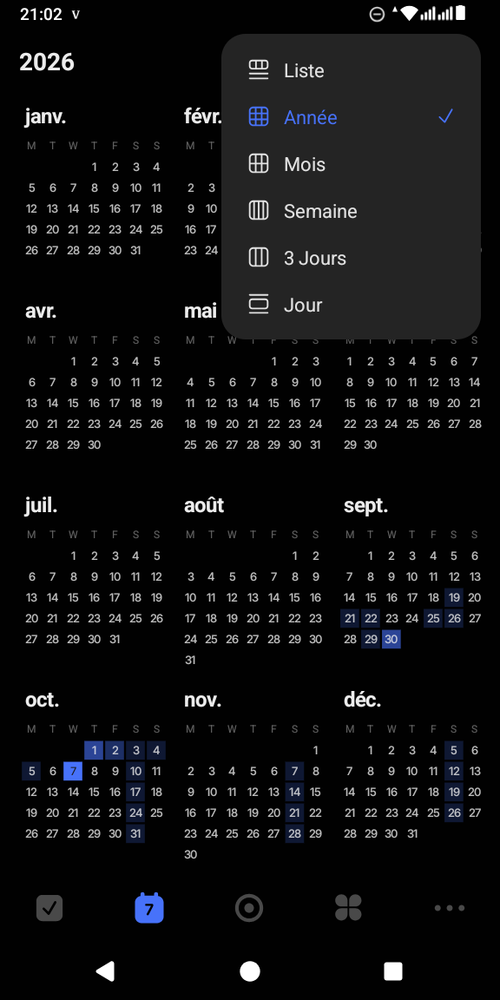

### PRD-CAL-03 · Calendrier : vue Année

**Captures de référence :** #9, #69

- **Objectif :** Vue d'ensemble annuelle.
- **Composition UI :**
  - Titre « 2026 », icône bascule, 12 mini-mois avec en-têtes M T W T F S S
  - Jours avec éléments en cases bleu foncé, aujourd'hui en bleu clair
- **États :**
  - Vide : mois sans surbrillance
- **Interactions :**
  - Tap un mois : bascule en vue Mois du mois choisi
- **Règles métier :**
  - Largeur 3 colonnes, 4 lignes
- **Critères d'acceptation :**
  - Tous les mois visibles sans défilement horizontal

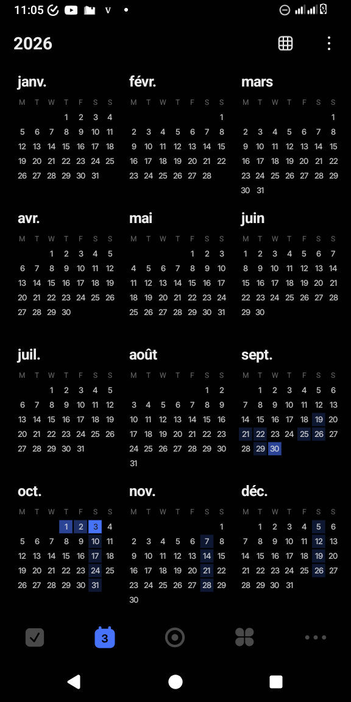

### PRD-CAL-04 · Aperçus Premium des vues

**Captures de référence :** #70, #71, #72, #73, #74

- **Objectif :** Montrer la valeur des vues Mois / Semaine / 3 jours / Jour avant l'achat.
- **Composition UI :**
  - Maquette de téléphone avec capture animée
  - Titre (« Vue mensuelle », « Vue Hebdomadaire », « Vue à 3 jours », « Vue journalière »)
  - Paragraphe explicatif
  - Bouton orange « Mettre à jour maintenant »
- **États :**
  - Défilement si texte long
- **Interactions :**
  - Bouton : ouvre l'écran d'abonnement
  - Retour : revient à la vue Liste
- **Règles métier :**
  - Une seule page d'aperçu par vue
- **Critères d'acceptation :**
  - Texte et illustration originaux, jamais ceux de la référence

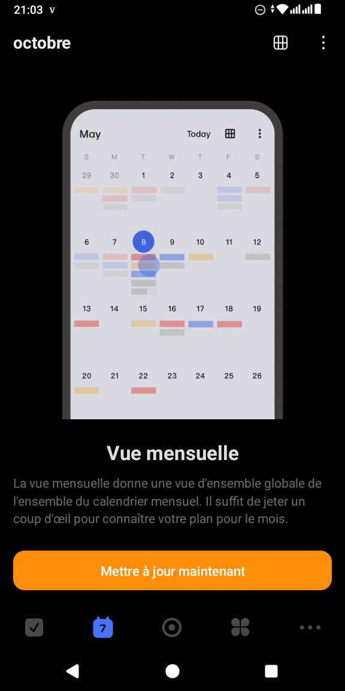
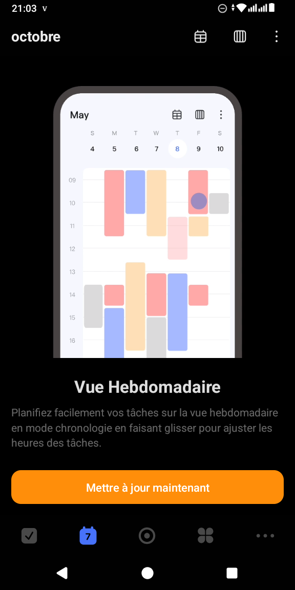
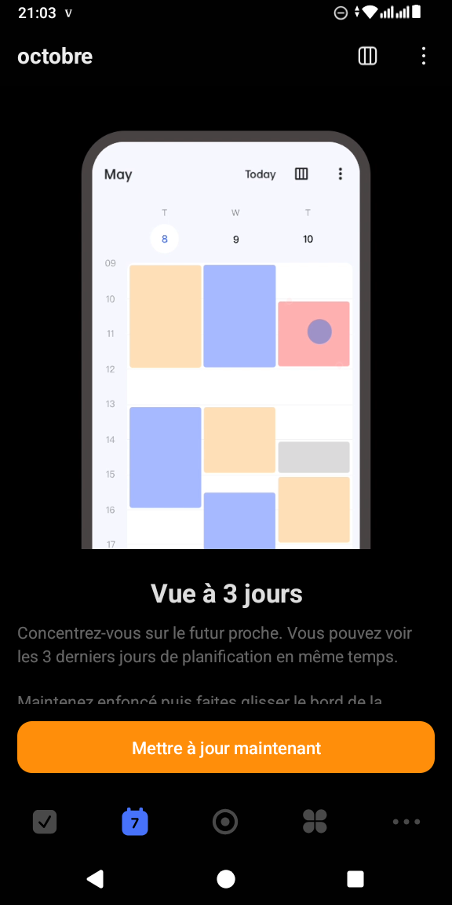
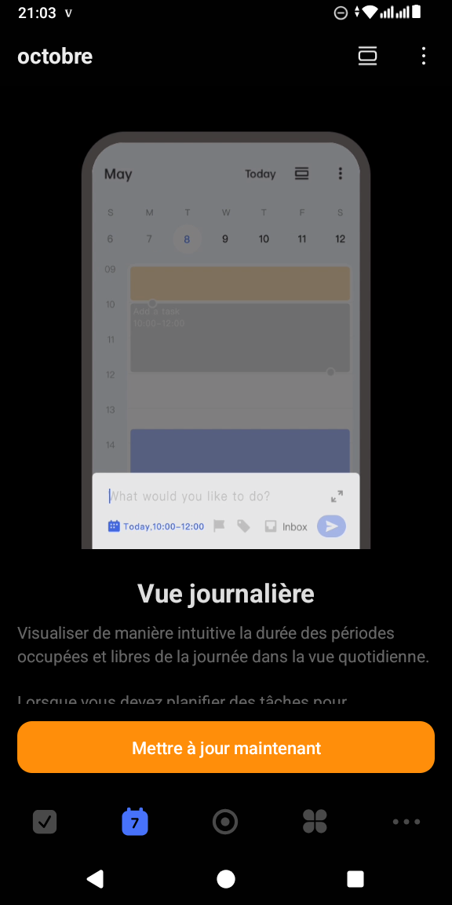
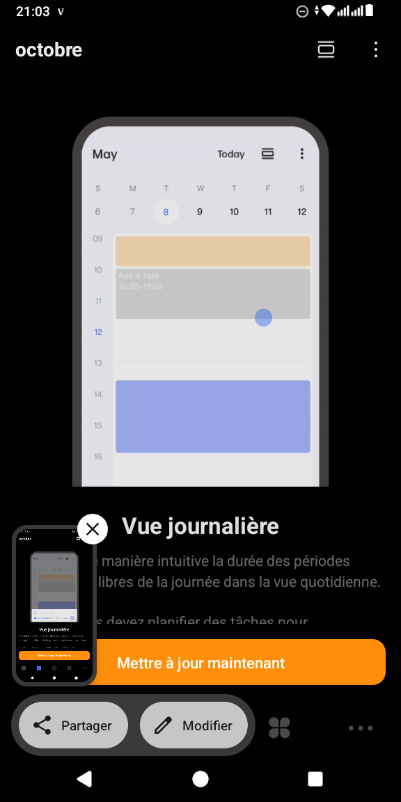

## 4.3 Focus (Pomodoro et chronomètre)

### PRD-FOC-01 · Minuteur Pomodoro et Chronomètre

**Captures de référence :** #77, #78, #79, #80

- **Objectif :** Se concentrer sur une tâche avec minuteur 25 min ou chronomètre libre.
- **Composition UI :**
  - Chevron fermer, onglets « Pomo » / « Chronomètre »
  - Lien « Restez concentré > » (ou nom de tâche) pour lier une tâche
  - Grand cercle gradué avec temps (25:00 ou 00:00)
  - Bouton bleu large « Début »
  - Feuille « Choisir » : onglets Tâche / Minuteur / Habitude, recherche, sections Déjà passée / Aujourd'hui / Habitude
  - Dialogue sous-tâches : cases, « Tâche supplémentaire », Annuler / Terminé
- **États :**
  - Prêt, En cours (anneau se vide), En pause, Terminé (cloche + vibration)
- **Interactions :**
  - Début : démarre ; Pause/Reprendre
  - Changer de tâche : ouvre la feuille de choix
  - Terminé : enregistre la session
- **Règles métier :**
  - Durée Pomo par défaut 25 min (réglable)
  - Session enregistrée avec tâche et durée réelle
- **Critères d'acceptation :**
  - Le minuteur continue écran verrouillé (service premier plan)
  - Notification de fin

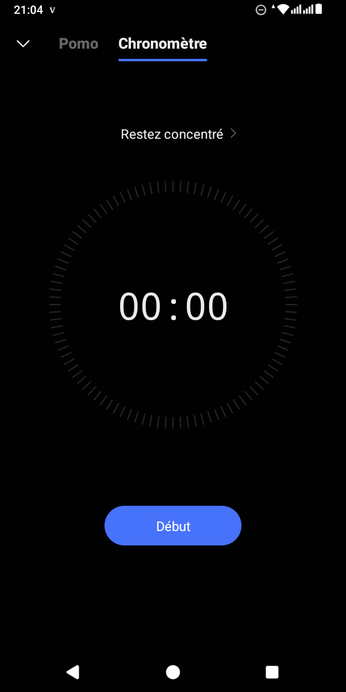
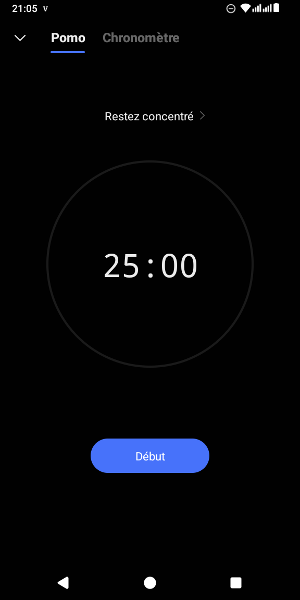
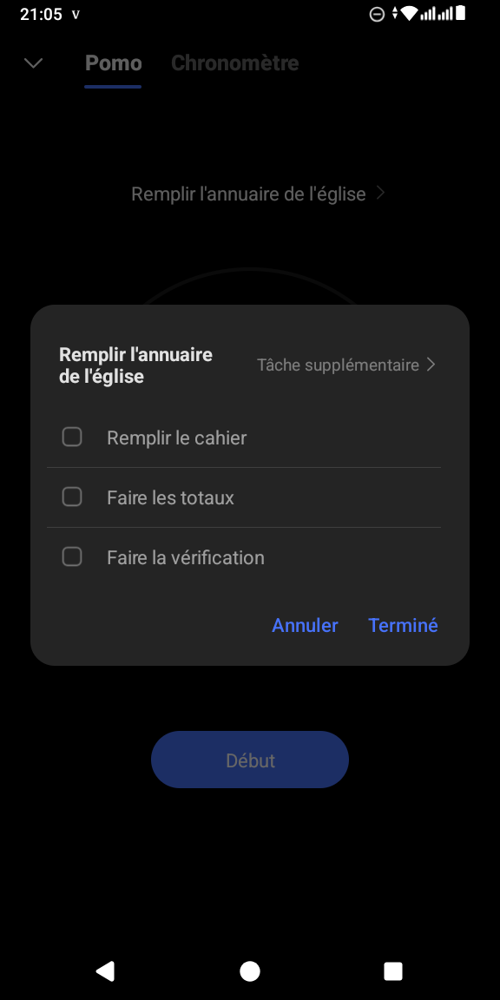
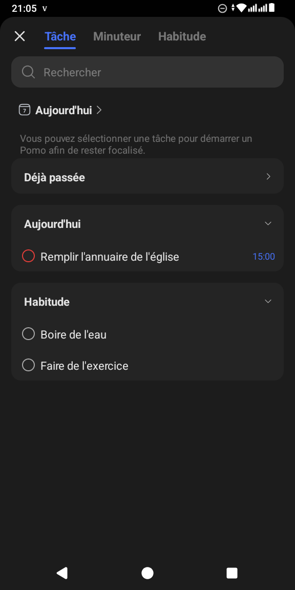

### PRD-FOC-02 · Statistiques de Focus

**Captures de référence :** #81, #82, #83

- **Objectif :** Mesurer sa concentration.
- **Composition UI :**
  - Cartes : Pomo d'aujourd'hui, Focus d'aujourd'hui, Pomo Total, Durée de Focus Total
  - Enregistrement de la concentration (+)
  - Détails : Jour / Semaine / Mois / Personnalisé, anneau « Aucune donnée », classement de concentration (Liste)
  - Tendances (Semaine/Mois/Année), Chronologie, Temps de concentration optimal, Grilles annuelles (Premium, avec données d'exemple signalées en orange)
- **États :**
  - Aucune donnée : texte central
  - Premium : données d'exemple + couronne
  - Erreur réseau : toast
- **Interactions :**
  - Flèches < > changent la période
  - Icône partage en haut à droite
- **Règles métier :**
  - Ne jamais afficher de données d'exemple comme réelles : bandeau « Données d'exemple »
- **Critères d'acceptation :**
  - Totaux = somme des sessions
  - Périodes correctes selon le fuseau

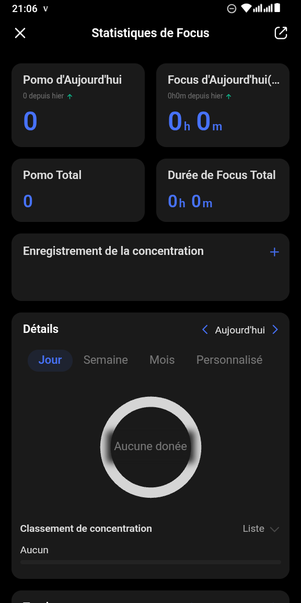
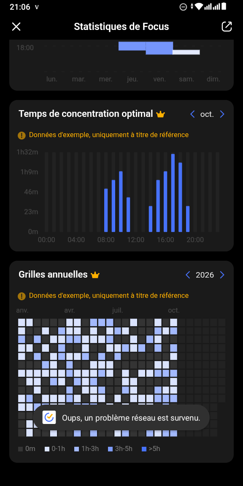
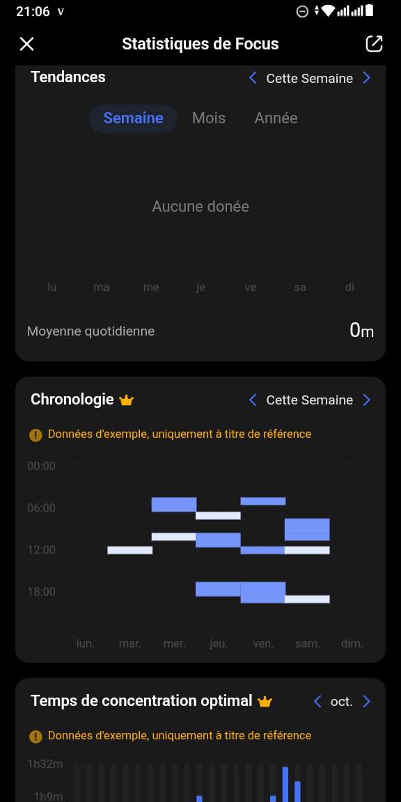

### PRD-FOC-03 · Ajouter une minuterie

**Captures de référence :** #84, #85

- **Objectif :** Créer un minuteur nommé avec icône.
- **Composition UI :**
  - Champ Nom, grille d'icônes colorées (≈40) + lettre, mode Pomo (avec minutes) ou Chronomètre, ✓
- **États :**
  - Nom vide : ✓ désactivé
- **Interactions :**
  - Choix mode : radio
- **Règles métier :**
  - Minutes 1-180
- **Critères d'acceptation :**
  - Minuterie apparaît dans l'onglet Minuteur

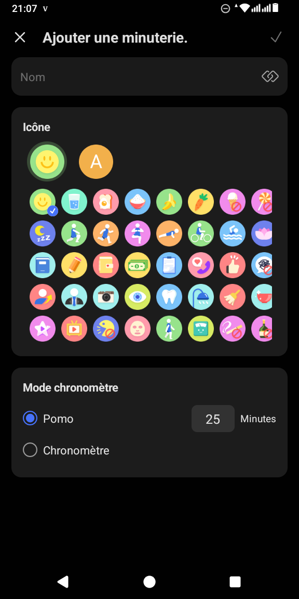
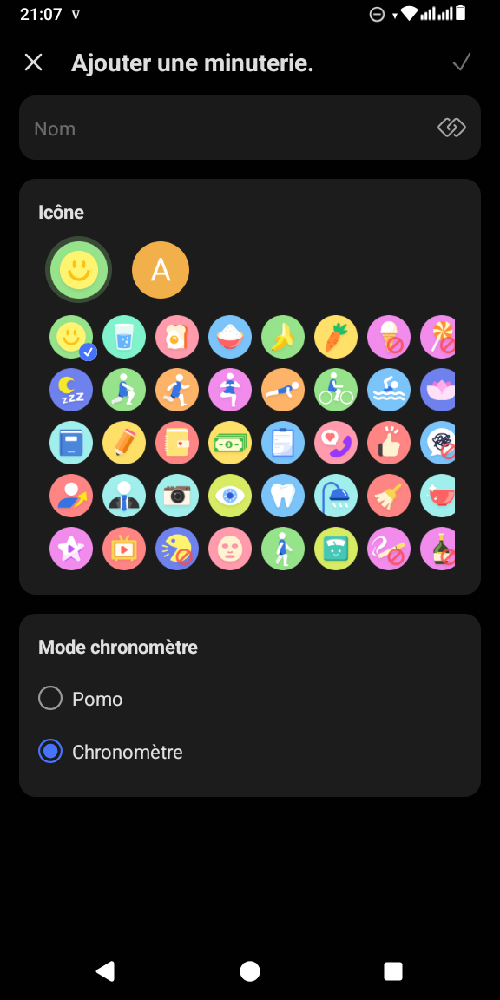

## 4.4 Matrice d'Eisenhower

### PRD-EIS-01 · Matrice d'Eisenhower

**Captures de référence :** #86, #33, #35

- **Objectif :** Prioriser par urgence et importance.
- **Composition UI :**
  - AppBar : titre, ⋮
  - Grille 2×2 de cartes : I Urgent et important (rouge), II Non urgent mais important (orange), III Urgent mais non important (bleu), IV Pas urgent et non important (vert)
  - Chaque carte : liste de tâches tronquées, dates en rouge
  - FAB « + »
- **États :**
  - Quadrant vide : texte discret
  - Défilement interne par quadrant
- **Interactions :**
  - Tap tâche : détail
  - Glisser une tâche vers un autre quadrant : change priorité
  - FAB : saisie rapide avec quadrant présélectionné
- **Règles métier :**
  - Quadrant dérivé de priorité + date d'échéance
- **Critères d'acceptation :**
  - Déplacement persisté < 500 ms

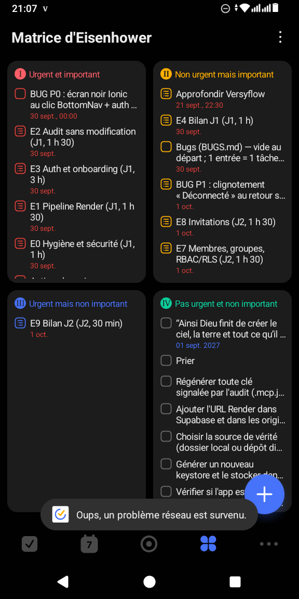
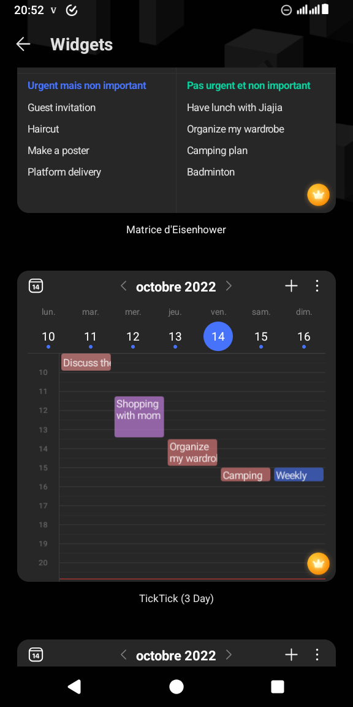
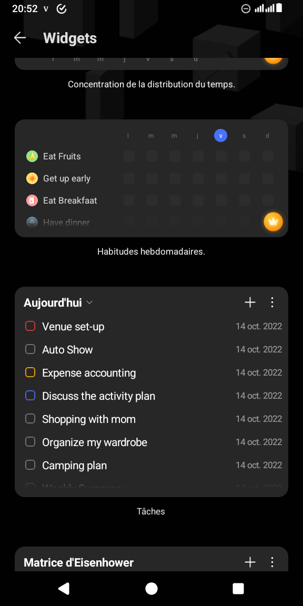

## 4.5 Habitudes

### PRD-HAB-01 · Habitudes : jour

**Captures de référence :** #87, #88, #89, #90

- **Objectif :** Cocher les habitudes du jour et voir l'historique.
- **Composition UI :**
  - Bandeau jours (jeu-mer) avec jour actif en bleu, icônes horloge / liste / réglages
  - Section « Autres » : habitude (icône, nom, progression « 0 / 3 Tasse », « Total du Jour »)
  - Vues Semaine / Mois / Record : grille de cases par jour, historique par date avec statut Coché / Non Coché / 1/3 Tasse
  - Mois : mini-grilles par habitude (Premium, données d'exemple)
- **États :**
  - Aucune habitude : état vide + FAB
  - Mois : bandeau « Premium only, sample data »
- **Interactions :**
  - Tap cercle : coche/progresse
  - Tap habitude : détail/stat
  - FAB : nouvelle habitude (galerie)
- **Règles métier :**
  - Habitude numérique : objectif quotidien (ex. 3 tasses)
- **Critères d'acceptation :**
  - Cocher met à jour série et stats immédiatement

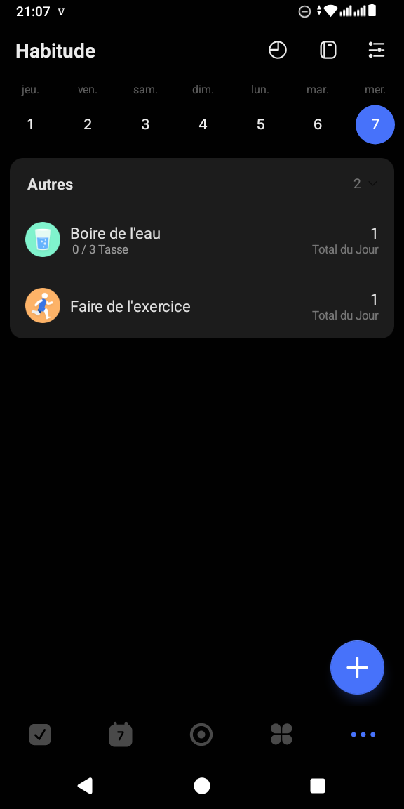
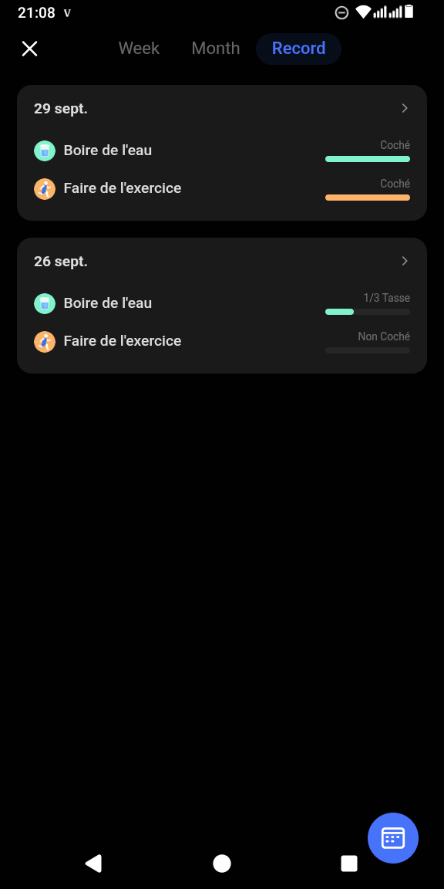
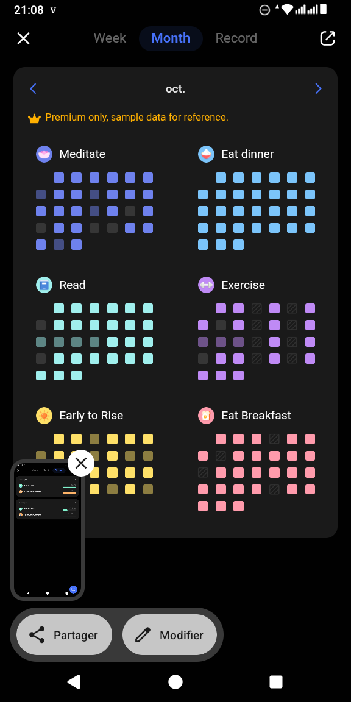
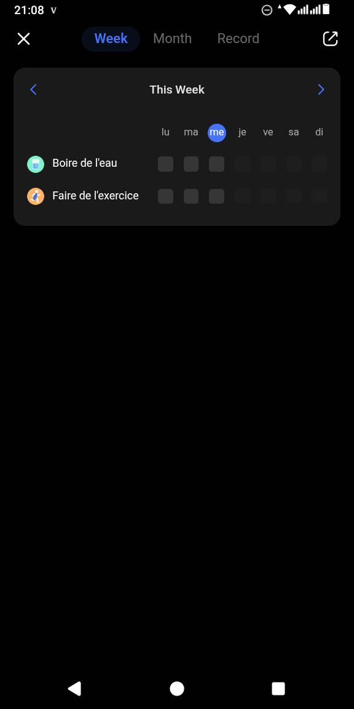

### PRD-HAB-02 · Gestion : Actif / Archivé

**Captures de référence :** #91, #92

- **Objectif :** Lister et archiver les habitudes.
- **Composition UI :**
  - Onglets Actif / Archivé
  - Lignes avec total du jour
  - État vide archivé : illustration + « Aucune habitude archivée disponible »
  - FAB
- **États :**
  - Archivé vide
- **Interactions :**
  - Appui long : archiver / restaurer / supprimer
- **Règles métier :**
  - Archiver conserve l'historique
- **Critères d'acceptation :**
  - Restauration remet la série d'origine

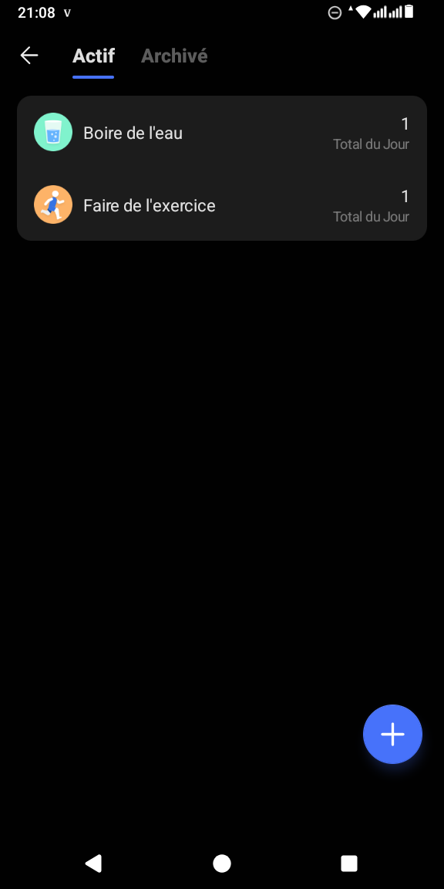
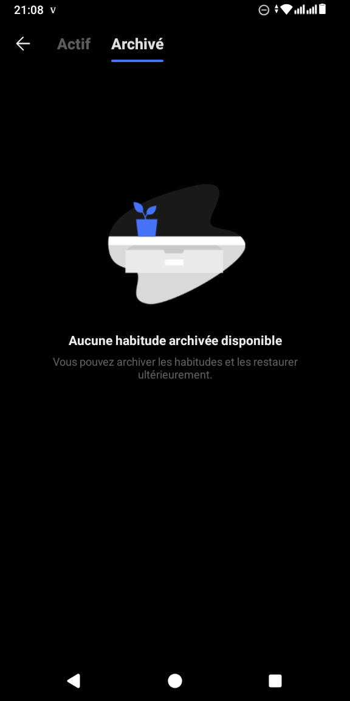

### PRD-HAB-03 · Galerie d'habitudes

**Captures de référence :** #97-#108

- **Objectif :** Proposer des habitudes prêtes à ajouter.
- **Composition UI :**
  - Onglets : proposé, Vie, Santé, Sports, État d'esprit
  - Lignes : icône colorée, titre gras, citation grise, bouton « + »
  - Bouton bas « Créer une nouvelle habitude »
  - Catalogue (≈70 modèles) : Santé (eau, petit déjeuner, dîner, fruits, légumes, médicaments, dents, douche, peau, tabac, alcool…), Vie (journal, lecture, écriture, économies, instrument, musique, film, plantes, animaux…), Sports (étirements, course, yoga, pompes, vélo, natation…), État d'esprit (méditer, respirer, introspection, positivité, « je t'aime »…)
- **États :**
  - Déjà ajoutée : « + » devient coche
- **Interactions :**
  - Tap « + » : ouvre création préremplie
  - Tap onglet : défilement vers la catégorie
- **Règles métier :**
  - Catalogue servi par un fichier JSON local (id, catégorie, nom, citation, icône) : textes et icônes originaux
- **Critères d'acceptation :**
  - Au moins 40 modèles à la sortie, localisables

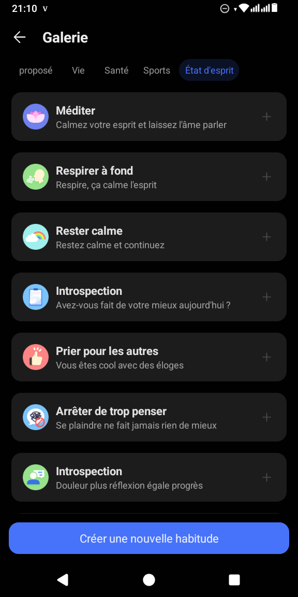
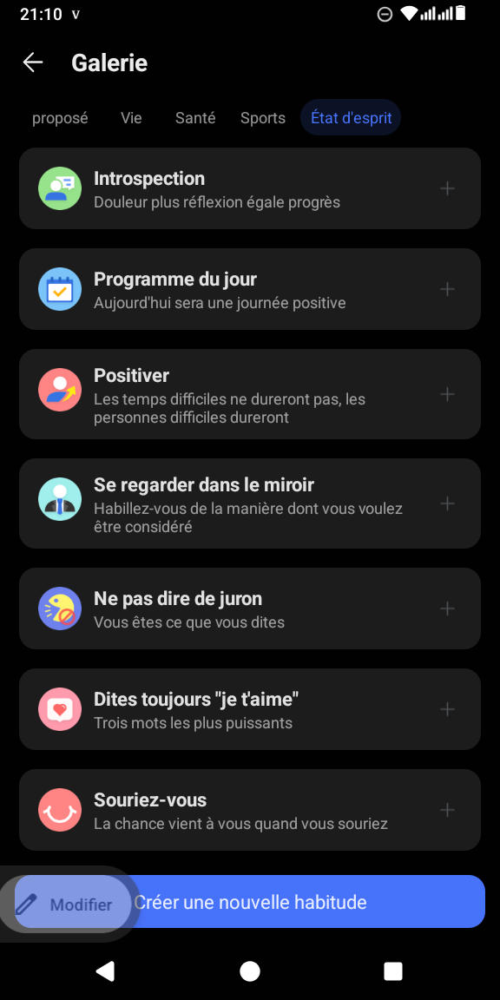


### PRD-HAB-04 · Nouvelle habitude (assistant 2 étapes)

**Captures de référence :** #93, #94, #95, #96

- **Objectif :** Créer une habitude.
- **Composition UI :**
  - Étape 1 : Nom, grille d'icônes + lettre, Citation (bouton rafraîchir), « Suivant »
  - Étape 2 : Fréquence (Quotidienne : puces L M M J V S D ; Hebdomadaire : molette « N jours par semaine » ; Répétition : « Tous les N jours »), Objectif (« Tout marquer comme terminé » ou valeur), Date de début, Jours de l'objectif (« Pour toujours »), Section (Autres/Détails/+), Rappel (07:00, + Ajouter), Rappel constant (Premium), bascule journal automatique
  - Bouton « Sauvegarder » fixé en bas
- **États :**
  - Nom requis
- **Interactions :**
  - Molettes verticales
  - Plusieurs rappels possibles
- **Règles métier :**
  - Jours sélectionnés ≥ 1
  - Date de début ≥ aujourd'hui par défaut
- **Critères d'acceptation :**
  - Habitude visible dans « Habitude » dès le jour de début


## 4.6 Compte à rebours

### PRD-CD-01 · Création et styles de compte à rebours

**Captures de référence :** #109-#115

- **Objectif :** Compter les jours jusqu'à une date (fête, anniversaire, date marquante).
- **Composition UI :**
  - Menu radial FAB : Fête, Anniversaire, Date anniversaire, Compte à rebours
  - Formulaire : titre, date, rappel (Le jour même 09:00, 1/2/3 jours avant, 1 semaine, Personnalisé, Rappel constant Premium)
  - Sélecteur de style : onglets Style / Couleur / Image, miniatures (calendrier papier clair, calendrier sombre, photo plein écran, polaroid, carte colorée) ; bouton « Sauvegarder »
  - Rendu : grand nombre de jours, titre, « Jours jusqu'à sam. 23/01/2027 », bouton « Recadrer » pour image
- **États :**
  - Styles Premium marqués couronne
  - Info-bulle « Appuyez sur la date pour changer de format »
- **Interactions :**
  - Tap date : alterne jours / semaines / format détaillé
  - Icônes bas : note, thème, partager
- **Règles métier :**
  - Jours = date cible - aujourd'hui (fuseau local)
- **Critères d'acceptation :**
  - Compteur correct à minuit local
  - Images utilisateur recadrables


## 4.7 Paramètres

### PRD-SET-01 · Paramètres (racine)

**Captures de référence :** #19, #20, #21

- **Objectif :** Point d'entrée de tous les réglages.
- **Composition UI :**
  - Carte profil : avatar, nom, badges (Lv.1, N badges), chevron
  - Bannière « Compte Premium » + bouton orange contouré « Mettre à jour maintenant »
  - Lignes : Barre d'onglets, Apparence, Date et heure, Sons & Notifications, Widgets, Fonctions d'IA, Général, Intégrations et Import, Recommandation à des amis, Aide et retour d'information, Suivez-nous, À propos
  - Bouton rouge « Se déconnecter »
- **États :**
  - Premium actif : bannière remplacée par statut
- **Interactions :**
  - Tap ligne : sous-écran
- **Règles métier :**
  - Déconnexion : confirmation
- **Critères d'acceptation :**
  - Tous les sous-écrans accessibles en 1 tap


### PRD-SET-02 · Barre d'onglets

**Captures de référence :** #22, #23, #24

- **Objectif :** Choisir et ordonner les onglets.
- **Composition UI :**
  - Liste Activés avec poignée de tri, bouton rouge « - » pour désactiver ; section Désactivé avec bouton vert « + »
  - Ligne « Nombre maximal d'onglets de navigation en bas de page » (valeur 5) ; dialogue molette 4 / 5 ; note « Les onglets dépassant la limite seront affichés dans Plus »
- **États :**
  - Onglet Tâche non désactivable (désactivé visuellement)
- **Interactions :**
  - Glisser-déposer pour réordonner
  - OK applique
- **Règles métier :**
  - Au moins 1 onglet actif
- **Critères d'acceptation :**
  - La barre se met à jour sans redémarrage


### PRD-SET-03 · Apparence : Thème / Icône / Affichage

**Captures de référence :** #25, #26, #27

- **Objectif :** Personnaliser le rendu.
- **Composition UI :**
  - Onglets Thème, Icône, Affichage
  - Thème : ligne « Utiliser le mode nuit du système », série de couleurs (Défaut, Teal, Turquoise, Phragmites, Lumière du soleil, Pêche, Lilas, Perle, Gravier, Sombre, Matériel Vous), Saisons et Villes (arrière-plans illustrés, Premium)
  - Affichage : nombre de barres latérales (Aujourd'hui / Toutes les tâches), Cacher la note, Couleur de la liste (afficher/masquer), Style de tâche terminée (Défaut / Barré) avec aperçus
- **États :**
  - Option choisie : coche bleue en coin
  - Premium : couronne
- **Interactions :**
  - Tap carte : applique en direct
- **Règles métier :**
  - Thème Sombre par défaut
- **Critères d'acceptation :**
  - Changement de thème sans redémarrage


### PRD-SET-04 · Date et heure

**Captures de référence :** #28, #29

- **Objectif :** Formats et calendriers.
- **Composition UI :**
  - Format de l'heure, Premier jour de la semaine, Autre calendrier (dialogue radio : Aucun, lunaires chinois/coréen/vietnamien, persan, Hijri civil/Koweït/Saoudien, Hébreu, Ère Shaka), Montrer les numéros de semaine (S), La semaine 1 est, Fuseau horaire (interrupteur + explication)
- **États :**
  - Options dépendantes grisées
- **Interactions :**
  - Radio avec Annuler
- **Règles métier :**
  - Fuseau activé = chaque tâche porte son fuseau
- **Critères d'acceptation :**
  - Calendrier alternatif affiché en plus du grégorien


### PRD-SET-05 · Sons & Notifications

**Captures de référence :** #30

- **Objectif :** Gérer rappels et sons.
- **Composition UI :**
  - Alerte quotidienne, Notification & barre d'état, Sonnerie de rappel, Vibration de rappel, Paramètres avancés, Notifications par email, Notifications de calendrier local, Son de complétude, Vibreur (interrupteur), « Rappels inactifs ? » (aide)
- **États :**
  - Rappels inactifs : lien vers aide batterie/permissions
- **Interactions :**
  - Tap sonnerie : sélecteur
- **Règles métier :**
  - Canal de notification dédié par type
- **Critères d'acceptation :**
  - Le son choisi est joué à la complétion


### PRD-SET-06 · Widgets

**Captures de référence :** #31-#36

- **Objectif :** Prévisualiser et ajouter des widgets Android.
- **Composition UI :**
  - Galerie verticale : Pomodoro (tomate + Début), Habitude du jour, Carte thermique des habitudes, Statistiques de complétion, Ajout rapide de tâche, Compte à rebours, Calendrier (semaine, 3 jours, mois), Tâches, Matrice d'Eisenhower, Habitudes hebdomadaires, Distribution du temps, Pomo
  - Légende sous chaque widget
- **États :**
  - Widgets Premium : couronne
- **Interactions :**
  - Tap : guide d'ajout à l'écran d'accueil
- **Règles métier :**
  - Widgets redimensionnables, thème clair/sombre
- **Critères d'acceptation :**
  - Mise à jour des données < 15 min


### PRD-SET-07 · Général

**Captures de référence :** #37

- **Objectif :** Réglages généraux.
- **Composition UI :**
  - Langue, Raccourcis, Page de détail de la tâche, Reconnaissance intelligente, Ajout rapide de tâche, Paramètres par défaut de la nouvelle tâche, Transférer/Télécharger des pièces jointes, Collaborer, Gérer le modèle, Verrouillage par schéma, Actions par glissé
- **États :**
  - (voir captures)
- **Interactions :**
  - Tap : sous-écrans PRD-SET-08 à 14
- **Règles métier :**
  - Verrouillage par schéma : demande code au lancement
- **Critères d'acceptation :**
  - Langue appliquée immédiatement


### PRD-SET-08 · Page de détail de la tâche

**Captures de référence :** #38

- **Objectif :** Choisir Page ou Dialogue.
- **Composition UI :**
  - Deux aperçus de téléphone avec radio Page / Dialogue + texte explicatif
- **États :**
  - Dialogue sélectionné par défaut
- **Interactions :**
  - Tap aperçu : sélectionne
- **Règles métier :**
  - (aucune)
- **Critères d'acceptation :**
  - Appliqué à la prochaine ouverture

### PRD-SET-09 · Ajout rapide de tâche

**Captures de référence :** #39

- **Objectif :** Réglages de saisie rapide.
- **Composition UI :**
  - Interrupteurs : Ajout rapide, Reconnaître les informations dans le presse-papiers, Barre d'état (ajout rapide + compteur), Couleur de police de la barre d'état, Affichage dans le Centre de Notifications, Quick Ball (écran d'accueil), Action de sélection de texte
- **États :**
  - (voir captures)
- **Interactions :**
  - Interrupteurs
- **Règles métier :**
  - Quick Ball nécessite la permission « Afficher par-dessus »
- **Critères d'acceptation :**
  - Permission demandée au premier activation


### PRD-SET-10 · Paramètres par défaut de la nouvelle tâche

**Captures de référence :** #40

- **Objectif :** Valeurs initiales d'une tâche.
- **Composition UI :**
  - Date par défaut, Rappel par défaut, Priorité par défaut, Étiquette par défaut, Liste par défaut (Boîte de réception), Ajout par défaut (en haut/bas), La section Échue s'affiche à, bouton « Réinitialiser par Défaut »
- **États :**
  - (voir captures)
- **Interactions :**
  - Tap ligne : sélecteur
- **Règles métier :**
  - S'applique aussi aux widgets et partages entrants
- **Critères d'acceptation :**
  - Réinitialiser restaure les valeurs d'usine


### PRD-SET-11 · Pièces jointes et Collaborer

**Captures de référence :** #41, #42

- **Objectif :** Données mobiles et partage.
- **Composition UI :**
  - Pièces jointes : transfert et téléchargement automatiques via données cellulaires (2 interrupteurs)
  - Collaborer : acceptation automatique des invitations de contacts connus ; notifications par défaut des listes partagées (Compléter/Annuler, Ajouter, Supprimer/Déplacer) + texte d'explication
- **États :**
  - (voir captures)
- **Interactions :**
  - Interrupteurs
- **Règles métier :**
  - Un réglage manuel par liste prime sur le défaut
- **Critères d'acceptation :**
  - Les préférences sont synchronisées


### PRD-SET-12 · Actions par glissé

**Captures de référence :** #45

- **Objectif :** Configurer les gestes de balayage.
- **Composition UI :**
  - Balayage Gauche : Gauche (Déplacer vers), Central (Supprimer), Droit (Date d'échéance) ; Balayage Droit : Gauche (Terminer la tâche), Droit (Épingler) ; bouton « Réinitialiser par Défaut »
- **États :**
  - (voir captures)
- **Interactions :**
  - Tap ligne : liste d'actions
- **Règles métier :**
  - Actions possibles : terminer, supprimer, déplacer, date, épingler, priorité
- **Critères d'acceptation :**
  - Geste immédiatement actif dans les listes


### PRD-SET-13 · Modèles de tâche et de note

**Captures de référence :** #43, #44

- **Objectif :** Gérer des modèles réutilisables.
- **Composition UI :**
  - Onglets Modèle de Tâche / Modèle de Note, icône aide
  - Cartes en grille : titre + aperçu de cases (A faire avant le travail, Choses à emporter pour voyager, Enregistrement quotidien, Note de réunion, Revue hebdomadaire, Note de lecture)
- **États :**
  - Vide : invitation à créer
- **Interactions :**
  - Tap : aperçu/édition
  - Insertion depuis le menu « … » de la saisie
- **Règles métier :**
  - Modèles fournis en original
- **Critères d'acceptation :**
  - Un modèle insère toutes ses cases


### PRD-SET-14 · Paramètres avancés

**Captures de référence :** #46

- **Objectif :** Permissions et confirmation de sortie.
- **Composition UI :**
  - Permission d'accès (autoriser/ne pas autoriser l'accès aux tâches par d'autres apps), Avertir avant de quitter (double retour)
- **États :**
  - (voir captures)
- **Interactions :**
  - Interrupteur
- **Règles métier :**
  - (aucune)
- **Critères d'acceptation :**
  - Double retour quitte seulement si activé


### PRD-SET-15 · Intégrations et Import

**Captures de référence :** #47, #48, #49

- **Objectif :** Connecter des services.
- **Composition UI :**
  - Calendrier, Notion ; Importer : Todoist, Microsoft To Do ; Intégration : Zapier, IFTTT, Telegram
  - Calendrier : Locaux, Google, Outlook, iCloud, CalDAV, Exchange, Jours fériés, URL (iCal .ics)
  - Notion : illustration, texte d'explication, bouton bleu « Ajouter une intégration », lien Guide
- **États :**
  - Non connecté / connecté
- **Interactions :**
  - OAuth du service
- **Règles métier :**
  - Synchronisation bidirectionnelle en phase 3
- **Critères d'acceptation :**
  - Déconnexion retire les données importées sur demande


### PRD-SET-16 · À propos

**Captures de référence :** #50

- **Objectif :** Informations légales.
- **Composition UI :**
  - Logo, version (8.2.2.0 dans la référence : à remplacer par la version réelle), Site officiel, Noter l'application, réseaux sociaux, blog, Conditions d'utilisation, Vie privée, Licences, Remerciements
- **États :**
  - (voir captures)
- **Interactions :**
  - Liens externes
- **Règles métier :**
  - (aucune)
- **Critères d'acceptation :**
  - Liens fonctionnels


## 4.8 Profil et compte

### PRD-PRO-01 · Profil, réussite et statistiques

**Captures de référence :** #51, #52, #53, #54

- **Objectif :** Valoriser la progression.
- **Composition UI :**
  - Avatar, nom, bouton « Mettre à niveau au Premium »
  - Ma Médaille (5) : écussons numérotés
  - Mon Score d'Archivement (courbe, Score de réussite, Niveau Lv.1 « Débutant »)
  - Statistiques des Tâches (complétion totale), Statistiques de Focus, Statut d'Habitude Hebdomadaire (7 cercles)
  - Menu ⋮ : Compte, Se déconnecter
- **États :**
  - Aucune donnée
  - Gratuit : mise à niveau visible
- **Interactions :**
  - Tap carte : détail de stats
- **Règles métier :**
  - Score = f(tâches complétées, séries, focus) : formule à documenter côté produit
- **Critères d'acceptation :**
  - Courbe cohérente avec l'historique


### PRD-PRO-02 · Compte

**Captures de référence :** #55

- **Objectif :** Gérer le compte.
- **Composition UI :**
  - Avatar, Nom, Email, Vérification en 2 étapes, Gestion des appareils, compte Google lié, bouton rouge « Supprimer le compte »
- **États :**
  - (voir captures)
- **Interactions :**
  - Supprimer : double confirmation
- **Règles métier :**
  - Suppression irréversible, export proposé avant
- **Critères d'acceptation :**
  - Données effacées sous 30 jours


# 5. Modèle de données et API

| Entité | Champs principaux |
|---|---|
| User | id, email, name, avatar_url, plan (free/premium), locale, timezone, created_at |
| List | id, owner_id, name, color, sort_order, is_shared, archived |
| Task | id, list_id, title, description, priority(0-3), due_at, start_at, duration_min, all_day, tz, repeat_rule, reminder[], tags[], parent_id, status, completed_at, pinned, attachments[] |
| Tag | id, name, color |
| Template | id, kind (task/note), title, body |
| Habit | id, name, icon, quote, frequency (daily/weekly/interval), days[], goal_type, goal_value, start_date, end_date, section, reminders[], archived |
| HabitLog | habit_id, date, value, checked |
| FocusSession | id, task_id?, habit_id?, mode (pomo/stopwatch), started_at, duration_s, completed |
| Countdown | id, kind, title, target_date, style, color, image_url, reminder |
| Settings | user_id, tab_bar[], max_tabs, theme, default_task_values, swipe_actions, notification_prefs |
| Entitlement | user_id, product, status, expires_at |

API : REST/JSON versionnée (/v1), authentification OAuth2 (Google) + e-mail, synchronisation par delta (updated_since), résolution de conflits par dernière écriture avec horodatage serveur, mode hors ligne par file d'actions locale.

# 6. Exigences non fonctionnelles et plan

- Performance : démarrage à froid < 2 s, interactions < 100 ms, listes virtualisées (> 5 000 tâches).
- Hors ligne d'abord : toute création/modification fonctionne sans réseau, sync à la reconnexion.
- Accessibilité : contraste AA, cibles tactiles ≥ 48 dp, labels TalkBack, police agrandie jusqu'à 200 %.
- Localisation : français par défaut, chaînes externalisées (aucun texte en dur).
- Sécurité : tokens dans le stockage sécurisé, chiffrement en transit, verrouillage par schéma/biométrie.
- Monétisation : abonnement via facturation Google Play ; chaque fonction verrouillée affiche un aperçu cohérent.
- Télémétrie : événements anonymisés (création tâche, session focus, achat), consentement explicite.

## Plan de livraison

| Phase | Contenu |
|---|---|
| 1 - Cœur | Auth, tâches, listes, Aujourd'hui, saisie rapide, sélecteur date, calendrier Liste, paramètres de base, thème sombre |
| 2 - Engagement | Habitudes (galerie, création, stats), Pomodoro + stats, compte à rebours, matrice d'Eisenhower, notifications |
| 3 - Premium | Vues calendrier avancées, thèmes, stats détaillées, IA, widgets, intégrations, abonnement |

## Critères de recette globaux

- Chaque écran de ce document existe, avec ses états vide / chargement / erreur.
- Aucun élément de marque de l'app de référence n'est présent.
- Tests : unitaires sur règles de récurrence, rappels et calcul de séries ; e2e sur création de tâche, focus, habitude.
