# PRD · App de Bible

_Lecture, versions, plans de lecture, verset du jour, notes, surbrillances, séries, communauté_

- **Nom de travail :** Lumen Bible (nom provisoire, à remplacer)
- **Source :** Captures de l'app de Bible de référence : réf. #1-6, #10-18, #124-144 (≈36 écrans, thèmes clair et sombre, Android, français)
- **Plateforme cible :** Android d'abord, extensible iOS
- **Destinataire :** Agent de codage
- **Captures :** dossier images/ : ref_NNN.png = référence #NNN
- **Important :** Marque, logos, illustrations des plans, visuels de versets et textes des versions bibliques de la référence ne doivent pas être copiés. Les textes bibliques doivent venir de sources dont la licence est vérifiée (domaine public ou licence éditeur). Aucun contenu sous droits n'est fourni par ce document.

# 0. Mode d'emploi pour l'agent de codage

Ce document sert de modèle de départ pour construire rapidement une application inspirée de ces écrans. Chaque fiche est accompagnée de ses captures : la capture fait foi pour la structure, les composants et la disposition.

- À reproduire : la hiérarchie des écrans, les composants UI, leur ordre et leur disposition, les états (vide, chargement, erreur), les interactions et la navigation.
- Libre : couleurs, polices, illustrations, icônes et textes de marque. Les couleurs citées dans les fiches sont indicatives (sens : alerte, actif, verrouillé) ; choisir une palette cohérente et la centraliser dans un fichier de thème.
- Méthode conseillée : construire d'abord le squelette de navigation et les composants réutilisables, puis les écrans par phase (voir plan de livraison), en comparant chaque écran à sa capture.
- Les références ref_NNN renvoient aux fichiers du dossier ref_screens.zip ; les captures sont aussi intégrées dans ce PDF.
- Remplacer les noms de marque, logos et textes d'origine par du contenu original.

# 1. Vision et périmètre

Lumen Bible est une application de lecture et d'étude de la Bible : lecteur multi-versions (en ligne et hors ligne), verset du jour partageable, plans de lecture guidés avec suivi quotidien, notes et surbrillances personnelles, séries de lecture (streaks) et badges, communauté légère (amis, encouragements, prières).

## 1.1 Utilisateurs cibles

- Lecteurs quotidiens cherchant une routine de lecture.
- Étudiants de la Bible (notes, surbrillances, comparaison de versions).
- Membres d'une église qui suivent un plan commun.

## 1.2 Objectifs

- Ouvrir le dernier passage lu en 1 tap depuis l'accueil.
- Rendre la lecture confortable : typographie à empattements, tailles réglables, thèmes clair/sombre.
- Encourager la régularité : série, badges, rappels doux.

## 1.3 Hors périmètre v1

- Audio complet (barre audio prévue, sources à licencier).
- Vidéos, événements d'église, dons : écrans d'entrée listés mais contenu en phase 3.
- Cartes, dictionnaires, commentaires.

# 2. Composants UI et mise en page

Aucune charte de couleurs n'est imposée : reproduire la structure. La référence est claire pour la navigation et propose un lecteur clair ou sombre.

## 2.1 Principes de disposition

| Principe | Description |
|---|---|
| Lecture | Texte en police à empattements, très aéré ; numéro de chapitre géant en tête, numéros de versets en exposant, notes de bas de page signalées. |
| Navigation | 5 onglets fixes en bas (Accueil, Bible, Plans, Découvrir, Toi) ; avatar rond pour l'onglet profil. |
| Cartes de flux | Cartes blanches arrondies : avatar, phrase d'activité, date relative, extrait avec barre verticale, actions cœur / commentaire / ⋮. |
| Filtres | Rangée de puces défilante ; puce active en plein, inactives en gris clair. |
| Feuilles basses | Actions sur sélection : feuille ancrée en bas, poignée, boutons carrés avec icône + libellé. |
| Titres de page | Grand titre à gauche sous la barre (Plans, Découvrir, Notes…). |

## 2.2 Composants

| Composant | Description |
|---|---|
| BottomTabBar | 5 onglets : icône + libellé ; actif en plein. |
| ChipRow | Puces de filtre défilantes (Étiquette, Livre, Mes plans, Tout…). |
| VerseCard | Carte de contenu : avatar, phrase d'activité, date relative, barre verticale + extrait, référence en gras, actions. |
| ReaderActionSheet | Référence, pastilles de couleur de surbrillance, boutons Sauvegarder, Note, Copier, Partager, Image, Comparer, Prier. |
| PlanDayChip | Pastille « jour + date » avec coche si lu, bordure sur le jour courant. |
| Toggle | Interrupteur avec coche dans le curseur. |
| ProgressTile | Tuile de statistique : libellé, grand chiffre, icône éclair, « Le meilleur : N ». |

# 3. Architecture de navigation

| Onglet | Contenu |
|---|---|
| Accueil | Salutation, verset du jour, lecture quotidienne, prière guidée, onglet Communauté, flamme de série, cloche notifications |
| Bible | Lecteur (barre d'outils : audio, recherche, ⋯, version), sélecteur de livres/chapitres, versions, barre audio basse « Genèse 2 » |
| Plans | Mes plans, Découvre les plans, Enregistré, Terminé ; détail et jour du plan |
| Découvrir | Recherche, raccourcis Plans / Vidéos / Églises / Partenaires, « Pour toi », thèmes (Orgueil, Amour…) |
| Toi | Profil (Activité, Enregistré, Profil), badges, séries, paramètres, notifications |

# 4. Spécification des écrans

## 4.1 Accueil

### PRD-HOME-01 · Accueil

**Captures de référence :** #124, #144

- **Objectif :** Donner une raison d'ouvrir l'app chaque jour et reprendre la lecture.
- **Composition UI :**
  - En-tête : onglets « Aujourd'hui » (souligné rouge) et « Communauté », éclair + nombre de jours de série, cloche
  - Salutation « Bonjour, Prénom »
  - Grande carte Verset du jour : image de fond, référence + version, texte, cœur/commentaire/partage/Plus avec compteurs
  - Cartes « Lecture quotidienne » (durée 2-5 min) et « Prière guidée » avec vignette et indicateur de série
- **États :**
  - Chargement : squelettes gris
  - Hors ligne : verset en cache
  - Série en cours : flamme active
- **Interactions :**
  - Tap verset : plein écran (PRD-HOME-02)
  - Tap éclair : feuille « Série » (jours L-D, record, jours cette année)
  - Tap cloche : notifications (PRD-ME-08)
- **Règles métier :**
  - Verset du jour identique pour tous à une date donnée, sélectionné dans une liste éditoriale
  - Série +1 si au moins une action de lecture dans la journée (fuseau local)
- **Critères d'acceptation :**
  - Verset affiché < 1 s après ouverture (cache)
  - Compteur de série cohérent avec l'historique

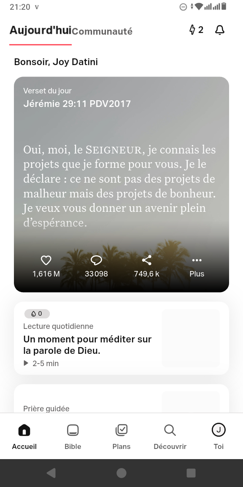
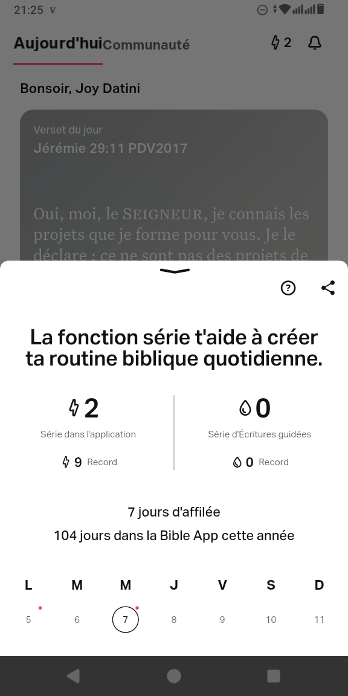

### PRD-HOME-02 · Verset du jour plein écran

**Captures de référence :** #125

- **Objectif :** Lire et partager le verset du jour.
- **Composition UI :**
  - Fond photo plein écran avec voile sombre
  - Fermer ✕, menu ⋯
  - Libellé « Verset du jour », référence, texte en grand serif blanc
  - Barre basse : cœur, commentaire, partager (avec compteurs)
- **États :**
  - Image indisponible : dégradé de secours
- **Interactions :**
  - Partager : image générée du verset
  - Cœur : like local + compteur
- **Règles métier :**
  - Images : banque libre de droits ou générée
- **Critères d'acceptation :**
  - Lisibilité du texte AA sur toute image (voile adaptatif)

## 4.2 Lecteur et versions

### PRD-READ-01 · Lecteur de Bible

**Captures de référence :** #1, #2, #3, #4, #126

- **Objectif :** Lire un chapitre confortablement et agir sur les versets.
- **Composition UI :**
  - Barre haute : audio, recherche, ⋯, puce de version (ex. « PDV2017 », « NFC », « OST »), mention de l'éditeur du texte
  - Numéro de chapitre géant gris, texte serif, numéros de versets en exposant, notes de bas de page soulignées en pointillés
  - Barre basse : bouton lecture audio + pilule « Genèse 2 » (livre + chapitre)
  - Thèmes clair et sombre ; lettres rouges optionnelles
- **États :**
  - Verset(s) sélectionné(s) : fond coloré (vert foncé en sombre, bleu clair en clair)
  - Hors ligne sans version téléchargée : message + téléchargement
  - Chargement : squelette de texte
- **Interactions :**
  - Tap verset : sélectionne ; tap multiples : plage (ex. Psaumes 127:1-2)
  - Feuille d'actions (PRD-READ-02)
  - Tap pilule livre/chapitre : PRD-READ-03
  - Tap puce version : PRD-READ-04
  - Glisser gauche/droite : chapitre suivant/précédent
- **Règles métier :**
  - Dernier chapitre lu mémorisé par appareil
  - Texte biblique jamais modifié ; versets affichés selon la version choisie
- **Critères d'acceptation :**
  - Sélection fluide, aucune perte de position au retour
  - Taille de police ajustable 80-200 %

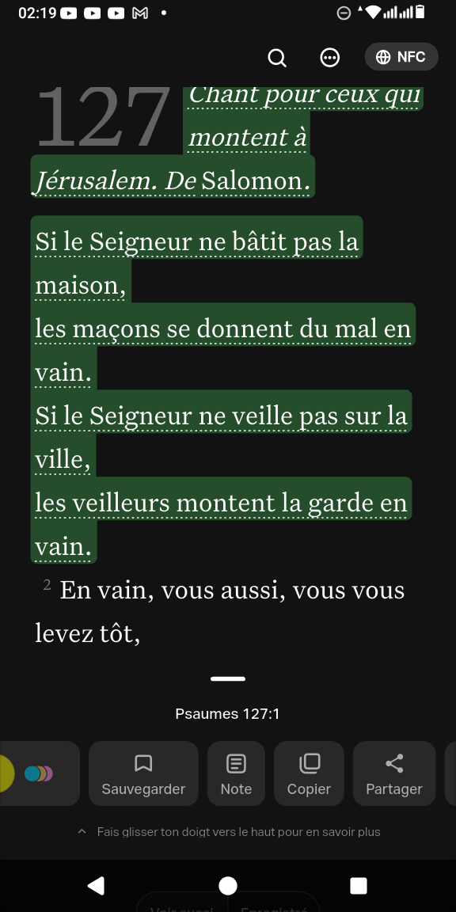
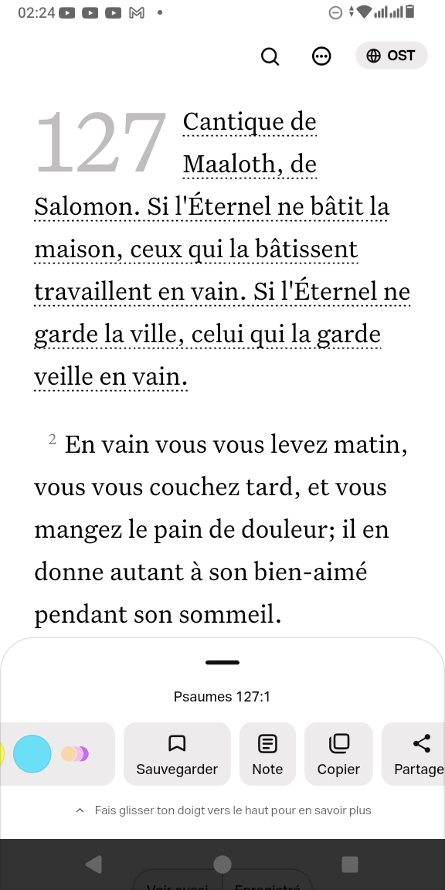
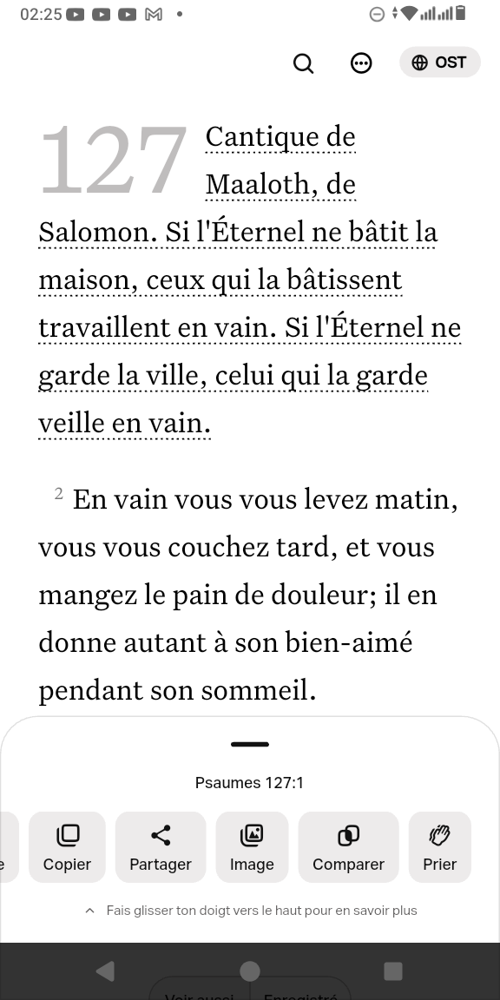
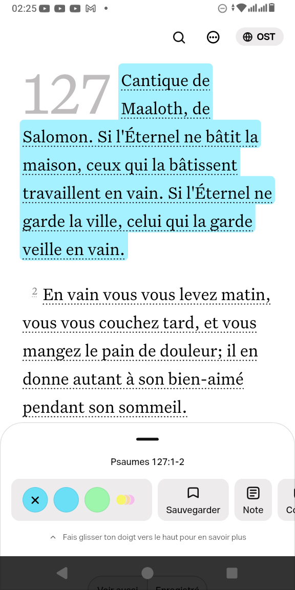
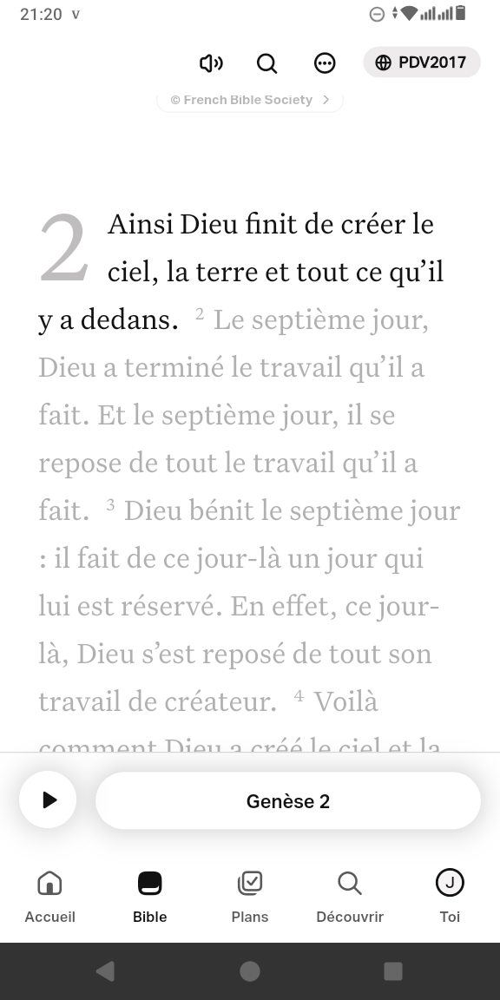

### PRD-READ-02 · Feuille d'actions sur sélection

**Captures de référence :** #1, #2, #3, #4

- **Objectif :** Agir sur les versets sélectionnés.
- **Composition UI :**
  - Poignée de feuille, référence (« Psaumes 127:1 »)
  - Pastilles de surbrillance : cercles de couleur (jaune, bleu, vert, rose, violet) + croix pour retirer
  - Rangée 1 : Sauvegarder, Note, Copier, Partager ; rangée 2 : Copier, Partager, Image, Comparer, Prier
  - Texte d'aide « Fais glisser ton doigt vers le haut pour en savoir plus »
- **États :**
  - Surbrillance active : croix visible
  - Feuille réduite / étendue
- **Interactions :**
  - Tap couleur : surligne ; croix : retire
  - Sauvegarder : enregistre le verset (avec étiquettes)
  - Note : éditeur de note
  - Image : génère un verset illustré
  - Comparer : ouvre PRD-READ-05
  - Prier : crée une demande de prière liée
- **Règles métier :**
  - Surbrillance liée à la version et au verset (clé : livre, chapitre, verset)
- **Critères d'acceptation :**
  - Une action ne ferme pas la sélection sauf Copier/Partager

### PRD-READ-03 · Choix du livre et du chapitre

**Captures de référence :** #5

- **Objectif :** Naviguer dans les livres.
- **Composition UI :**
  - Retour, titre « Livres », menu ⋮
  - Liste verticale des livres (Psaumes surligné, Proverbes, Ecclésiaste, Cantique, Ésaïe…)
  - Bandeau « Récentes » avec cartes (« Psaumes 127:1 » + nom de version)
- **États :**
  - Livre courant surligné
- **Interactions :**
  - Tap livre : grille des chapitres
  - Tap récente : saute au passage
- **Règles métier :**
  - Ordre canonique selon la version (protestant, catholique)
- **Critères d'acceptation :**
  - Accès à n'importe quel chapitre en ≤ 3 taps

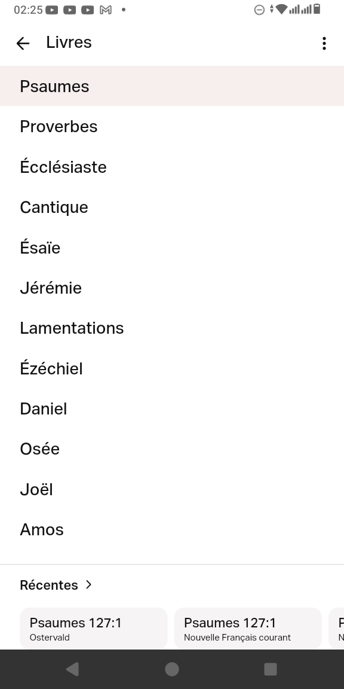

### PRD-READ-04 · Versions (traductions)

**Captures de référence :** #10-#18

- **Objectif :** Choisir, télécharger et gérer les versions bibliques.
- **Composition UI :**
  - Barre : retour, « Versions » + sous-titre (« 3 864 versions en 2 462 langues » dans la référence), recherche
  - Sections par langue (« Español (América Latina) versions (30) »)
  - Ligne : abréviation en gras (LSG, NBS, PDV2017…), pastille audio avec nombre de pistes, icône téléchargement, nom complet gris, menu ⋮ à droite
  - Liste alphabétique avec défilement long
- **États :**
  - Téléchargée : icône coche ; en cours : anneau de progression
  - Version active en gras
- **Interactions :**
  - Tap ligne : sélectionne la version
  - Tap téléchargement : télécharge hors ligne
  - ⋮ : supprimer, informations, mentions légales
- **Règles métier :**
  - Chaque version porte sa licence et sa mention de droits
  - Catalogue initial : versions du domaine public ou sous licence valide (liste à constituer)
- **Critères d'acceptation :**
  - Recherche par abréviation ou nom < 300 ms
  - Téléchargement reprenable

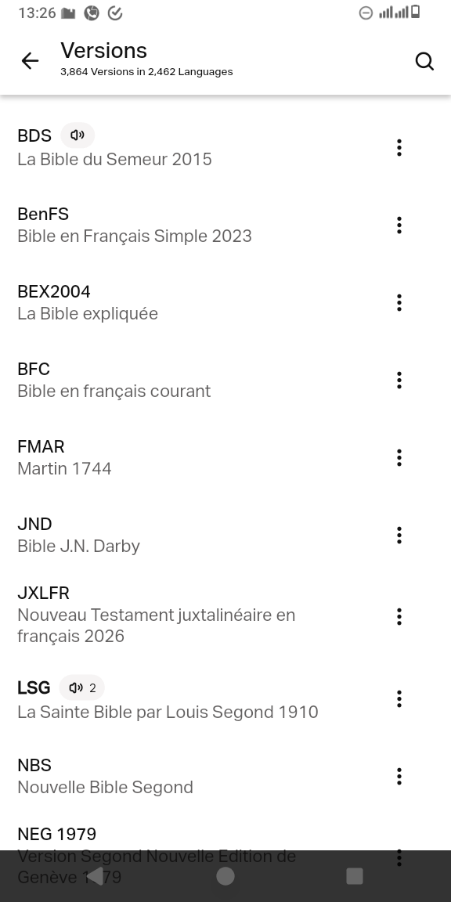
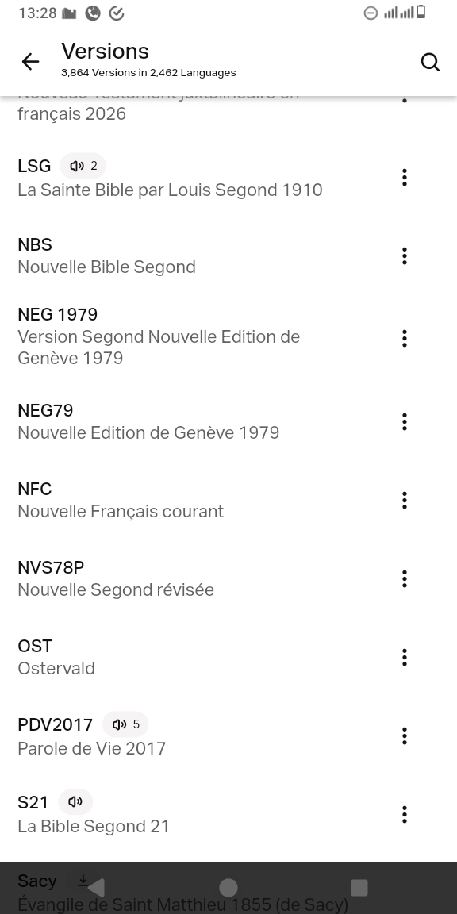
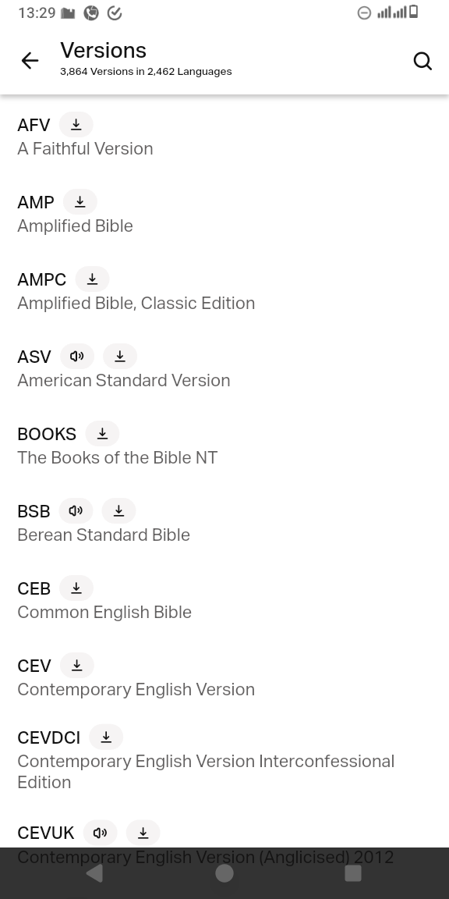
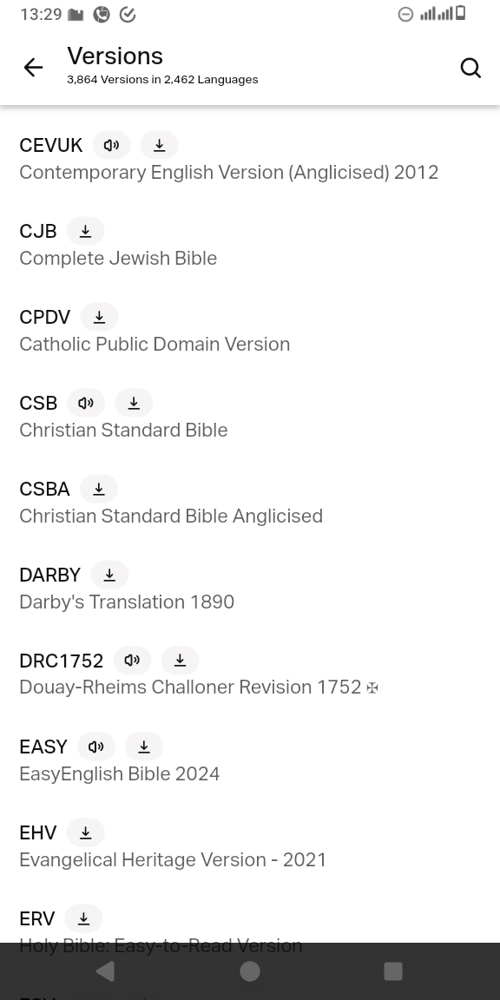
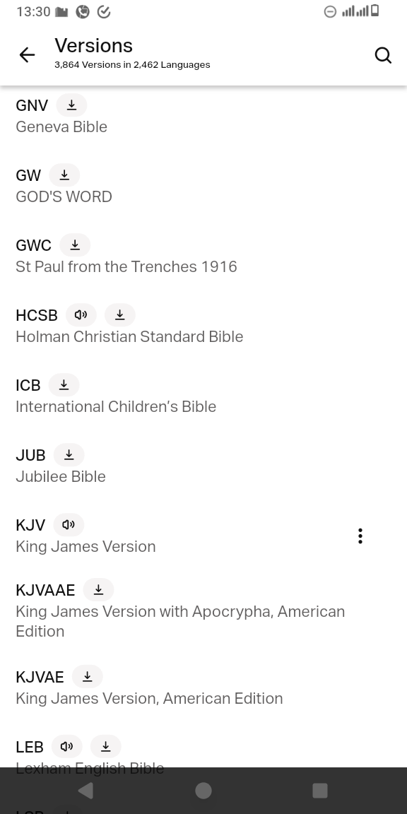
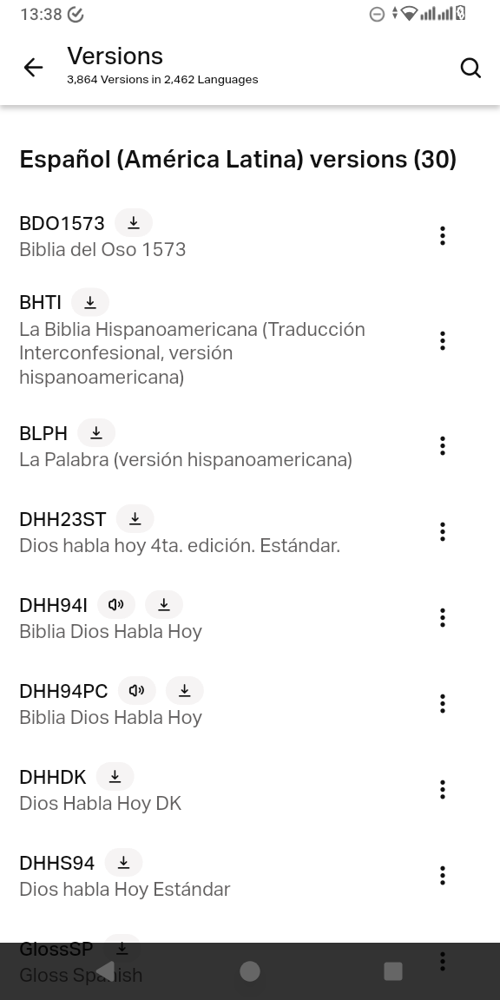
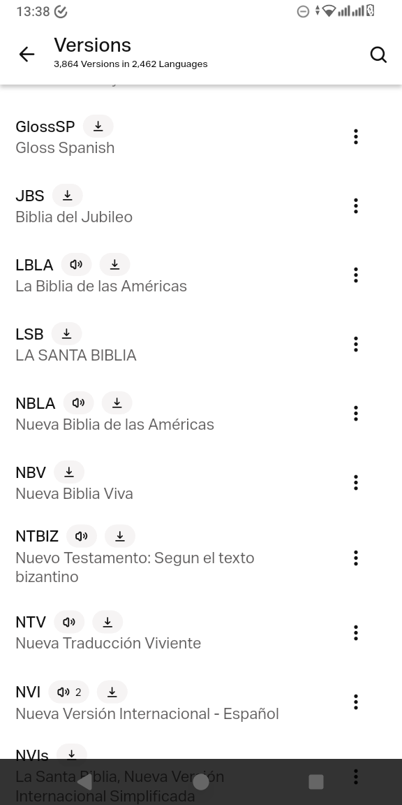
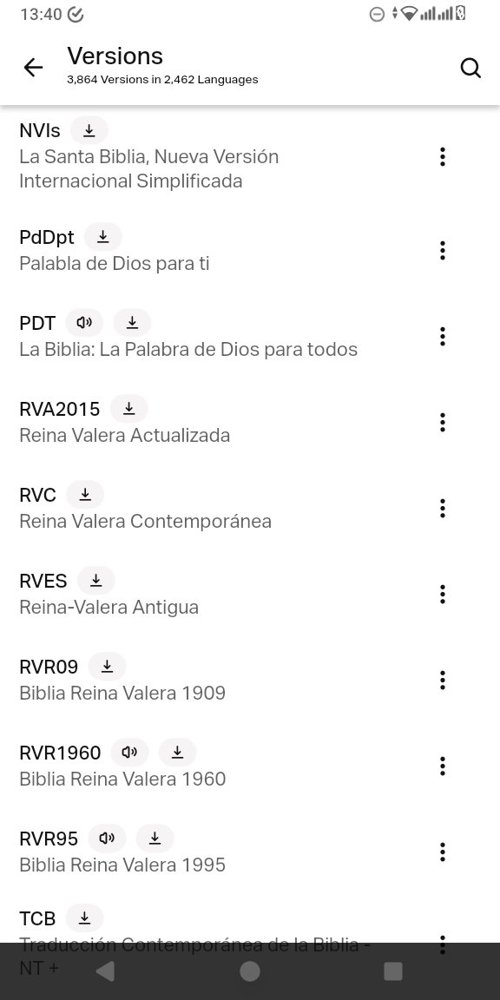
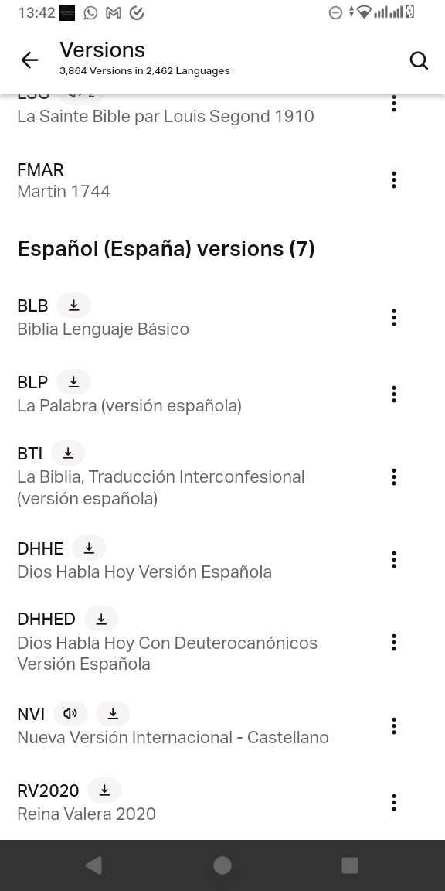

### PRD-READ-05 · Comparer des versions

**Captures de référence :** #3 (bouton)

- **Objectif :** Voir un même passage dans deux versions.
- **Composition UI :**
  - Bouton « Comparer » de la feuille d'actions ; écran à deux colonnes ou liste empilée : version A / version B pour le passage sélectionné
- **États :**
  - Version manquante : proposition de téléchargement
- **Interactions :**
  - Changer de version dans une colonne
- **Règles métier :**
  - Passage aligné par verset
- **Critères d'acceptation :**
  - Comparaison disponible pour toute paire téléchargée

## 4.3 Plans de lecture

### PRD-PLAN-01 · Plans : liste

**Captures de référence :** #127

- **Objectif :** Retrouver ses plans.
- **Composition UI :**
  - Titre « Plans » + recherche
  - Puces : Mes plans (actif), Découvre les plans, Enregistré, Terminé
  - Cartes : visuel carré, titre, barre de progression
- **États :**
  - Aucun plan : appel à « Découvre les plans »
- **Interactions :**
  - Tap plan : détail (PRD-PLAN-02)
- **Règles métier :**
  - Progression = jours lus / jours totaux
- **Critères d'acceptation :**
  - La progression se met à jour dès qu'un jour est marqué lu

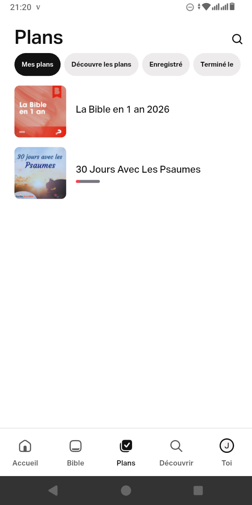

### PRD-PLAN-02 · Détail d'un plan et jour courant

**Captures de référence :** #128, #129

- **Objectif :** Lire le programme du jour.
- **Composition UI :**
  - Barre : retour, titre du plan, ⋮
  - Bannière illustrée
  - Rangée de PlanDayChip défilante (jour, date, coche si lu)
  - Titre « Jour 5 sur 30 » + pastille « 26 jours manqués »
  - Liste du jour : cases rondes (Méditation, passages à lire) avec chevron
  - Bouton noir « Commencer à lire »
- **États :**
  - Jour terminé : toutes cases cochées
  - Jours manqués : pastille grise
- **Interactions :**
  - Tap passage : ouvre le lecteur au passage
  - Tap case : marque lu
  - Tap jour : bascule le contenu
- **Règles métier :**
  - Plan en retard : possibilité de rattraper ou recalculer
  - Notification « Lecture du jour terminée »
- **Critères d'acceptation :**
  - Marquer lu synchronise série et progression

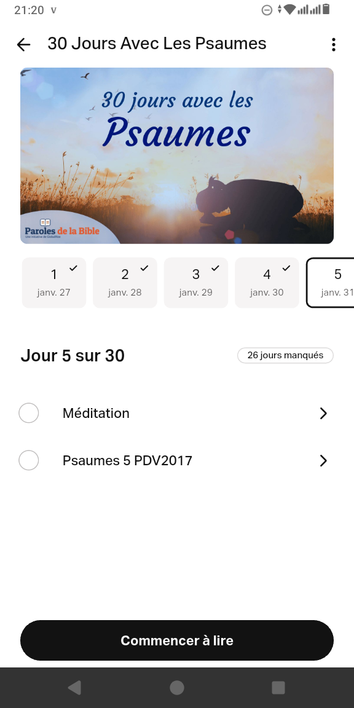
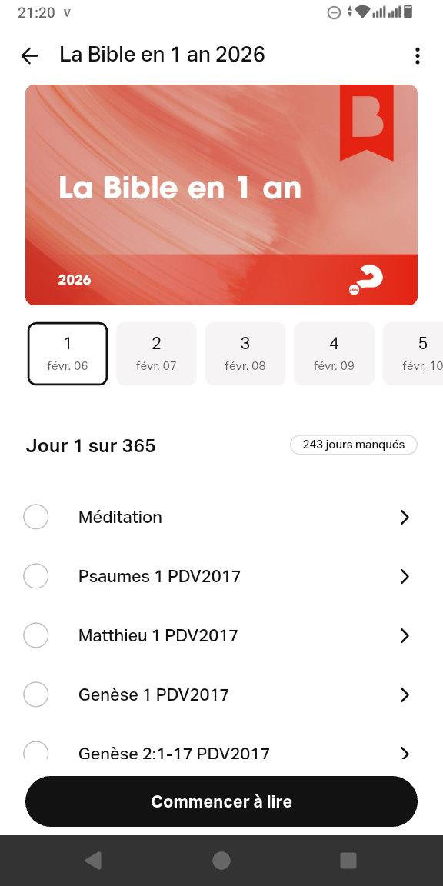

## 4.4 Découvrir

### PRD-DISC-01 · Découvrir

**Captures de référence :** #130

- **Objectif :** Explorer plans, vidéos et thèmes.
- **Composition UI :**
  - Titre « Découvrir », champ de recherche (versets, sujets, questions)
  - Grille de raccourcis 2×2 : Plans, Vidéos, Églises, Partenaires
  - Section « Pour toi » (carrousel de plans avec durée en jours)
  - Tuiles de thèmes colorées (Orgueil, Amour…)
- **États :**
  - Chargement squelette
- **Interactions :**
  - Tap tuile : liste filtrée
- **Règles métier :**
  - Recommandations simples (populaires + reprise)
- **Critères d'acceptation :**
  - Recherche renvoie versets et plans

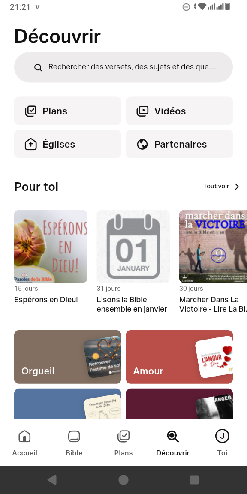

## 4.5 Profil, enregistré et réglages

### PRD-ME-01 · Toi : Activité

**Captures de référence :** #6, #131

- **Objectif :** Montrer l'engagement.
- **Composition UI :**
  - Bouton « Faire un don », icônes QR, réglages, menu
  - Nom, « Trouve ton église »
  - Avatar rond avec appareil photo
  - Onglets Activité / Enregistré / Profil
  - Tuiles : « Série dans l'application » (2, meilleur 9), « Jours dans l'app cette année » (104)
  - Encouragements envoyés (icône envoi)
  - Badges (7) : médailles
  - Filtres Tout / Surbrillances / Notes / Plans / Badges
- **États :**
  - Débutant : valeurs à 0
- **Interactions :**
  - Tap badge : détail
- **Règles métier :**
  - Badges débloqués par seuils (verset enregistré, notes, surbrillances, plans abonnés) à niveaux
- **Critères d'acceptation :**
  - Valeurs cohérentes avec le journal d'activité

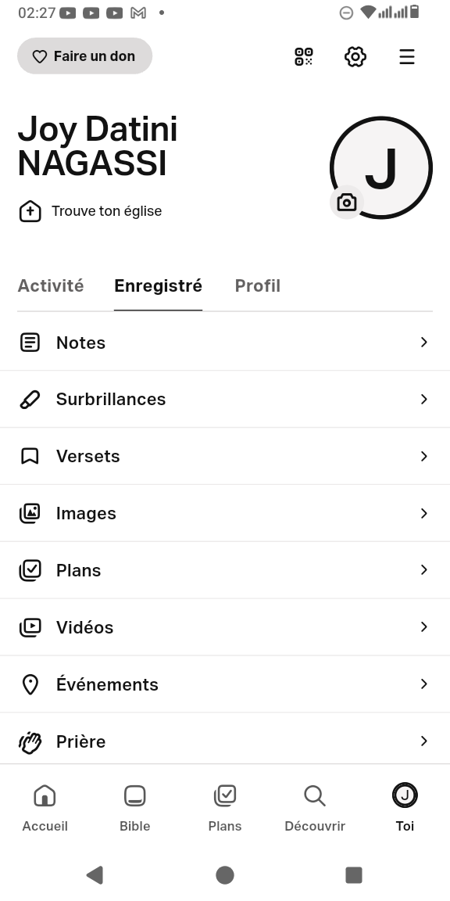
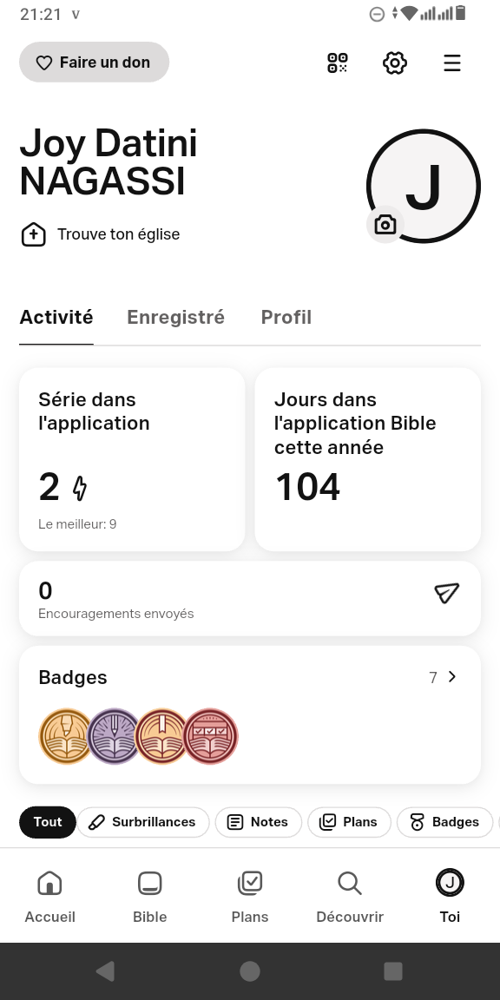

### PRD-ME-02 · Toi : Enregistré

**Captures de référence :** #6, #132

- **Objectif :** Retrouver ses contenus.
- **Composition UI :**
  - Liste à chevrons : Notes, Surbrillances, Versets, Images, Plans, Vidéos, Événements, Prière
- **États :**
  - (voir captures)
- **Interactions :**
  - Tap : liste correspondante
- **Règles métier :**
  - (aucune)
- **Critères d'acceptation :**
  - Compteurs facultatifs

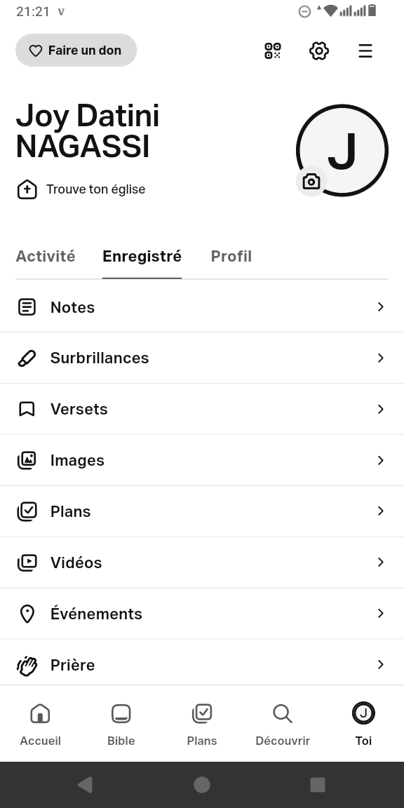

### PRD-ME-03 · Notes, Surbrillances, Versets, Images

**Captures de référence :** #133-#136

- **Objectif :** Parcourir son contenu personnel.
- **Composition UI :**
  - Titre de page grand (Notes / Surbrillances / Images / Versets), icône info, + pour créer (Notes, Images)
  - Filtres Étiquette et Livre (puces à menu)
  - VerseCard : avatar, « Vous avez ajouté une note, 1 Pierre 3:9 », date relative, confidentialité (cadenas « Privé »), étiquettes, extrait avec barre verticale, texte de la note dans un encart gris, cœur / commentaire / ⋮
  - Support multilingue (extraits en japonais affichés correctement)
- **États :**
  - Vide par catégorie
  - Image : « Vous avez créé un verset illustré pour… »
- **Interactions :**
  - Tap carte : ouvre le passage
  - ⋮ : modifier, supprimer, rendre public
  - Filtre : combinable
- **Règles métier :**
  - Contenu privé par défaut
  - Étiquettes libres
- **Critères d'acceptation :**
  - Filtres appliqués instantanément
  - Suppression avec confirmation

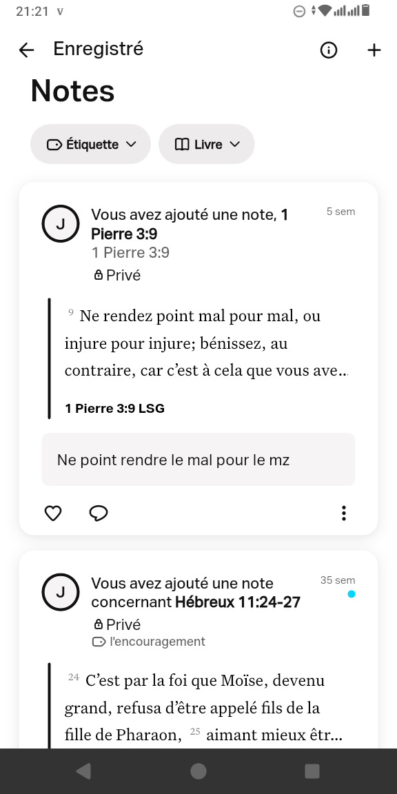
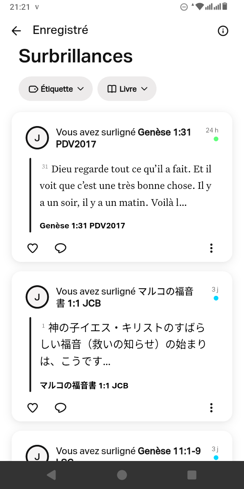
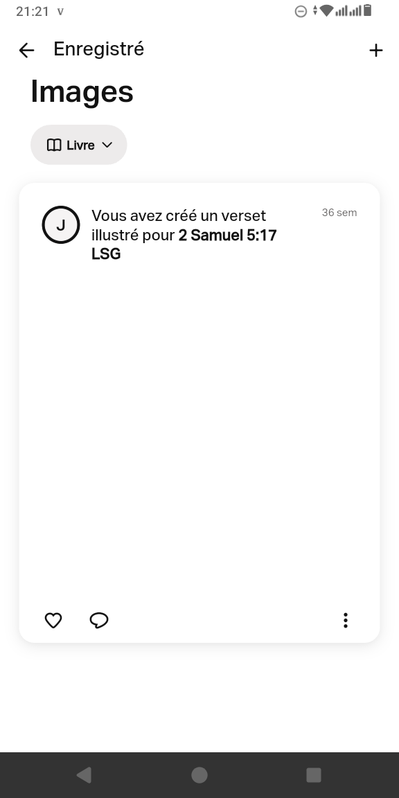
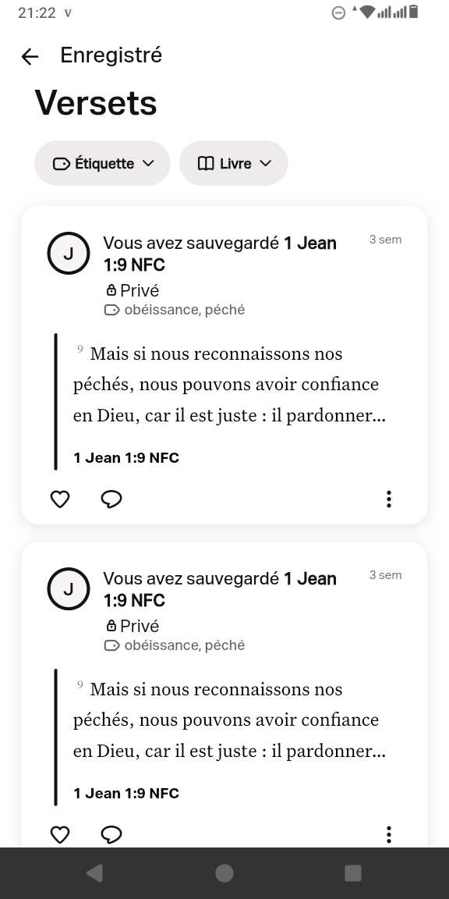

### PRD-ME-04 · Toi : Profil et édition

**Captures de référence :** #137, #138

- **Objectif :** Gérer les liens sociaux et ses informations.
- **Composition UI :**
  - Onglet Profil : Amis (0), Suivis (0), Don
  - Modifier le profil : Prénom, Nom, Emplacement, Biographie (0/160), Informations privées (Modifier le mot de passe, Paramètres de notification), « Supprimer mon compte » rouge, bouton « Sauvegarder »
- **États :**
  - Sauvegarder désactivé sans changement
- **Interactions :**
  - Appareil photo : choisir/prendre photo
- **Règles métier :**
  - Bio ≤ 160 caractères
- **Critères d'acceptation :**
  - Suppression de compte irréversible avec confirmation

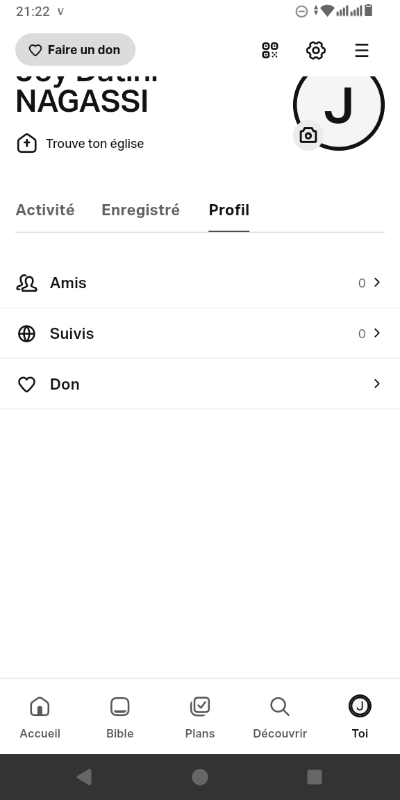
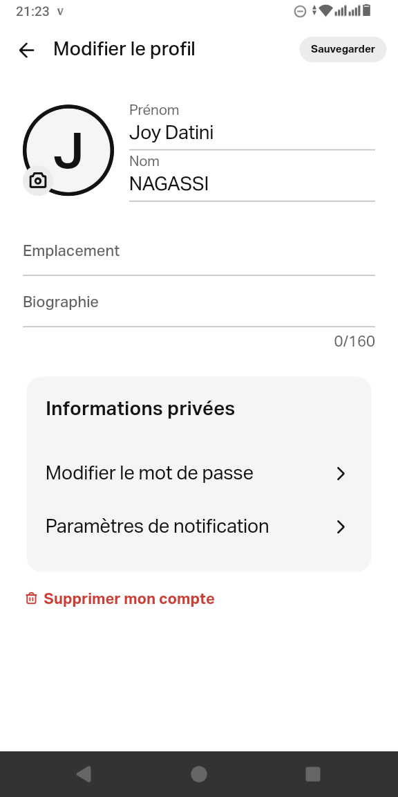

### PRD-ME-05 · Paramètres

**Captures de référence :** #139

- **Objectif :** Régler la lecture et les données.
- **Composition UI :**
  - Lecture : Police, Afficher notes de bas de page, Lettres en rouge, Afficher barre audio, Gérer polices/versions hors ligne
  - Plans : notification « Lecture du jour terminée »
  - Plus : Effacer le cache local, Informations de débogage
  - Bouton texte « Se déconnecter »
- **États :**
  - (voir captures)
- **Interactions :**
  - Interrupteurs
- **Règles métier :**
  - Options « Selon disponibilité » selon la version
- **Critères d'acceptation :**
  - Cache effacé sans perdre les données de compte

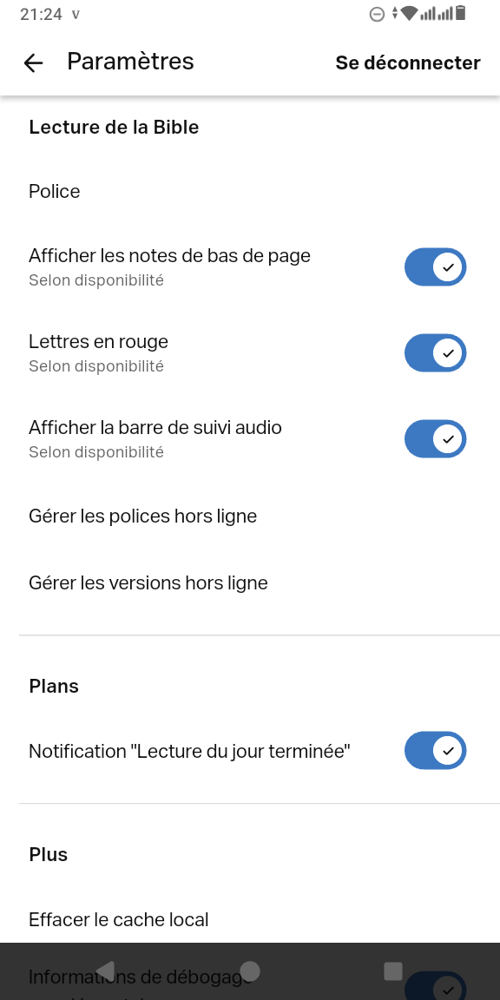

### PRD-ME-06 · Notifications push (réglages)

**Captures de référence :** #140, #141, #142

- **Objectif :** Choisir quoi recevoir.
- **Composition UI :**
  - Texte du verset du jour (heure réglable, ex. 07:22), Verset du jour illustré, Actualités de l'app
  - Plans : commentaire d'un participant, invitation acceptée, invitation reçue
  - Amis : demandes, activité, commentaires, likes, contact inscrit, encouragements
  - Prière : rappels, partage, prière pour vous, mises à jour, commentaires
  - Activité : rappels de séries, badge gagné
  - Mon église : plan suggéré, message publié
- **États :**
  - Tous activés par défaut sauf « Verset du jour illustré »
- **Interactions :**
  - Tap heure : sélecteur
- **Règles métier :**
  - Respect des canaux de notification Android
- **Critères d'acceptation :**
  - Désactiver bloque effectivement la notification

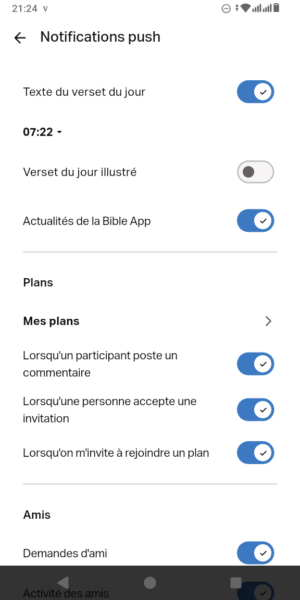
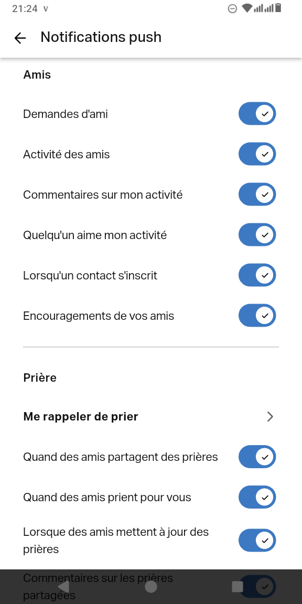
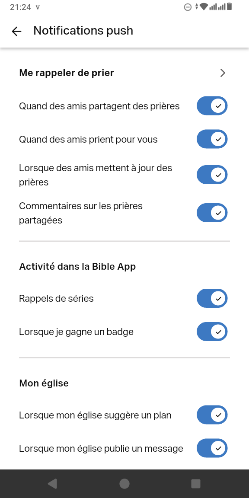

### PRD-ME-07 · Série (feuille)

**Captures de référence :** #144

- **Objectif :** Expliquer et afficher la série.
- **Composition UI :**
  - Titre « La fonction série t'aide à créer ta routine biblique quotidienne. »
  - Deux colonnes : série dans l'application (2, record 9) / série d'Écritures guidées (0)
  - « 7 jours d'affilée », « 104 jours cette année »
  - Rangée L M M J V S D avec points rouges aux jours actifs, jour courant cerclé
  - Icônes aide et partager
- **États :**
  - Série à 0 : message d'encouragement
- **Interactions :**
  - Tap ? : explication
- **Règles métier :**
  - Jour validé = action de lecture ou plan
- **Critères d'acceptation :**
  - Reset à minuit local si aucun jour validé

### PRD-ME-08 · Centre de notifications

**Captures de référence :** #143

- **Objectif :** Historique des alertes.
- **Composition UI :**
  - Liste : avatar rond, texte (« Vous avez gagné le badge… »), date relative
- **États :**
  - Vide : message
- **Interactions :**
  - Tap : ouvre le badge
- **Règles métier :**
  - (aucune)
- **Critères d'acceptation :**
  - Ordre antéchronologique

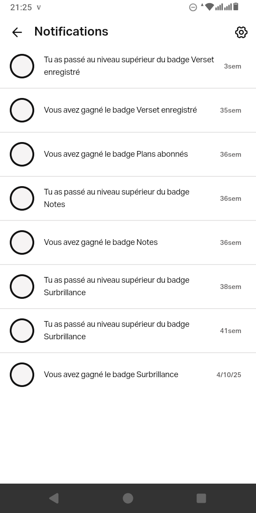

# 5. Modèle de données

| Entité | Champs principaux |
|---|---|
| User | id, name, avatar, locale, church_id?, created_at |
| Version | id, abbr, name, language, license, has_audio, size, downloaded |
| Verse | version_id, book, chapter, verse, text (contenu sous licence : tiers) |
| Highlight | user_id, ref(book,chapter,verse range), color, version_id, created_at |
| Note | user_id, ref, body, tags[], visibility (private/friends/public) |
| SavedVerse | user_id, ref, tags[], visibility |
| VerseImage | user_id, ref, template, image_url |
| Plan | id, title, cover, days[{index, items[{type, ref/text}]}], language |
| PlanSubscription | user_id, plan_id, start_date, progress{day: [items done]} |
| Streak | user_id, current, best, last_active_date |
| Badge / UserBadge | id, kind, level, thresholds ; user_id, badge_id, earned_at |
| Friendship | a, b, status |
| NotificationPref | user_id, flags{} |

Sources de contenu : API de versions bibliques licenciée ou textes du domaine public embarqués en SQLite (FTS5 pour la recherche). Hors ligne : versions téléchargées en base locale.

# 6. Exigences non fonctionnelles et plan

- Performance : ouverture d'un chapitre < 300 ms hors ligne ; recherche plein texte < 300 ms.
- Accessibilité : texte agrandissable, contraste AA, TalkBack lisible verset par verset.
- Droits : mention du détenteur de droits de chaque version (comme sous le texte du lecteur), limites de citation respectées.
- Confidentialité : notes et surbrillances privées par défaut ; export et suppression de compte.
- Internationalisation : textes de toutes langues, y compris écritures non latines.

| Phase | Contenu |
|---|---|
| 1 | Lecteur, versions (domaine public), sélecteur de livres, surbrillances, notes, sauvegarde, profil local |
| 2 | Compte, plans de lecture, verset du jour, séries, badges, notifications, recherche |
| 3 | Communauté (amis, encouragements, prière), audio, découvrir enrichi, dons |

## Critères de recette globaux

- Chaque écran listé existe avec états vide / chargement / erreur.
- Aucun logo, illustration ou texte propriétaire de la référence.
- Tests e2e : lire, surligner, noter, suivre un plan, série incrémentée.
