# PRD · Application d'assistant IA

_Conversations, projets, artefacts, bibliothèque, connecteurs, capacités et autorisations_

- **Nom de travail :** AssistPro (nom provisoire, à remplacer)
- **Source :** Captures de trois assistants IA mobiles : réf. #123, #145-#158 (≈15 écrans, thème sombre, Android, français)
- **Plateforme cible :** Android d'abord
- **Destinataire :** Agent de codage
- **Captures :** dossier images/ : ref_NNN.png = référence #NNN
- **Confidentialité :** Les captures contiennent des titres de conversations et noms de projets réels de l'auteur : ils sont volontairement omis ici et remplacés par des exemples neutres.
- **Important :** Marques, logos, noms de modèles et textes de l'app de référence à ne pas reprendre. Le moteur de modèle de langage est un service externe : ce PRD couvre le client et son orchestration, pas l'entraînement.

# 0. Mode d'emploi pour l'agent de codage

Ce document sert de modèle de départ pour construire rapidement une application inspirée de ces écrans. Chaque fiche est accompagnée de ses captures : la capture fait foi pour la structure, les composants et la disposition.

- À reproduire : la hiérarchie des écrans, les composants UI, leur ordre et leur disposition, les états (vide, chargement, erreur), les interactions et la navigation.
- Libre : couleurs, polices, illustrations, icônes et textes de marque. Les couleurs citées dans les fiches sont indicatives (sens : alerte, actif, verrouillé) ; choisir une palette cohérente et la centraliser dans un fichier de thème.
- Méthode conseillée : construire d'abord le squelette de navigation et les composants réutilisables, puis les écrans par phase (voir plan de livraison), en comparant chaque écran à sa capture.
- Les références ref_NNN renvoient aux fichiers du dossier ref_screens.zip ; les captures sont aussi intégrées dans ce PDF.
- Remplacer les noms de marque, logos et textes d'origine par du contenu original.

# 1. Vision et périmètre

AssistPro est un client mobile d'assistant IA : on converse, on organise le travail en projets, on conserve les productions (documents, designs, présentations) sous forme d'artefacts consultables, on importe des fichiers dans une bibliothèque et on connecte des services externes (Drive, Canva, Figma, Gmail…) via des connecteurs.

## Objectifs

- Reprendre une conversation ou un projet en 2 taps.
- Retrouver n'importe quelle production (artefact) par recherche, type ou statut.
- Donner le contrôle clair des capacités (recherche web, exécution de code, mémoire) et des autorisations système.

## Hors périmètre v1

- Entraînement ou hébergement de modèles.
- Édition collaborative des artefacts.
- Création musicale et génération d'images (écrans d'entrée seulement).

# 2. Composants UI et mise en page

Aucune charte de couleurs n'est imposée : reproduire la structure. Référence en thème sombre, titres d'écran centrés.

## Principes de disposition

- Pas de barre d'onglets : navigation par menu latéral ouvert via un bouton rond en haut à gauche.
- Titre d'écran centré, action de filtre ou « + » à droite.
- Champ de recherche en pilule sous la barre, listes pleine largeur avec séparateurs discrets.
- Actions flottantes en pilule (« + Nouveau projet ») ancrées en bas à droite.
- Réglages en lignes avec interrupteurs ; sections séparées par un petit titre.

## Composants

| Composant | Description |
|---|---|
| TopBar | Bouton menu rond à gauche, titre centré, action à droite (filtres, +). |
| SearchPill | Champ de recherche arrondi avec loupe. |
| ToggleRow | Icône, titre, description, interrupteur. |
| ArtifactRow | Vignette d'aperçu, titre, cadenas « Vous uniquement », date de modification. |
| FilterMenu | Popover : Tous / Épinglés / Les vôtres / Partagés avec vous ; types : Tous / Design / Slides / Autre ; coche sur l'option active. |
| ConnectorRow | Icône, nom, badge (« Nouveau », popularité), bouton « Connecter » ou état « Connecté ». |
| ErrorState | Message centré + bouton « Réessayer » ; toast en bas avec action. |
| BottomSheetPicker | Feuille d'ajout : Photos, Appareil photo, Fichiers, Drive + liste d'outils. |

# 3. Navigation

Menu latéral (bouton hamburger) : Nouvelle conversation, Conversations, Projets, Artefacts, Bibliothèque, Connecteurs, Réglages. Pas de barre d'onglets.

# 4. Spécification des écrans

### PRD-AI-01 · Conversations (liste et sélection)

**Captures de référence :** #150

- **Objectif :** Retrouver, regrouper et supprimer des conversations.
- **Composition UI :**
  - Retour, titre « Conversations », icônes archiver et corbeille
  - Champ « Rechercher »
  - Liste : case à cocher + icône bulle + titre généré (tronqué) + date relative/absolue
- **États :**
  - Mode sélection : cases visibles, actions actives
  - Vide : « Aucune conversation »
  - Chargement : squelette
- **Interactions :**
  - Tap titre : ouvre la conversation
  - Coche + corbeille : suppression groupée avec confirmation
  - Recherche plein texte sur titres et contenus
- **Règles métier :**
  - Titre généré automatiquement après le premier échange
  - Tri antéchronologique
- **Critères d'acceptation :**
  - Suppression irréversible confirmée
  - Recherche < 300 ms sur 1 000 conversations

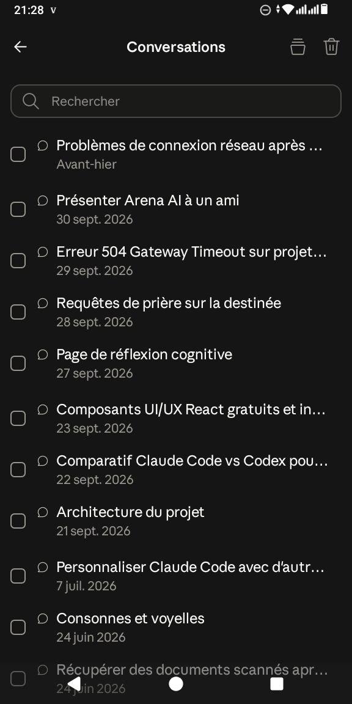

### PRD-AI-02 · Conversation et menu d'ajout

**Captures de référence :** #123

- **Objectif :** Écrire, joindre des éléments et lancer des outils.
- **Composition UI :**
  - En-tête : menu, sélecteur de modèle (nom + chevron)
  - Zone message : icône de l'assistant (logo animé) au centre quand vide
  - Feuille basse : Photos, Appareil photo, Fichiers, Drive ; lignes d'outils avec sous-titre : Créer des images, Créer de la musique, Canevas, Apprentissage guidé
- **États :**
  - Vide (accueil), En génération (bouton stop), Erreur (réessayer)
- **Interactions :**
  - Choix du modèle : feuille de sélection
  - Pièce jointe : aperçu avant envoi
  - Envoi : streaming de la réponse
- **Règles métier :**
  - Limites de taille et de nombre de fichiers par message
  - Message affichant le modèle utilisé
- **Critères d'acceptation :**
  - Streaming fluide (≥ 20 jetons/s affichés)
  - Brouillon conservé si on quitte l'écran

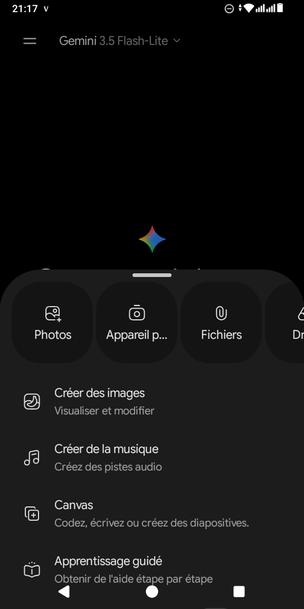

### PRD-AI-03 · Projets

**Captures de référence :** #149

- **Objectif :** Regrouper des conversations et fichiers par sujet.
- **Composition UI :**
  - Menu, titre « Projets », icône filtre
  - Champ « Rechercher des projets »
  - Liste : nom, « Modifié il y a… », épingle pour projet épinglé
  - Bouton flottant pilule « + Nouveau projet »
- **États :**
  - Vide : invitation à créer un projet
- **Interactions :**
  - Tap projet : détail (instructions, fichiers, conversations)
  - Appui long : épingler, renommer, supprimer
- **Règles métier :**
  - Un projet porte des instructions persistantes et des fichiers de contexte
- **Critères d'acceptation :**
  - Conversations d'un projet héritent des instructions

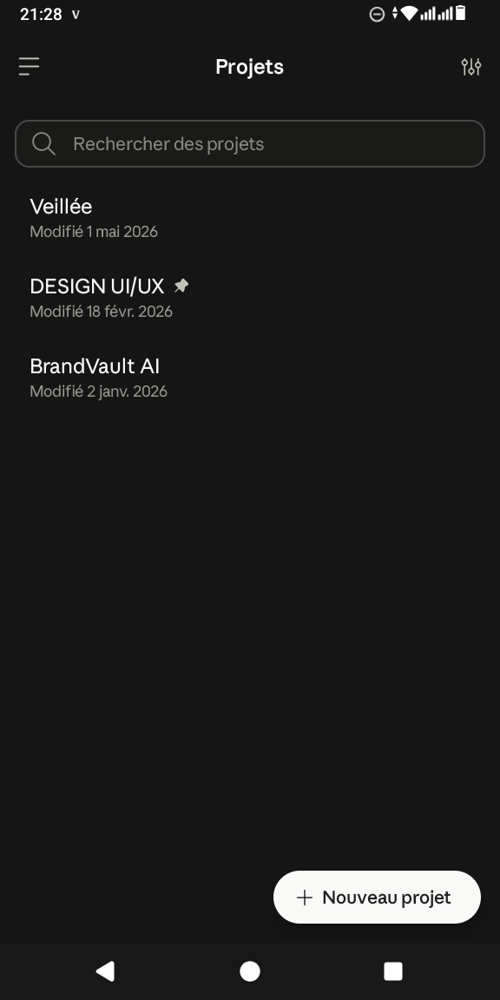

### PRD-AI-04 · Artefacts (liste)

**Captures de référence :** #147, #148

- **Objectif :** Retrouver les productions de l'assistant.
- **Composition UI :**
  - Titre « Artefacts », icône filtre
  - Recherche
  - ArtifactRow : vignette (aperçu du document), titre, cadenas « Vous uniquement », « Modifié 27 sept. »
  - Menu de filtres : Tous, Épinglés, Les vôtres, Partagés avec vous ; Tous les types, Design, Slides, Autre
- **États :**
  - Vide par filtre
  - Chargement squelette
- **Interactions :**
  - Tap : ouvre l'artefact en lecture/édition
  - Filtre : coche bleue
- **Règles métier :**
  - Visibilité : privé ou partagé ; types : document, design, présentation, autre
- **Critères d'acceptation :**
  - Vignette générée à la sauvegarde

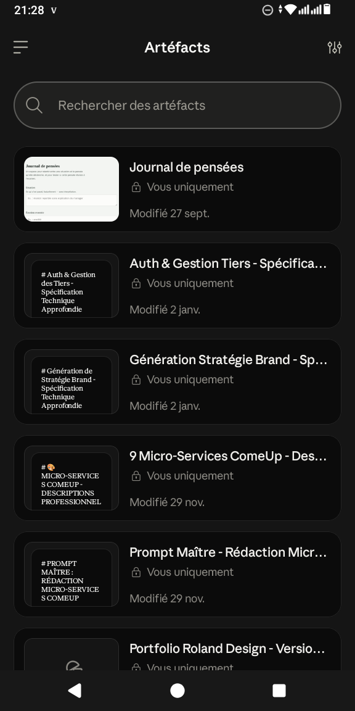
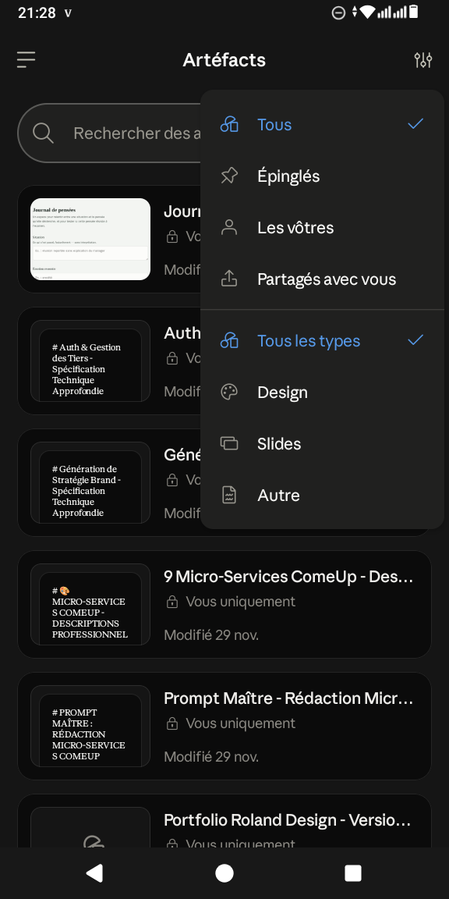

### PRD-AI-05 · Bibliothèque

**Captures de référence :** #145, #146, #157, #158

- **Objectif :** Centraliser fichiers et médias importés.
- **Composition UI :**
  - Menu, titre « Bibliothèque »
  - Sections « Documents » et « Contenus multimédias » (grille 3 colonnes)
  - Onglets : Suggérés, Favoris, Dossiers, Images
  - Tuiles de fichier : nom tronqué + icône de type ; vignettes pour images
  - Barre basse : recherche + bouton +
  - Carte d'info « Importez une fois, utilisez à volonté » avec bouton « En savoir plus »
- **États :**
  - Erreur : plein écran « Un problème est survenu » + Réessayer et toast
  - Chargement : tuiles squelettes et spinner
  - Vide : invitation à importer
- **Interactions :**
  - Tap fichier : aperçu
  - Bouton + : importer
  - Favori : étoile
- **Règles métier :**
  - Un fichier importé reste disponible pour toutes les conversations
- **Critères d'acceptation :**
  - Reprise automatique après perte de réseau

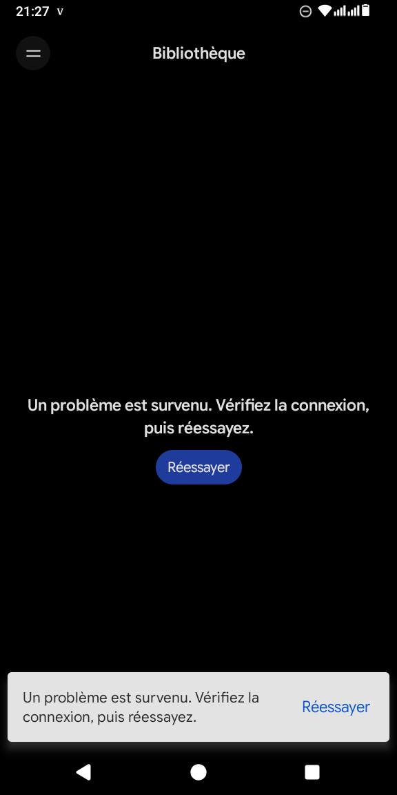
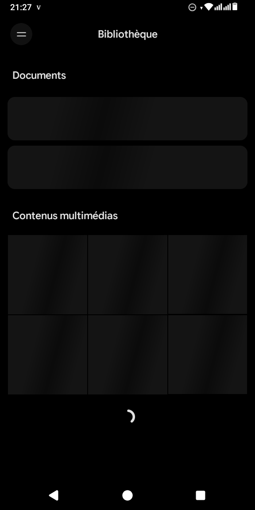
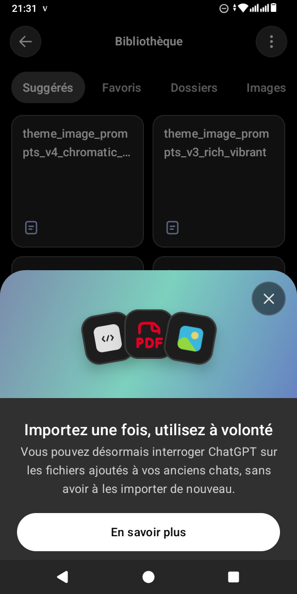
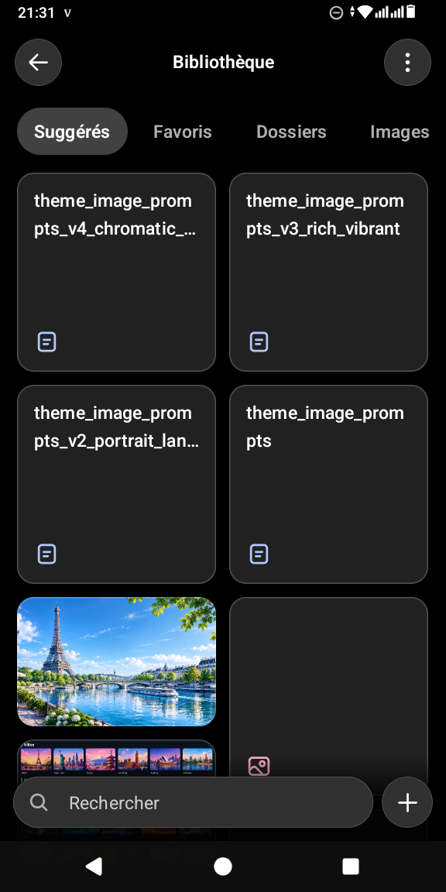

### PRD-AI-06 · Capacités

**Captures de référence :** #151, #152, #155

- **Objectif :** Activer ou désactiver les fonctions de l'assistant.
- **Composition UI :**
  - Titre centré « Capacités », liste d'interrupteurs : Recherche web, Artefacts (requis par l'exécution de code, verrouillé), Visualisations intégrées (bêta), Exécution de code et création de fichiers, Changer de modèle lorsqu'un message est signalé
  - Section Mémoire : Générer la mémoire à partir des conversations, Inclure les sujets sensibles dans la mémoire (lien « En savoir plus »), Fichiers mémoire (chevron)
  - Section Accès aux outils : radios Auto (« l'assistant choisit pour vous »), À la demande, Toujours disponible
- **États :**
  - Option verrouillée : grisée avec raison
- **Interactions :**
  - Interrupteur : applique immédiatement
  - Fichiers mémoire : liste consultable/supprimable
- **Règles métier :**
  - Désactiver la mémoire n'efface pas l'existant sans action explicite
  - Sujets sensibles : opt-in clair
- **Critères d'acceptation :**
  - Chaque réglage persiste et est envoyé avec la requête

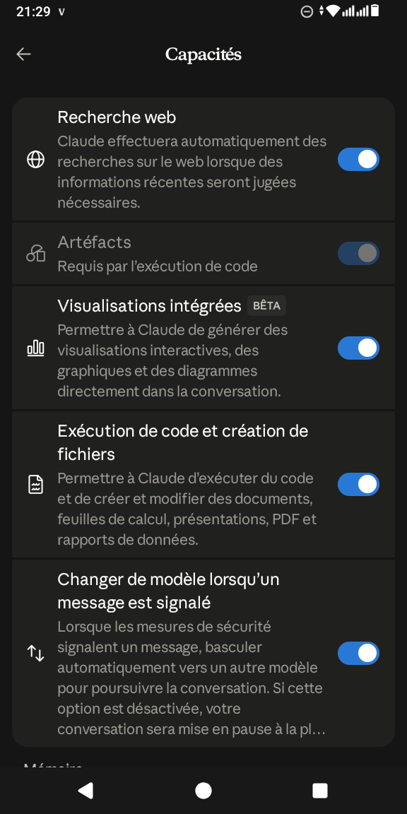
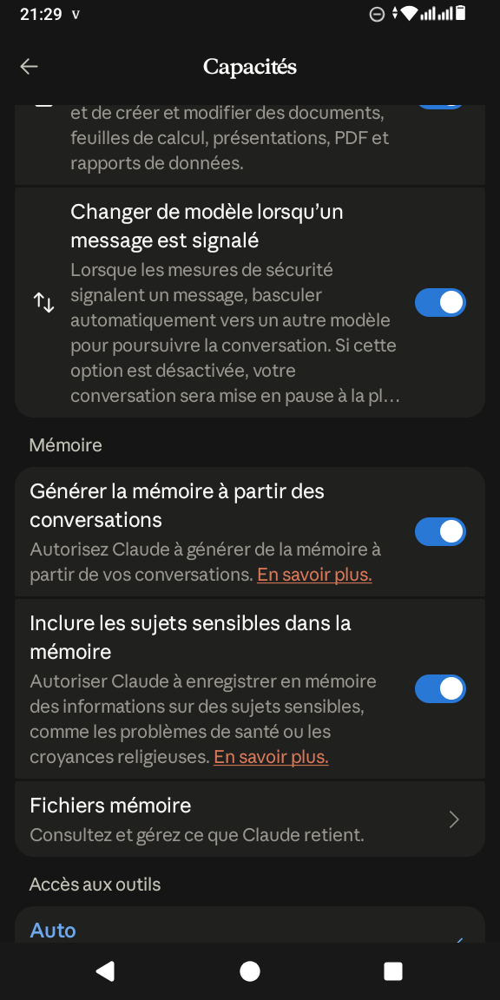
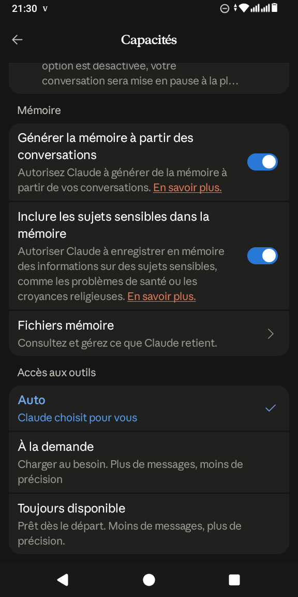

### PRD-AI-07 · Connecteurs

**Captures de référence :** #153, #154

- **Objectif :** Relier des services externes.
- **Composition UI :**
  - Titre « Connecteurs », bouton + à droite
  - Interrupteur « Découverte des connecteurs » (suggestions dans le répertoire)
  - Liste des services connectés avec compteur d'outils (Drive : 8) et non connectés avec « Connecter »
  - Répertoire : recherche, onglets de catégorie (Tout, Commerce et achats, Communication…), lignes avec badge de popularité, description d'une ligne en anglais ou français, bouton blanc « Connecter », statut vert « Connecté »
- **États :**
  - Connecté / Non connecté / Erreur d'auth (reconnecter)
- **Interactions :**
  - Connecter : OAuth dans le navigateur, retour dans l'app
  - Tap service connecté : gestion des outils et déconnexion
- **Règles métier :**
  - Seuls les scopes minimaux demandés
  - Révocation possible à tout moment
- **Critères d'acceptation :**
  - L'état de connexion se rafraîchit au retour de l'OAuth

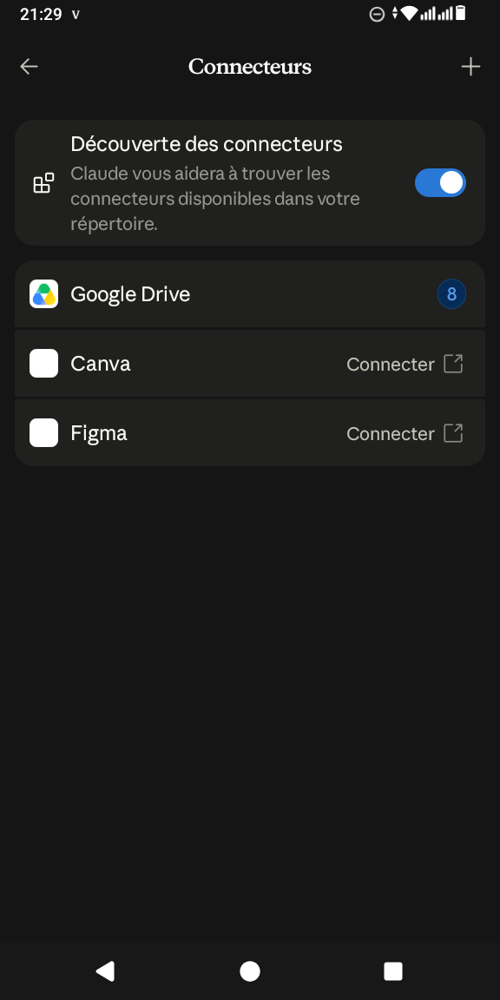
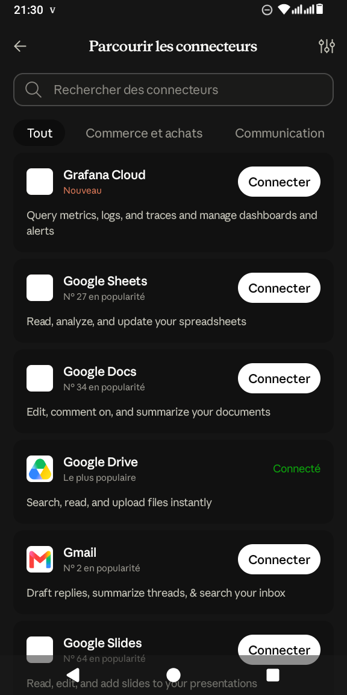

### PRD-AI-08 · Autorisations système

**Captures de référence :** #156

- **Objectif :** Gérer les permissions Android.
- **Composition UI :**
  - Titre « Autorisations », lignes : Localisation (explication), Calendrier (explication), lien « Paramètres » avec icône externe
- **États :**
  - Accordée / Refusée
- **Interactions :**
  - Tap Paramètres : ouvre les réglages Android de l'app
- **Règles métier :**
  - Demande contextuelle au premier usage
- **Critères d'acceptation :**
  - État reflète le système au retour

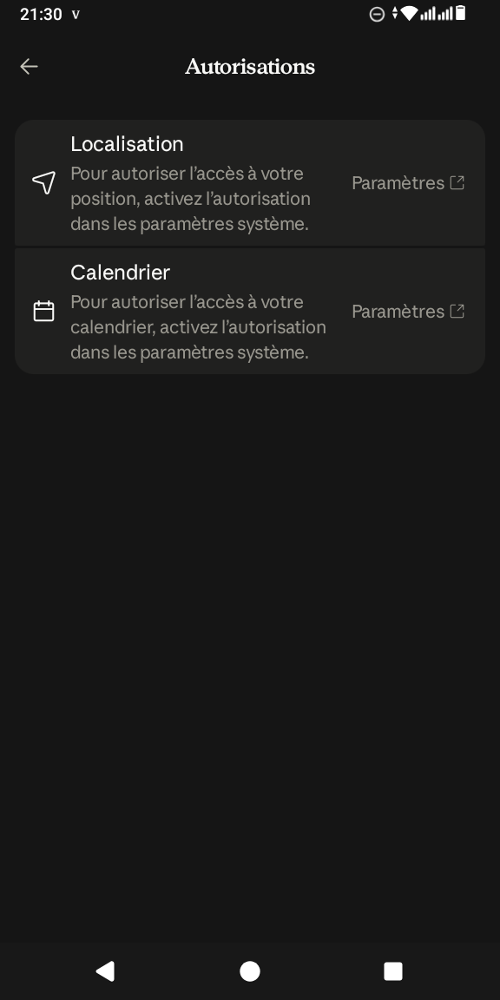

# 5. Données, architecture et exigences

| Entité | Champs |
|---|---|
| Conversation | id, project_id?, title, model, created_at, updated_at, archived |
| Message | id, conversation_id, role, content[], attachments[], tool_calls[], created_at |
| Project | id, name, instructions, pinned, updated_at |
| Artifact | id, type (doc/design/slides/other), title, thumbnail, visibility, content_ref, updated_at |
| LibraryFile | id, name, mime, size, favorite, folder_id |
| Connector | id, provider, status, scopes[], tools_count |
| Capabilities | user_id, web_search, code_exec, memory, sensitive_memory, tool_access (auto/on_demand/always) |
| MemoryFile | id, user_id, content, updated_at |

- Backend : passerelle API vers un fournisseur de modèle, streaming SSE, authentification utilisateur, quotas.
- Sécurité : aucune clé de modèle dans l'app mobile ; tokens OAuth des connecteurs chiffrés côté serveur.
- Confidentialité : mémoire et conversations exportables et supprimables ; sujets sensibles exclus par défaut.
- Fiabilité : états d'erreur réseau explicites (écrans et toasts) avec réessai.
- Accessibilité : contraste AA, tailles dynamiques, lecteur d'écran.

| Phase | Contenu |
|---|---|
| 1 | Conversation, modèle sélectionnable, historique, recherche, pièces jointes |
| 2 | Projets, bibliothèque, artefacts, capacités, mémoire |
| 3 | Connecteurs, outils avancés, partage d'artefacts |
