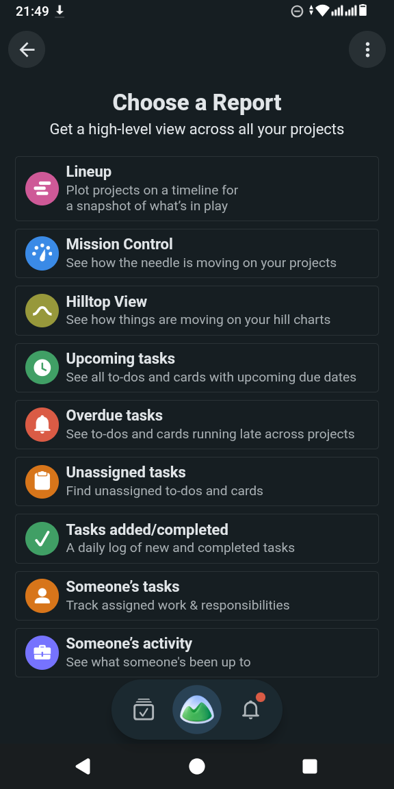
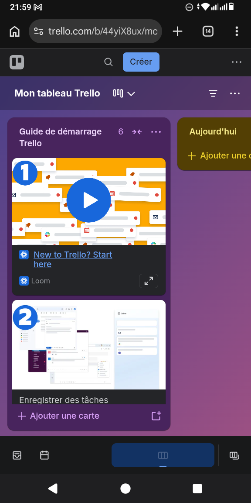
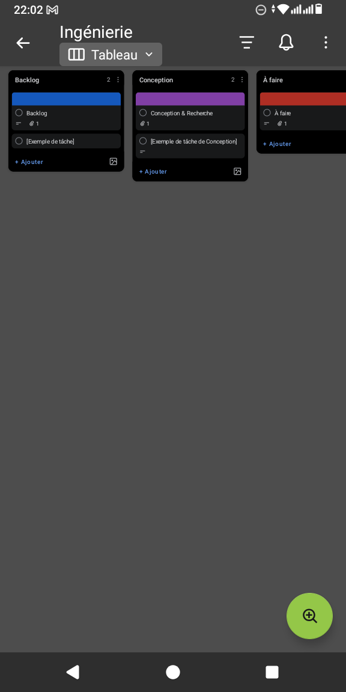

# PRD · App de gestion de projet

_Rapports multi-projets, tableaux kanban, onboarding de plateforme tout-en-un_

- **Nom de travail :** BoardWorks (nom provisoire, à remplacer)
- **Source :** Captures de trois outils de gestion de projet : réf. #159-#164 (6 écrans seulement : couverture partielle)
- **Plateforme cible :** Android d'abord
- **Destinataire :** Agent de codage
- **Captures :** dossier images/ : ref_NNN.png = référence #NNN
- **Limite :** Seuls 6 écrans sont fournis : ce PRD spécifie fidèlement ce qui est visible et liste explicitement les écrans manquants à fournir avant développement complet.
- **Important :** Marques, logos, illustrations d'onboarding et textes marketing de la référence à ne pas reprendre.

# 0. Mode d'emploi pour l'agent de codage

Ce document sert de modèle de départ pour construire rapidement une application inspirée de ces écrans. Chaque fiche est accompagnée de ses captures : la capture fait foi pour la structure, les composants et la disposition.

- À reproduire : la hiérarchie des écrans, les composants UI, leur ordre et leur disposition, les états (vide, chargement, erreur), les interactions et la navigation.
- Libre : couleurs, polices, illustrations, icônes et textes de marque. Les couleurs citées dans les fiches sont indicatives (sens : alerte, actif, verrouillé) ; choisir une palette cohérente et la centraliser dans un fichier de thème.
- Méthode conseillée : construire d'abord le squelette de navigation et les composants réutilisables, puis les écrans par phase (voir plan de livraison), en comparant chaque écran à sa capture.
- Les références ref_NNN renvoient aux fichiers du dossier ref_screens.zip ; les captures sont aussi intégrées dans ce PDF.
- Remplacer les noms de marque, logos et textes d'origine par du contenu original.

# 1. Vision et périmètre

BoardWorks est un outil de gestion de projet mobile : tableaux kanban (colonnes et cartes), rapports de synthèse transversaux (échéances, retards, non assignés, activité), et un parcours d'accueil présentant la proposition de valeur « un seul endroit pour tout le travail ».

## Objectifs

- Visualiser l'avancement de plusieurs projets d'un coup d'œil.
- Déplacer des cartes entre colonnes avec fluidité.
- Onboarder un nouvel utilisateur en 3 écrans.

## Écrans manquants à fournir pour une spécification complète

- Détail d'une carte/tâche, création de projet, vue liste, vue calendrier.
- Connexion/inscription effective, paramètres, notifications.
- États vides et erreurs de chaque rapport.

# 2. Composants UI et mise en page

Aucune charte de couleurs n'est imposée : reproduire la structure.

- Onboarding : logo en haut, illustration centrale, titre fort, texte, pagination en points, deux boutons empilés (principal plein, secondaire contour), mention légale en bas.
- Rapports : liste verticale de cartes, chacune avec pastille d'icône, nom en gras, description ; barre d'onglets flottante arrondie en bas.
- Kanban : colonnes côte à côte à défilement horizontal, en-tête de colonne avec compteur et menu, cartes empilées, « + Ajouter une carte » en pied de colonne.

| Composant | Description |
|---|---|
| ReportRow | Pastille d'icône + titre + description d'une ligne. |
| KanbanColumn | En-tête (nom, compteur, ⋯), liste de cartes, bouton d'ajout. |
| KanbanCard | Case, titre, pièce jointe, avatar, vignette média optionnelle. |
| FloatingTabBar | Barre d'onglets arrondie flottante à 3 icônes. |
| PrimaryButton / OutlineButton | Boutons pleine largeur arrondis. |

# 3. Spécification des écrans

### PRD-PM-01 · Rapports (choisir un rapport)

**Captures de référence :** #159

- **Objectif :** Offrir une vue d'ensemble transversale sur tous les projets.
- **Composition UI :**
  - Titre « Choose a Report » + sous-titre « Get a high-level view across all your projects » (à localiser en français)
  - Liste de 9 rapports : pastille d'icône colorée + nom en gras + description : Lineup (frise de projets), Mission Control (avancement), Hilltop View (courbes de progression), Upcoming tasks, Overdue tasks, Unassigned tasks, Tasks added/completed, Someone's tasks, Someone's activity
  - Barre d'onglets flottante arrondie : tâches, rapports (actif, avatar-montagne), notifications avec point rouge
- **États :**
  - Chargement des rapports
  - Aucun projet : message
- **Interactions :**
  - Tap rapport : ouvre le rapport
  - Onglet notifications : liste
- **Règles métier :**
  - Rapports calculés sur les projets accessibles à l'utilisateur
- **Critères d'acceptation :**
  - Chaque rapport s'ouvre en < 1 s avec jusqu'à 50 projets

### PRD-PM-02 · Tableau de projet (web mobile)

**Captures de référence :** #160

- **Objectif :** Vue kanban avec guide de démarrage.
- **Composition UI :**
  - Barre de navigation : titre « Mon tableau », sélecteur de vue, filtre, menu
  - Colonnes à défilement horizontal : « Guide de démarrage » (compteur 6, boutons replier / ⋯) avec cartes tutoriel numérotées (1, 2), vignette vidéo, lien, source ; colonne « Aujourd'hui » avec « + Ajouter une carte »
  - Barre basse : boîte de réception, planificateur, tableau (actif), changer de tableau
  - Bouton « + Créer » en haut
- **États :**
  - Colonne vide : « + Ajouter une carte »
  - Carte avec média : vignette
- **Interactions :**
  - Glisser-déposer une carte entre colonnes
  - Tap carte : détail (écran à fournir)
  - Défilement horizontal des colonnes
- **Règles métier :**
  - Ordre des cartes persistant
  - Compteur de colonne = nombre de cartes
- **Critères d'acceptation :**
  - Déplacement sans clignotement, sauvegarde < 500 ms

### PRD-PM-03 · Tableau « Ingénierie » (vue Tableau)

**Captures de référence :** #161

- **Objectif :** Kanban compact avec colonnes thématiques.
- **Composition UI :**
  - AppBar : retour, titre « Ingénierie », sélecteur « Tableau ⌄ », filtre, cloche, ⋮
  - Trois colonnes visibles (Backlog, Conception, À faire) avec bandeau coloré (bleu, violet, rouge), compteur, cartes (case, titre, pièce jointe, avatar), « + Ajouter »
  - Bouton flottant vert « zoom » pour réduire/agrandir la vue
- **États :**
  - Colonne vide
  - Zoom arrière : toutes les colonnes visibles
- **Interactions :**
  - Tap sélecteur : Tableau / Liste / Calendrier (à fournir)
  - Zoom : bascule densité
- **Règles métier :**
  - Couleur de colonne personnalisable
- **Critères d'acceptation :**
  - Zoom conserve la position de défilement

### PRD-PM-04 · Onboarding en 3 écrans

**Captures de référence :** #162, #163, #164

- **Objectif :** Présenter la valeur et orienter vers l'inscription.
- **Composition UI :**
  - Logo en haut, illustration centrale (personnage + téléphone), titre fort, sous-texte, indicateur de pagination 3 points
  - Message 1 : « Un seul endroit pour tout votre travail » (tâches, documents, objectifs, discussions) ; message 2 : gain de temps hebdomadaire ; message 3 : personnalisation « Pas d'opinions, que des options »
  - Boutons : « Commencer » (violet plein), « Se connecter » (contour)
  - Mention légale avec liens Conditions générales et Politique de confidentialité
- **États :**
  - Écran 1/3, 2/3, 3/3
- **Interactions :**
  - Balayage horizontal change d'écran
  - Commencer : inscription
  - Se connecter : connexion
- **Règles métier :**
  - Acceptation des conditions implicite au tap sur Commencer (à valider juridiquement)
- **Critères d'acceptation :**
  - Parcours complet en 3 balayages maximum
  - Illustrations originales, jamais celles de la référence

# 4. Modèle de données et plan

| Entité | Champs |
|---|---|
| Workspace | id, name, members[] |
| Project | id, workspace_id, name, view, color |
| Column | id, project_id, name, color, sort_order |
| Card | id, column_id, title, description, assignee_id?, due_at?, attachments[], position |
| Report | id, kind (lineup/mission/hilltop/upcoming/overdue/unassigned/activity/...), filters |

- Mise à jour optimiste et synchro temps réel (WebSocket) des déplacements de cartes.
- Hors ligne : file d'actions locale.
- Accessibilité : déplacement de carte possible sans glisser (menu « Déplacer vers »).

| Phase | Contenu |
|---|---|
| 1 | Onboarding, auth, projets, tableau kanban, cartes |
| 2 | Rapports Upcoming/Overdue/Unassigned, filtres |
| 3 | Lineup, Mission Control, Hilltop, activité, notifications |
